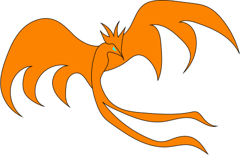

---
aliases:
date: "2021-05-06"
description:
lastmod: "2023-02-10"
license: CC BY-NC-ND
menu:
  main:
    params:
      icon: user
    weight: -90
title: About me
---

My name is Alejandro and since I was a child hundreds of questions have been flying over my head. Questions that when they seemed to be solved, bifurcated once again giving rise to a new uncertainty. 

I have always been interested in the "mechanism of things", in the innumerable "why?" that every inquiring mind asks itself at some time in its life. 

Right now I am a student of engineering while I work in it, and my curiosity and interest have always led me to embark on a series of projects where not only my unknowns are satisfied, but I can get through the compression of things, to the creation of these.

If you have reached this point, it means that my effort and perseverance have borne fruit and I am achieving what I set out to do from the very beginning: to contribute my "grain of sand" to the vast knowledge and its dissemination. 

