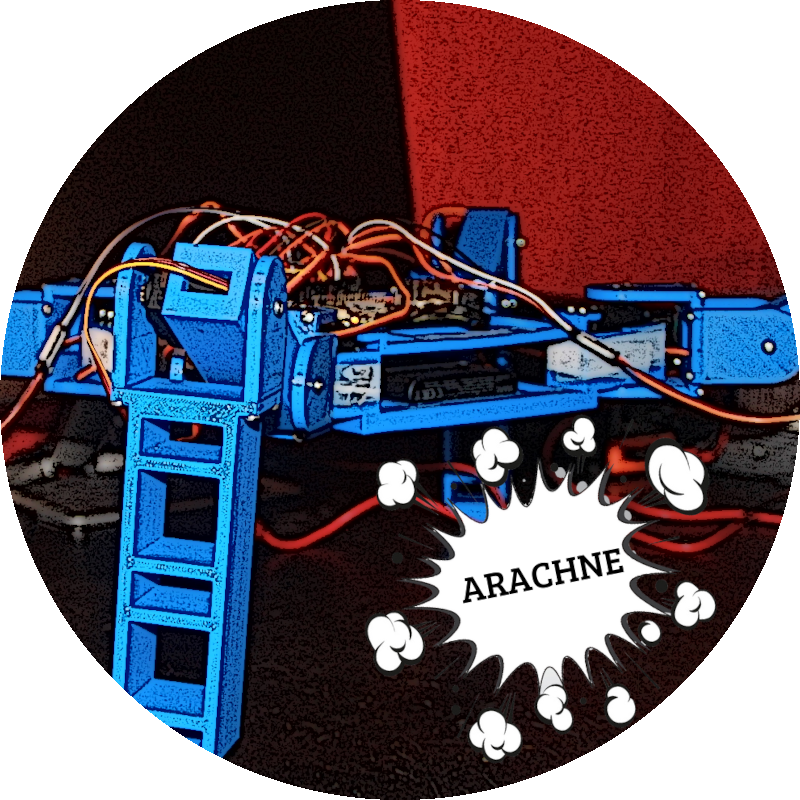
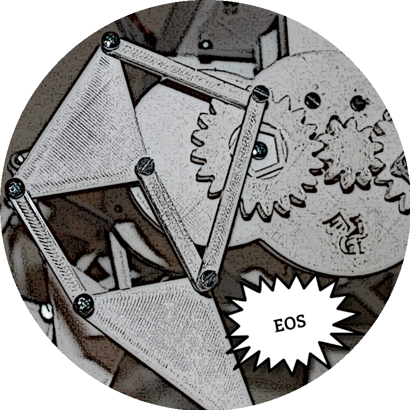

---
menu:
  main:
    params:
      icon: flask
    weight: -90
slug: lab
title: Laboratorio
---

## Escalando la montaña

Siempre he pensado que tenemos que escalar una **montaña**. No cualquier montaña.

Cada uno de nosotros debemos, día a día, escalar y construir nuestra propia montaña, sin importar lo que nadie opine.

## Arachne

<a href="/p/2022/arachne"> ¡Haz clic aquí para ver a "Arachne"! </a>

## EOS

<a href="/p/2022/eos"> ¡Haz clic aquí para ver a "EOS"! </a>

