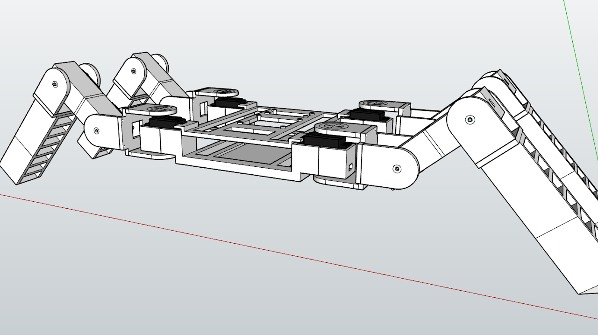

--- 
aliases: 
author: Alejandro García Peláez 
categories: 
- Laboratorio 
date: "2022-07-06" 
description: 
image: 
series: 
tags: 
title: Arachne 
--- 

[Arachne es un proyecto completamente open source](https://github.com/aleph8/Arachne); puedes encontrar todos los archivos de diseño y programación en su repositorio.

## Inspiración

Siempre me ha fascinado todo lo relacionado con "la creación de la naturaleza". Algo que siempre me ha llamado la atención de esto, son los arácnidos, desde sus asombrosos métodos de supervivencia ( por ejemplo la autotomía, también presentes en lagartos ), así como la manera que tienen de cazar a sus presas hasta su increíble diseño.

Influenciado por esto, empecé a pensar en un robot bio-inspirado, que fuera capaz de mantenerse en pie, tras levantarse. He aquí cuando surgió "Arachne". El nombre proviene de la mitología Griega.

## Diseño de la pata

Principalmente me centré en el diseño; pensé que lo más estético era el diseño con seis patas, pero esto significaba mayores costes en cuanto a electricidad, impresión, tiempo ... etc. Por eso dejé de lado esta idea para un futuro y me centré en la funcionalidad. Era el momento de diseñar las patas.
 

La pata tiene tres grados de libertad para realizar el movimiento. Como podemos apreciar en la imagen, tenemos tres servomotores, uno por sección: extremo, centro, chassis.

## Diseño del chasis

Una vez diseñadas las patas, era el turno del chasis, donde iría la elctrónica. El chasis se divide en dos niveles.

El primer nivel es más robusto, debido a que es la unión de todas las patas y debe aportar la robustez necesaria al diseño final. El segundo nivel va atornillado a los servomotores del chasis; es más ligero que el anterior y donde va la electrónica, mientras en el nivel inferior irá la batería.

## Electrónica básica

La electrónica está formada por una Raspberry Pi 3b+ y el integrado PCA9685 (motor driver) que con unas pocas conexiones nos permite conectar hasta 16 servos en nuestra Raspberry.

## Demostración

¡ Arachne se levanta y mantiene de pie !

<iframe width="646" height="461" src="https://www.youtube.com/embed/ejJqCW5x-p0" title="YouTube video player" frameborder="0" allow="accelerometer; autoplay; clipboard-write; encrypted-media; gyroscope; picture-in-picture; web-share" allowfullscreen></iframe>
