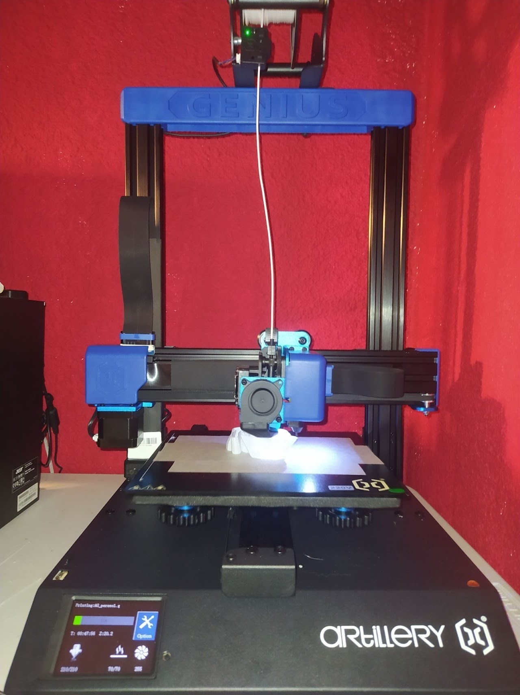

--- 
aliases: 
author: Alejandro García Peláez 
categories: 
- Impresión 3D 
date: "2022-02-11" 
description: 
image: 
series: 
tags: 
title: Artillery Genius 
--- 

Tras llevar un tiempo con la Ender 3, decidí apostar por otra impresora que me había llamado en varias ocasiones la atención: la Artillery Genius (Pro).

Esta impresora ofrece de serie mejores prestaciones que sus competidoras por un precio un poco más elevado, ya que incorpora extrusión directa con un fusor volcano y un extrusor Titán; ambas son obviamente réplicas chinas, pero se desenvuelven muy bien . No solo esto, sino que además incorpora un doble eje Z sincronizado, una estructura de aluminio muy sólida (y compacta) ,un sensor que controla el filamento y calibración automática. Cuenta con la versión de Marlin mas actualizada (por lo menos la que me ha llegado a mí) y drivers silenciosos; eso ha sido en lo que he notado más la diferencia, y es que es increíble lo poco que se escucha a diferencia ,por ejemplo, de la Ender 3.

Obviamente no todos es bueno y hay varias cosas que hay que tener en cuenta. En primer lugar a pesar de que la plataforma de impresión se caliente en nada, cuesta que la pieza se adhiera, lo que provoca que se despegue en numerosas ocasiones, interrumpiéndose el proceso de impresión. Como solución temporal podemos recurrir a la laca o cinta de carrocero. En mi caso estoy usando la cinta de carrocero y esperando a pedir un fleje magnético para acabar con este problema. Por otro lado no viene con cables convencionales sino con cables planos; hay que tener mucho cuidado con este tipo de cables ya que debido al movimiento de la impresora se pueden desconectar, aunque en la versión actual del mercado (Genius Pro ya que la Genius normal está descatalogada) viene con una especie de "acopladores" que en teoría evitan este problema. 

En cuanto a montarla no hay ningún problema ya que básicamente es atornillar cuatro tornillos (literalmente) porque todo el eje Z y sus pertinentes conexiones al eje X está conectado, junto con el carro del extrusor. Solo hace falta conectar los motores, los finales de carrera (que por cierto, se sustituyen los mecánicos tradicionales por sensores ópticos)  y la impresora ya estaría lista para imprimir.

 

