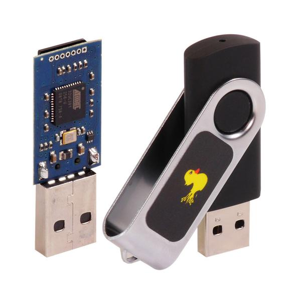

--- 
aliases: 
author: Alejandro García Peláez 
categories: 
- Cybersecurity 
date: "2022-11-03" 
description: 
image: 
series: 
tags: 
- hacking-tools 
title: Bad Usb 
--- 

When we see this object, we may think at first that it is a USB flash drive, with nothing special; it may even happen that you plug it into your computer thinking that it is, and that nothing will happen to it.

The problem arises when we see the inside, which makes us realize that it is far from normal:

 

We see that internally it is built by a small processor of 60 MHz and 32 Bits, which makes it a programmable and potentially dangerous device, since through the micro SD can be loaded a series of scripts, so that once connected it behaves as a "hidden keyboard".

But how come our computer does not detect it as harmful? The answer is simple, and it is that our device really thinks it is just another keyboard, as if someone were typing; with this small device and a little social engineering, a multitude of attacks can be carried out, from remote access via reverse-shell to downloading and executing malicious programs in the background.

Moreover, it is within anyone's reach; for example, with a small Google search we can obtain the script of a keylogger so that our little "camouflaged keyboard" does the rest.

We can take some preventive measures:

* Obviously, the main thing is not to connect just any USB stick to your computer. You may come across a USB flash drive on the street, and have the impulse to plug it in directly to view its contents. By doing so, you expose yourself to potential damage.

* Some scripts are configured for a "default environment". For example, in Windows, when running cmd as administrator, we follow a series of preset steps:

  * Click the Windows button

  * We are looking for cmd

  * Run as administrator

  * We give "yes" to allow access.

  * We freely execute whatever we want.

These steps can be easily automated, so we should have this type of situation by default with some unforeseen step in between, so that the malicious program is disabled; in the case of example, it would be enough to have to insert the user's password before performing actions with elevated permissions.