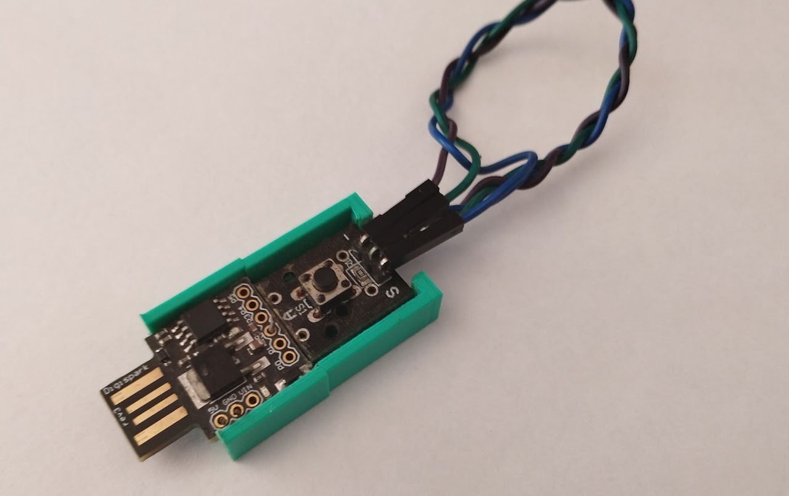

--- 
aliases: 
author: Alejandro García Peláez 
categories: 
- Ciberseguridad 
date: "2022-11-20" 
description: 
image: 
series: 
tags: 
- hacking-tools 
title: Digital Key 
--- 

Cuando tienes muchas contraseñas complejas, a veces es complicado recordarlas todas; los navegadores actuales nos suelen ofrecer contraseñas seguras generadas automáticamente, y se almacenan en el propio navegador, como un "llavero virtual".

Como hemos podido ver en [la parte del Bad Usb](/p/2022/bad-usb) con un simple dispositivo que se asemeja a un USB, podemos simular un teclado, pero no todo es malo; se me ocurrió usar su funcionamiento y el de dispositivos similares para crear un "llavero virtual" portable o "Digital Key" usando las funciones HID de los microprocesadores que encontramos ya integrados en diversas placas de desarrollo.

La idea consiste, en tener un dispositivo que sea, por un lado, capaz de generar contraseñas seguras y almacenarlas en nuestra memoria EEPROM (tipos de memorias en microcontroladores) y, por otro lado, que sea capaz de volcarlas en tiempo de ejecución, escribiéndolas como si fuese un teclado.

Para esto, lo único que ha hecho falta, ha sido emplear la placa de desarrollo "Digispark" que cuenta con una interfaz USB 2.0 integrada, además de su reducido tamaño y precio. Para añadirle un factor de autenticación, para que en el caso de perder el dispositivo no se escriba directamente la contraseña, he utilizado una codificación del binario similar a la del código morse. 

El dispositivo final, cuenta, por tanto, con la placa de desarrollo y un botón. Al conectar el dispositivo, este no hace nada, exclusivamente, escribe que está conectado. Una vez se muestre esto, el usuario debe pulsar adecuadamente la combinación en binario; en el caso de éxito, se escribirá la contraseña almacenada o se creará en el caso de que no haya ninguna almacenada. En el caso de error, no sucederá nada. El dispositivo cuenta con dos funcionalidades más, dependiendo el tiempo de pulsación: modo de generación de contraseña pero sin almacenarla y modo de reset para "eliminar" la contraseña almacenada en EEPROM:

```c++
#include "DigiKeyboard.h"
#include <EEPROM.h>

/* 
   Aleph8 Digital Key
   Code: 5970 Bytes
   EEPROM used: 61 bits
   Binary encode: 1 - long , 0 - short
   
*/

const int PASS_SIZE = 30;
const int random1 = 1000;
const int n_components = 36;
const int combination[4] = {1,0,1,1};
float initTime = millis();
int components[n_components] = {KEY_A,KEY_B,KEY_C,KEY_D,KEY_E,KEY_F,KEY_G,KEY_H,KEY_I,KEY_J,KEY_K,KEY_L,KEY_M,KEY_N,KEY_O,KEY_P,KEY_Q,KEY_R,KEY_S,KEY_T,KEY_U,KEY_V,KEY_W,KEY_X,KEY_Y,KEY_Z,KEY_1,KEY_2,KEY_3,KEY_4,KEY_5,KEY_6,KEY_7,KEY_8,KEY_9,KEY_0};
int first_time,second_time,sentinel,digit;
bool t;


void setup() {for (int i = random(1,4) ; i < 5 ; i++){randomOrder(components);}pinMode(2,INPUT);DigiKeyboard.sendKeyStroke(0);DigiKeyboard.println("Waiting...");sentinel = 0;EEPROM.get(0,t);}

void loop() {
  DigiKeyboard.delay(500);
  //DigiKeyboard.println(t);
  first_time = millis();
  if (digitalRead(2) == 0){
    while(digitalRead(2)==0){}
    second_time = millis()-first_time;
    //DigiKeyboard.println(second_time);
    if(second_time < 1000){validation(0);}else if(second_time < 4000){validation(1);}else if(second_time < 9000){password(false);}else{DigiKeyboard.println("Reset...");t = true;EEPROM.put( 0, t );}
  }
}

void validation(int n){
  digit = n;
  if( digit == combination[sentinel]){
    sentinel++;
    if(sentinel == 4){password(true);sentinel = 0;}
  }else{sentinel = 0;}  
}

void password(bool b){
      digitalWrite(1,HIGH);
      DigiKeyboard.delay(1000*random(0,3));
      DigiKeyboard.sendKeyStroke(0);
      int a[PASS_SIZE];
      if( (t || t == 255) && b ){
        genPass(a);
        t = false;
        EEPROM.put( 0, t );
        EEPROM.put( 9, a );
      }else if( !t && b ){
        EEPROM.get( 9, a );
        translatePass(a);
      }else{genPass(a);translatePass(a);}
      digitalWrite(1,LOW);
}

void randomOrder(int pass[PASS_SIZE]){
  int tmp,rdm;
  randomSeed(analogRead(PB1)+(millis()-initTime));
  for(int i = 0 ; i < PASS_SIZE ; i ++){
    rdm = random(0,n_components);
    tmp = pass[i];
    pass[i] = pass[rdm];
    pass[rdm] = tmp; 
  }
}

void translatePass(int pass[PASS_SIZE]){
  for(int i = 0; i < PASS_SIZE;i++){
    DigiKeyboard.sendKeyStroke(pass[i]);
  }
  DigiKeyboard.sendKeyStroke(KEY_ENTER);
}

void genPass(int pass[PASS_SIZE]){
  randomSeed(random(analogRead(PB1),random1)/millis()-initTime);
  for(int i = 0; i < PASS_SIZE ; i++){
    pass[i] = components[random(0,(n_components-1))];
    DigiKeyboard.delay(500);
  }
}

```

Finalmente, [diseñé e imprimí una pequeña carcasa](https://github.com/aleph8/aleph_1/tree/main/digital_key) donde montarlo todo; lo suyo es que vaya soldado, pero para el caso de que no lo puedas soldar, lo he hecho sin soldar pegando la parte de plástico de los pines a la carcasa y asegurándome de que hace contacto.

<div style="text-align: center;"></div> 

(Esta versión del código, tiene una brecha de seguridad. Y es que para ver la contraseña almacenada, lo único que habría que hacer es cargar en la placa de desarrollo un pequeño script para recorrer la EEPROM. Para solucionar esto, hay varias alternativas; una de ellas es quitar el bootloader de Arduino y mandar el script usando un programador con el protocolo correspondiente; también podemos almacenar la contraseña en la memoria flash del dispositivo, de tal forma, que si se sobrescribe el programa actual, se eliminará directamente)