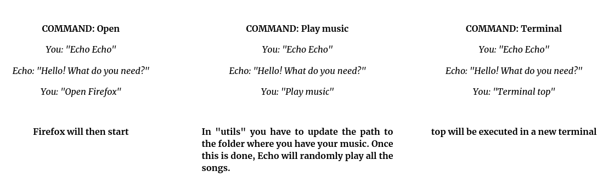

--- 
aliases: 
author: Alejandro García Peláez 
categories: 
- Software
date: "2022-05-17" 
description: 
image: 
series: 
tags: 
title: Echo a Virtual Assistant 
--- 

In a little break from Arachne, I decided to program my own Alexa. It's something I've always wanted to do, because I would like to develop a virtual assistant to my own needs, programming and automating my tasks. This is when "Echo" came up.

In a few lines I had the basic functionalities in less than half an hour ... and it already responded to several of my own commands!  It is not very complicated to do, and can have a multitude of applications such as home automation.

```python
import speech_recognition as sr
import utils
recognizer = sr.Recognizer() #Init the audio recognizer
record_file = sr.AudioFile('../core_records/record.wav') #Select the file

while True:
    utils.echo_call(recognizer,record_file)
    utils.tex2voice("Hello! What do you need?")
    utils.order_call(recognizer,record_file)
```

In order for the assistant to understand what we are saying, we will use SpeechRecognition, a Python library which we will import as 'sr'.

As you can see in the image, the process is repeated endlessly: we call Echo, it asks us what we want and we tell it what we want.

```python
def tex2voice(text):
    language = 'en'
    myobj = gTTS(text=text, lang=language, slow=False)
    myobj.save("../core_records/echo.mp3")
    os.system("mpg321 ../core_records/echo.mp3")
```

To make Echo respond to us (as Alexa does), this time we will use the GTTS library. Every time we want the assistant to tell us something we will use the "text2voice" function.

The utilities are in the file utils.py

Below you will find some examples of the use of Echo and the link to the Github repository where you will find the necessary code of the basic version of Echo ... so that anyone can participate and contribute to the growth of their own Echo! 

<div style="text-align: center;"></div> 

