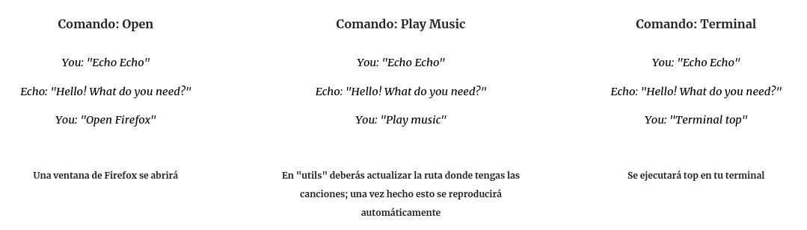

--- 
aliases: 
author: Alejandro García Peláez 
categories: 
- Software
date: "2022-05-17" 
description: 
image: 
series: 
tags: 
title: Echo un Asistente virtual 
--- 

En un pequeño descanso de Arachne, decidí programar mi propia Alexa. Es algo que siempre he querido hacer, porque me gustaría desarrollar un asistente virtual a mi propiass necesidades, programando y automatizando mis tareas. Aquí es cuando surge "Echo".

En unas pocas líneas tenía las funcionalidades básicas en menos de media hora ... ¡y ya respondía a varios de mis propios comandos!  No es muy complicado de hacer, y puede tener multitud de aplicaciones como la domótica.

```python
import speech_recognition as sr
import utils
recognizer = sr.Recognizer() #Init the audio recognizer
record_file = sr.AudioFile('../core_records/record.wav') #Select the file

while True:

    utils.echo_call(recognizer,record_file)
    utils.tex2voice("Hello! What do you need?")
    utils.order_call(recognizer,record_file)
```

Para que el asistente entienda qué es lo que le estamos diciendo, vamos a usar SpeechRecognition, una librería de Python la cual importaremos como 'sr'.

Como puedes ver en la imagen, el proceso se repite infinitamente: llamamos a Echo, nos pregunta que es lo que queremos y nosotros se lo decimos.

```python
def tex2voice(text):
    language = 'en'
    myobj = gTTS(text=text, lang=language, slow=False)
    myobj.save("../core_records/echo.mp3")
    os.system("mpg321 ../core_records/echo.mp3")
```

Para que Echo nos responda (tal y como hace Alexa), usaremos esta vez la librería GTTS. Cada vez que queramos que el asistente nos diga algo usaremos la función "text2voice".

Las utilidades están en el archivo utils.py

Más abajo encontrarás algunos ejemplos del uso de Echo y el enlace al repositorio de Github donde encontrarás el código necesario de la versión básica de Echo ... ¡ para que cualquiera pueda participar y contribuir al crecimiento de su propio Echo! 

<div style="text-align: center;"></div> 

