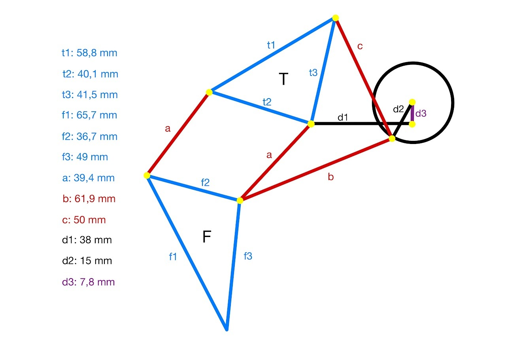
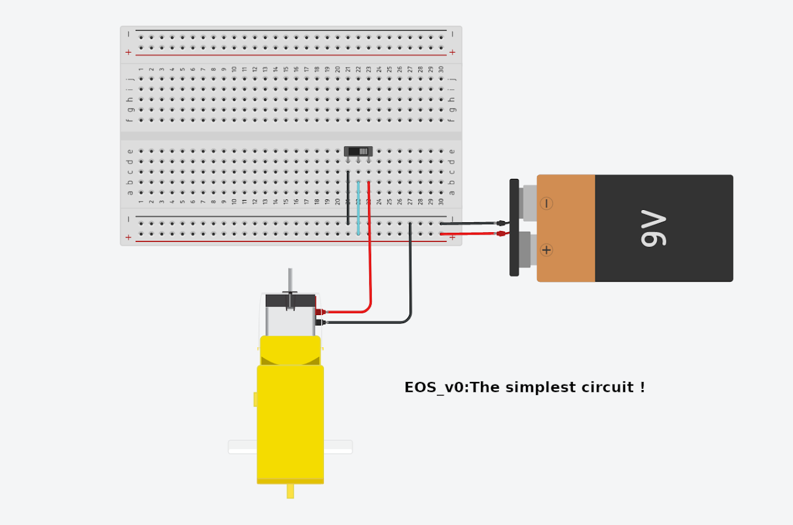

--- 
aliases: 
author: Alejandro García Peláez 
categories: 
- Laboratory 
date: "2022-04-05" 
description: 
image: 
series: 
tags: 
title: EOS 
--- 

[EOS is an open source project](https://github.com/Aleph8/EOS/) based on the "Jansen Linkage", a mechanism created by Teo Jansen ( left image ). a mechanism created by Teo Jansen ( left image ).

Anyone can make a simple version of the project!

The entire chassis is designed and printed (white PLA). Version 0 has only one of the two "trains" that make up EOS.

<iframe width="646" height="461" src="https://www.youtube.com/embed/GFB4ywv_JPY" title="Electronic Open Strandbeest (EOS)" frameborder="0" allow="accelerometer; autoplay; clipboard-write; encrypted-media; gyroscope; picture-in-picture; web-share" allowfullscreen></iframe>

The "brain" of the project is an arduino nano to which the L293D driver is added to control the direction of movement.EOS can move in all directions by pivoting on one of its two axes when it rotates.

All designs are [available on GitHub](https://github.com/Aleph8/EOS/) for anyone who wants to venture. With just a few connections ... EOS will be able to walk !