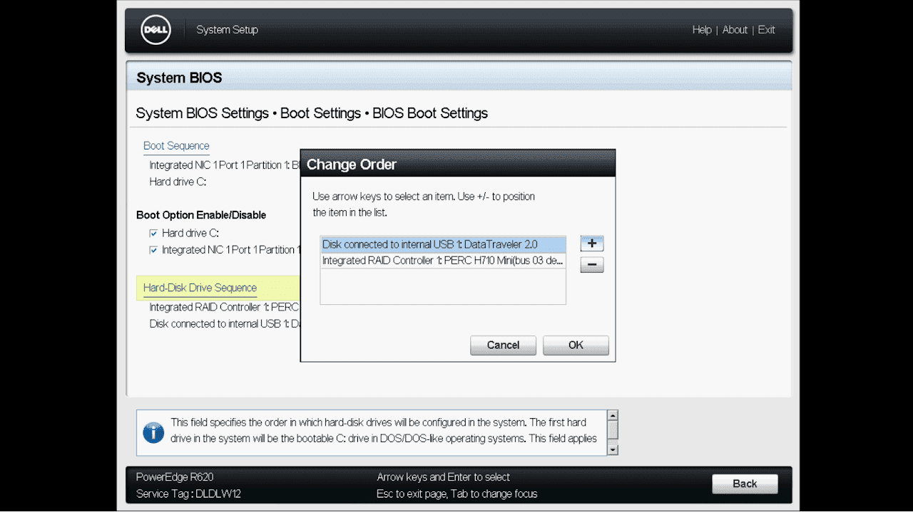
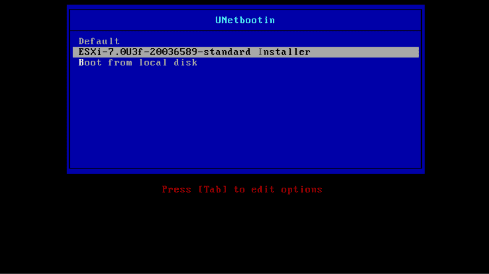
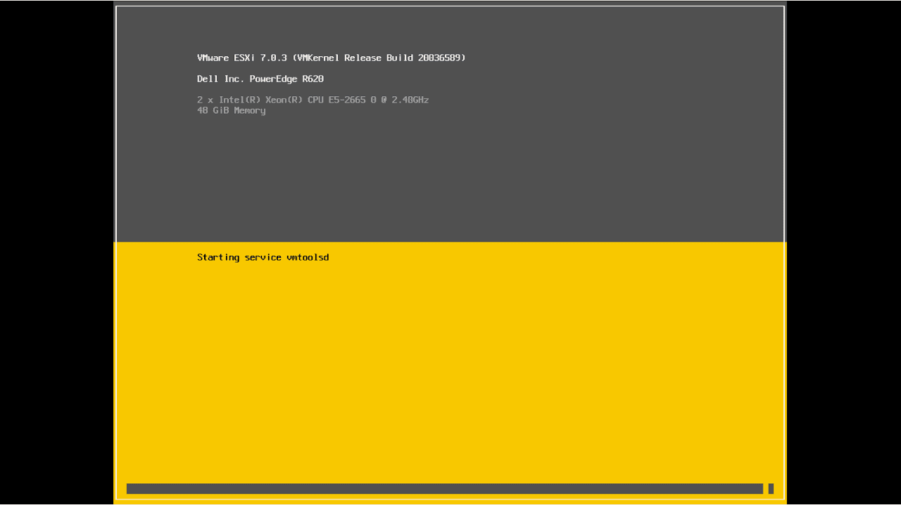

--- 
aliases: 
author: Alejandro García Peláez 
categories: 
- Servidores 
date: "2022-05-30" 
description: 
image: 
series: 
tags: 
title: VMware ESXi 
--- 

ESXi es un hypervisor bare-metal. Esto significa que el sistema operativo no se encuentra como intermediario entre la virtualización software y el hardware, ya que al ser bare-metal, ESXi es instalado directamente en el servidor.

Para obtener la imagen con la que bootear e instalarlo, debemos acceder a la página oficial de VMware. Una vez registrados, podemos descargar la última versión de ESXi para crear un dispositivo booteable.

 

Una vez hemos hecho esto, booteamos desde el dispositivo. En mi caso he hecho esto cambiado el orden de inicio dentro de las opciones del Integrated Dell Remote Access Controller (iDRAC) en "System BIOS"; esto también puede hacerse presionando la tecla correspondiente en el arranque del servidor.

Posteriormente, solo hay que seguir los pasos que nos indiquen.

&nbsp;&nbsp;&nbsp;&nbsp;&nbsp;&nbsp;
 

