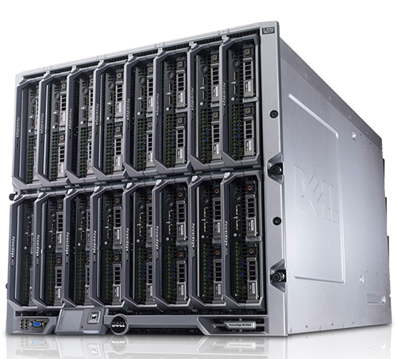
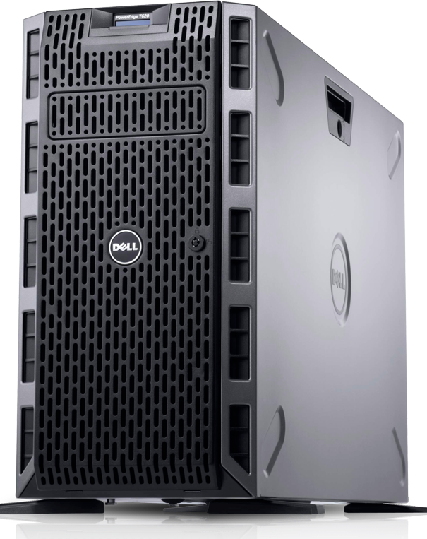

--- 
aliases: 
author: Alejandro García Peláez 
categories: 
- Servidores 
date: "2022-05-02" 
description: 
image: 
series: 
tags: 
title: ¿Qué es un servidor? 
--- 

Un servidor es un ordenador ( o conjunto de ellos) que sigue el modelo "cliente-servidor", manejando peticiones del cliente y devolviendo una respuesta acorde.

Cualquier persona puede configurar un ordenador como servidor, pero dependiendo del servicio que vayamos a ofrecer, se necesitarán más o menos recursos hardware. Por ejemplo, podemos utilizar un ordenador antiguo junto con unos cuantos discos duros para tener nuestro propio NAS (Network Attached Storage); sin embargo, si queremos un servidor que ofrezca máquinas virtuales, necesitaremos más recursos.

Es por esto, que podemos distinguir entre distintos formatos de servidor:

* **Servidores en Rack**: son compactos, tamaño estándar, diseñados para acoplarse en un "mueble" característico para estos servidores.

 

* **Servidores Blade**: Definidos como "solución de alta densidad"; este tipo de servidor está pensado para grandes empresas, ya que en poco espacio almacena varios dispositivos.

* **Tower Server**: servidores con apariencia de PC convencional. Suele ser usado en caso de no poder adquirir un server en Rack. Pueden tener varios procesadores y bancos de memoria.

En mi caso estaré usando un "Server en Rack".Concretamente, es un Dell Poweredge con dos Intel Xeon processors, 10 bays, RAID controller, hasta 768 GB RAM...etc. Es increíble la potencia de estos servidores y las posibilidades que ofrecen.