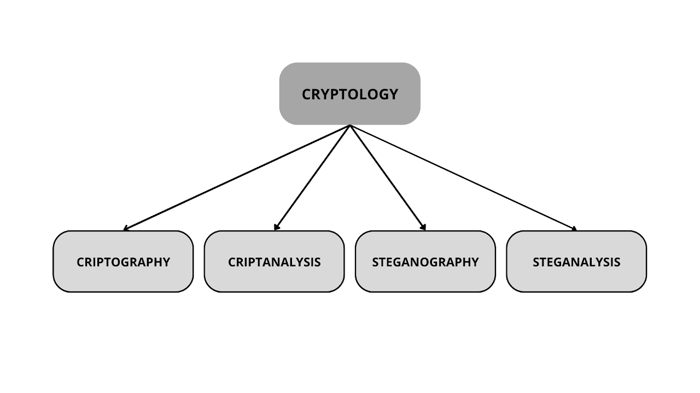

--- 
aliases: 
author: Alejandro García Peláez 
categories: 
- Cybersecurity 
date: "2022-11-01" 
description: 
image: 
series: 
tags: 
- cryptography 
title: Digging into Cryptography 
--- 

Lately, I have been digging into the field of **criptology**, more specifically cryptography.

We tend to think of cryptography as encompassing everything related to "the study of hidden writing".

However, this is not the case, since it is cryptology that is in charge of this, cryptography being one of the four branches that compose it:

- **Cryptography**: handles the algorithms that are used to protect information security.

- **Cryptanalysis**: obtains the cryptographic message without authorization, in order to break the security of the information.

- **Esteganography**: is responsible for transmitting private information through an insecure channel, surreptitiously.

- **Stegoanalysis**: like cryptanalysis with cryptography, stegoanalysis is responsible for detecting these messages transmitted over insecure channels.

 

