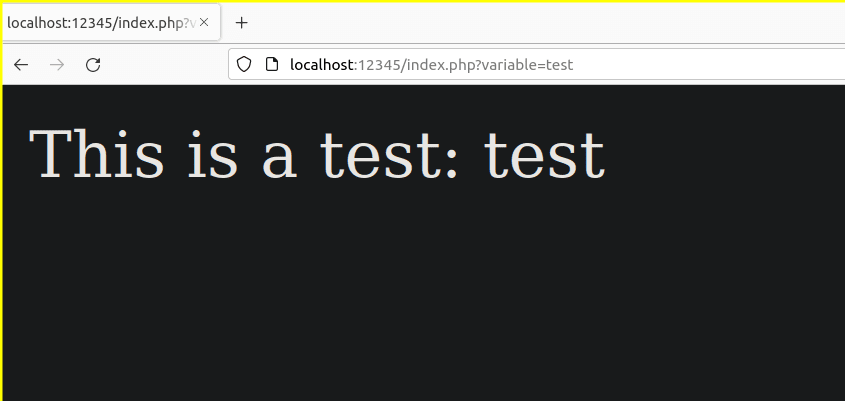
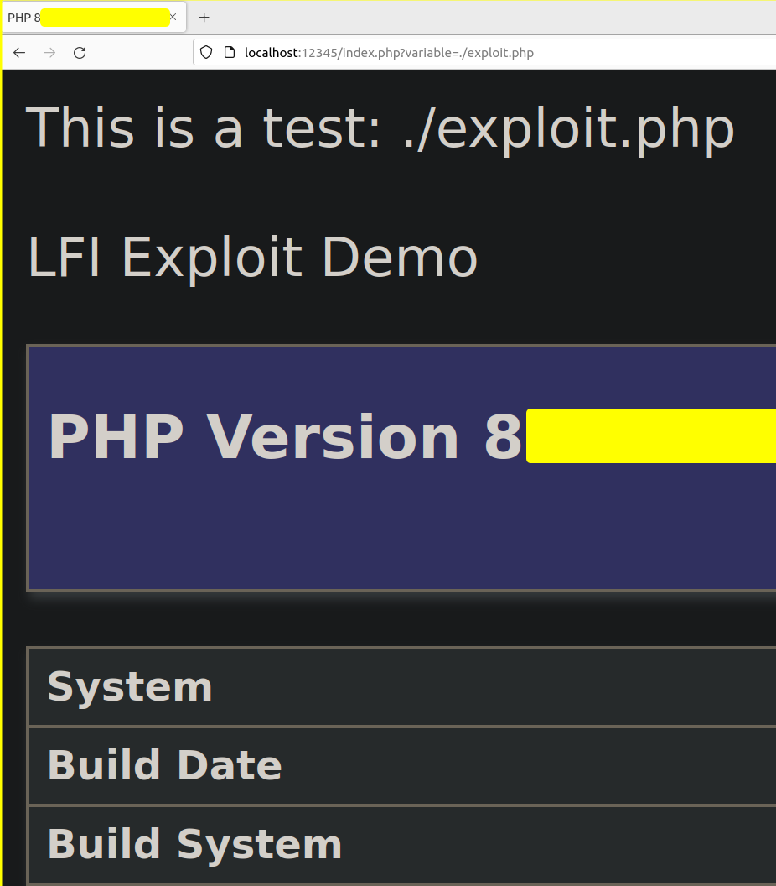

--- 
aliases: 
author: Alejandro García Peláez 
categories: 
- Cybersecurity 
date: "2023-01-30" 
description: 
image: 
series: 
tags: 
- pentesting-web 
title: LFI 
--- 

LFI or *Local File Inclusion* is one of the two File Inclusion style vulnerabilities that commonly affect web applications. If successfully exploited, it can lead to RCE or *Remote Code Execution*.

Thanks to a variable, we can point directly to a file in the file system on the server side; once pointed, it will be executed on the server side, with the corresponding web routine. To explain it better, let's work in a controlled environment, deploying our own web service locally, with the following format:

```bash
  php -S localhost:12345
```

This service contains an "index.php" that takes by GET the content of the variable named "variable", as follows:

<div style="text-align: center;"></div> 

* LFI as Directory Path Traversal

We can confuse these two vulnerabilities, since both can have the same behavior. This time we are going to look at the contents of a file located in the same directory where our service is deployed:

<div style="text-align: center;"></div> 

* LFI as CER

Suppose we get a potential way to upload files and locate them. In this case we could make an exploit in php and point it to add its content and execution to the web application routine. In this case I have prepared a file called "exploit.php" that will execute "phpinfo":

<div style="text-align: center;"></div> 
