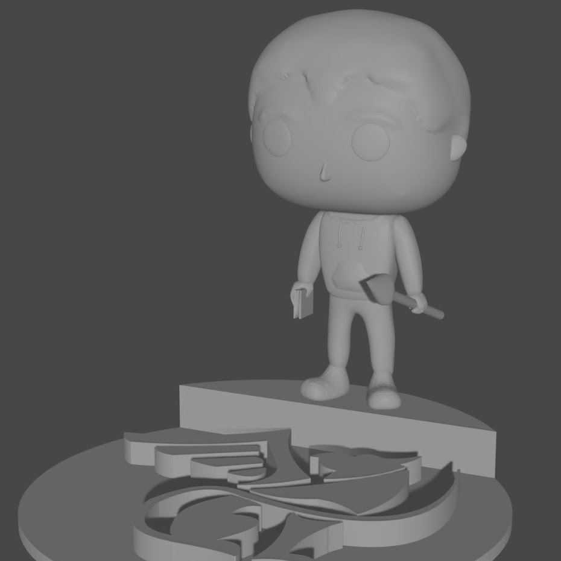
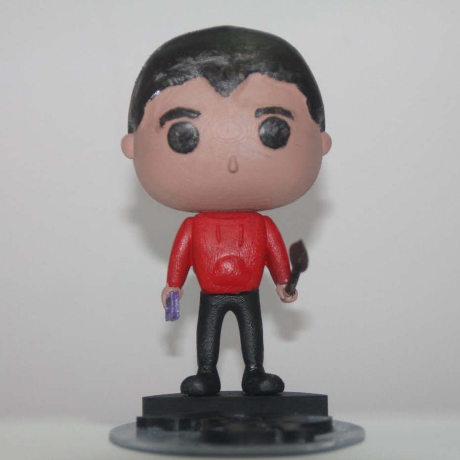

--- 
aliases: 
author: Alejandro García Peláez 
categories: 
- 3D Printing 
date: "2021-09-02" 
description: 
image: 
series: 
tags: 
title: Design and Printing of my Funko 
--- 

The Funko is modeled with Blender, printed using resin and then painted. The post-processing is simpler than in PLA since it is just painting it; the difference is that the process and treatment of the resin is more complex. 

&nbsp;&nbsp;&nbsp;&nbsp;
