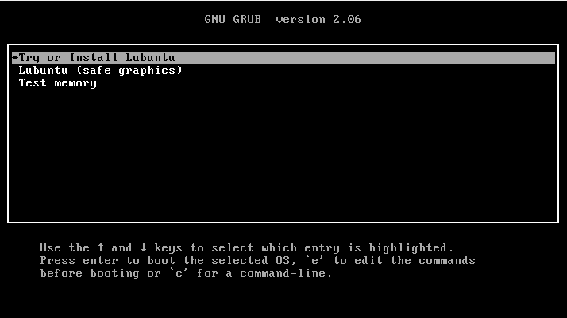
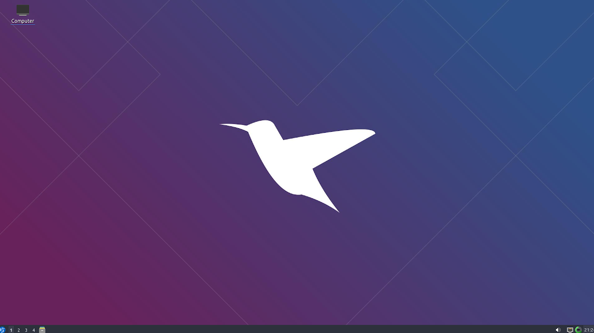

--- 
aliases: 
author: Alejandro García Peláez 
categories: 
- Servidores 
date: "2022-05-10" 
description: 
image: 
series: 
tags: 
title: Como Personaliza una Distro Linux 
--- 

Desde que trabajo con distintos sistemas operativos, he decidido "crear" mi propio distribución GNU/Linux para tener todas las utilidades que usualmente uso a mano, y tener una imagen (*iso) para instalarla en el server y crear distintas versiones del SO según mis necesidades.

Es un proceso muy sencillo para el que he empleado la herramienta "systemback".

Antes de nada debes crear una máquina virtual donde instales el sistema operativo base y lo dejes como quieras. En mi caso he utilizado la última imagen estable de Lubuntu.

&nbsp;&nbsp;&nbsp;&nbsp;
 

Usando "systemback" se crea una primera copia del sistema en el formato ".sblive" y posteriormente lo convertimos a ".iso"

Gracias a esto, se puede instalar rápidamente sistemas base, limpios y sin paquetes innecesario, permitiendo reservar diferentes máquinas virtuales según el propósito que se le quiera dar.