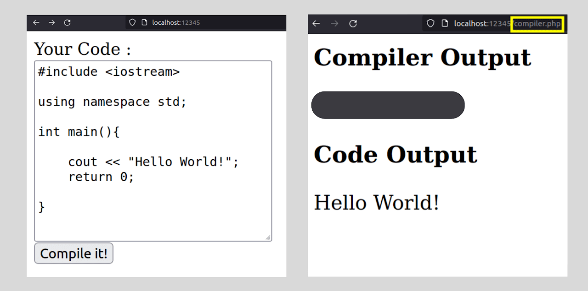
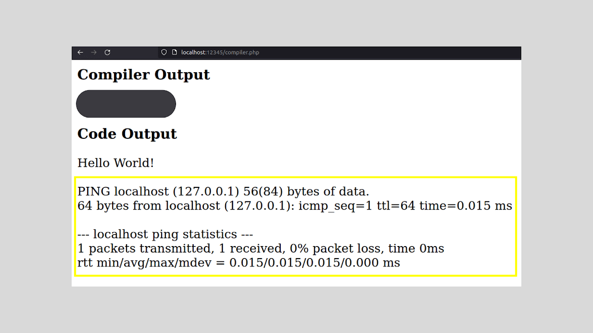

--- 
aliases: 
author: Alejandro García Peláez 
categories: 
- Cybersecurity 
date: "2023-02-06" 
description: 
image: 
series: 
tags: 
- pentesting-web 
title: RCE 
--- 

We call RCE or *Remote Code Execution* the execution of arbitrary commands by taking control of a remote computer through a vulnerability in the exposed service such as [LFI](/en/p/2023/lfi).

This can happen, for example, if user input is not well controlled. I deploy the prepared web service to explain this and let's assume the following situation:

There is a web service that allows its users to run C++ code in the browser, without running it on their device:

 

As we can see in the output, it appears that internally, the code we write is passed directly to a php file that at the system level compiles and displays the output in the web service.

An attacker could exploit this to do the following:

 

The indicated code block executes a server-side command thanks to the C function '**popen**'. Subsequently we define an array of characters that will be where we store the stdout of our command, to later display it in the web service. With the use of the function '**fgets**' we can easily do the latter by passing the arguments: first where we are going to save what we read, second the maximum length of what we want to read from the output and finally where we are going to get the information (from the execution of the command). 

In this case we are going to execute on the victim machine a 'ping' (ICMP protocol) to localhost (remember that this is a test environment, but in a real scenario we could test with our ip to see if we have a direct connection with the server and be able to establish a remote console):

 

