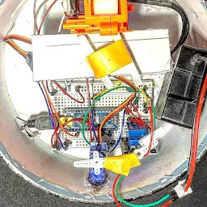

--- 
aliases: 
author: Alejandro García Peláez 
categories: 
- Electronics 
date: "2021-08-09" 
description: 
image: 
series: 
tags: 
title: Sentinel Robot
--- 
This time I have decided to make a kind of "sentry robot" that, after detecting movement, triggers a firing mechanism.

First of all I needed something I could shoot. For this I was given an old Nerf so I could play with it. Once I opened it I realized that, given its age, there was little left that could be reused, except for the barrel to which two motors were attached. Each motor has a kind of cylinder attached to it through which the bullet slides.

Secondly we came up with the electronics. I wanted it to be compact and decided to use an Arduino Nano which was more than enough for what I needed. The problem is that the output is 5V and approximately 40 mA, being this insufficient to get the full power of the motors. The solution I opted for was to power the motors externally with a 12V rechargeable battery.

The circuit that feeds the motors in principle would be open and when motion is detected it would be closed. For this I have used a relay, in this case a kind of "electronic switch", which has a control signal to open or close the circuit. 

The robot detects movement by means of a PIR sensor that is divided into two cells that measure infrared radiation and convert it into an electrical signal when it changes.

Finally there was the design and my printer was not working so I had to make do with a circular box that I found and I liked; now it only remained to assemble and prepare the whole circuit.

&nbsp;&nbsp;&nbsp;&nbsp;&nbsp;&nbsp;&nbsp;&nbsp;&nbsp;&nbsp;&nbsp;&nbsp;

 Relay &nbsp;-&nbsp; Pinout Relay &nbsp;-&nbsp; PIR Sensor &nbsp;-&nbsp; Sentinel 

 
