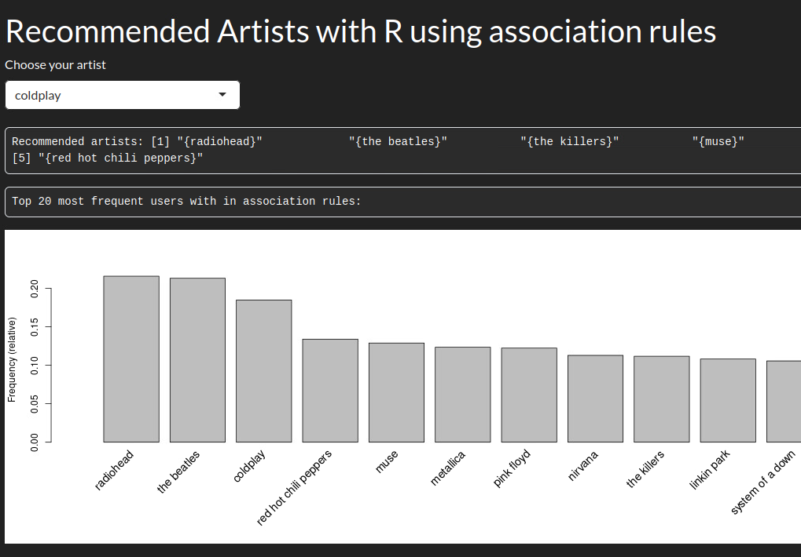

--- 
author: Alejandro García Peláez 
categories: 
- Data Science 
date: "2023-03-07" 
description: 
image: landing.png
series: 
tags:
- data-mining
- association-rules
title: "Data Mining: Music Recommender System in R"
--- 

It is incredible to be able to draw conclusions from huge amounts of data. It is because of these conclusions, that today our information is worth millions. 

This time I am going to work with R to extract association rules from a dataset with hundreds of thousands of transactions. In this case the transactions are rows where a user listens to a given artist X number of times. This notation is used in the **market basket analysis - ** is basically a study of market trends and preferences that tries to sell products based on what a buyer has purchased.


As I mentioned before, we are going to extract association rules using the Apriori algorithm; with these rules we will be able to create a music recommendation system based on our dataset, extracted from the [lastfm](https://www.last.fm) platform.

We start by importing the libraries we are going to work with and the dataset:

```r
library(readr)
library(dplyr)
library(ggplot2)
library(arules)

music_data <- as.data.frame(read_tsv("datasets/lastfm-dataset-360K/usersha1-artmbid-artname-plays.tsv"))
```

As a small note: once the file is read it is a **tibble** ([explained in my text-mining post](/en/p/2023/text-mining)), as it gave me problems when working with the **arules** package when creating transactions.

I rename the columns to better manage the data set:

```r
names(music_data) <- c("user","artist-id","artist","plays")

music_data <- group_by(music_data,user)

music_data <- mutate(music_data,
                     UserId = cur_group_id()
)

music_data <- ungroup(music_data,user)
```

I also create a new column that serves as the user id instead of using the sha1 value of the dataset.

Finally we generate the association rules with Apriori, for this:

+ We keep the data of interest, so we split the dataset to keep only the id of the user and the artists he/she listens to.

+ We filter to obtain the unique values, avoiding repetitions.

+ We transform the data to the type "transactions".

+ We generate the rules with certain values of **confianza** and **support**.

+ We keep the best rules based on the **lift** parameter.


```r
music_by_user <- split(x=music_data[,"artist"],f=music_data$UserId)

music_by_user <- lapply(music_by_user, unique)


transaction_music_by_user <- as(music_by_user,"transactions")

rules <- apriori(transaction_music_by_user,list(support=.01, confidence=.5))

best_rules <- sort(subset(rules,subset=lift > 1),by="confidence")
```

Once we have the rules, we only have to filter the left part or **lhs** and find the ones that have the artist in question, returning to the user the right part or **rhs**. To do this I deploy a web platform that I have programmed so that the user can select the artist, receiving the recommendations.

<div style="text-align: center;">
  
</div>