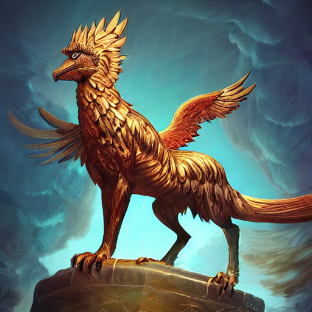
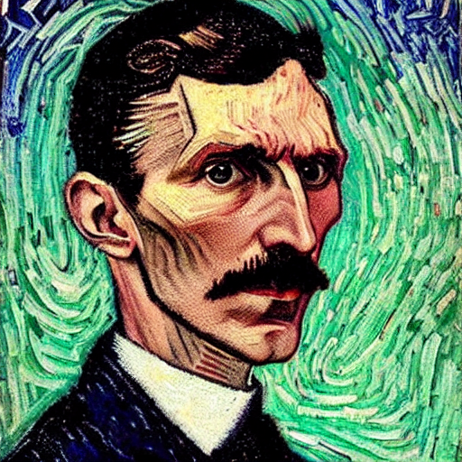

--- 
aliases: 
author: Alejandro García Peláez 
categories: 
- Software 
date: "2022-10-18" 
description: 
image: 
series: 
tags: 
title: Stable Diffusion Bot
---  

Stable Diffusion is a learning model capable of generating digital images from natural language descriptions with the use of a prompt.

I wanted to try and experiment with some image generating model and Stable Diffusion has its repository on Github; the problem is that I don't have a powerful graphic to work with graphics and, therefore, as incredible as it may seem, I had to find a way to run it on CPU, since my goal is to run it locally.

After searching a little, I found a repository that solved everything, allowing to execute the model using CPU. The only thing left was to create the bot, for which I used the Discord API in Python.

The execution times range from 2.4 minutes to 15 minutes depending on the inference steps we pass as arguments. As an extra I have made a linear adjustment to estimate the time depending on the inference steps. Here you can see the results:

&nbsp;&nbsp;&nbsp;&nbsp;&nbsp;&nbsp;&nbsp;&nbsp;&nbsp;
 

