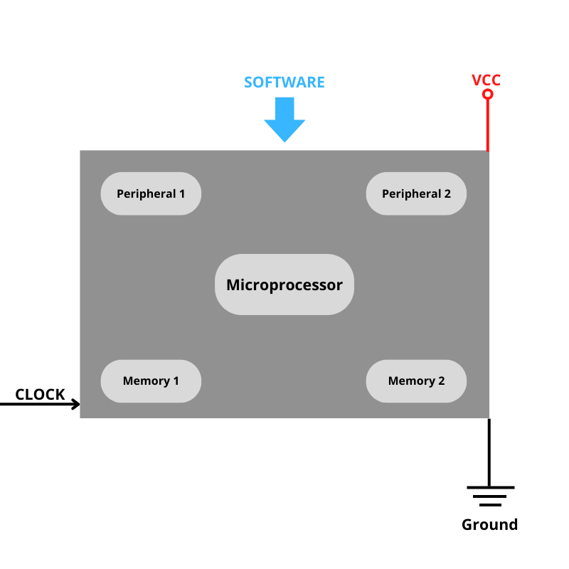

--- 
aliases: 
author: Alejandro García Peláez 
categories: 
- Electronics 
date: "2022-11-15" 
description: 
image: 
series: 
tags: 
title: Types of Memory in Microcontrollers
--- 

Within a microcontroller, we can contemplate two types of essential memories: volatile memory (usually SRAM), non-volatile memory for program storage (ROM, EEPROM, PROM ... ).

 

* Volatile memory: runtime data is stored in this memory, as well as the execution of our script. In the case of Arduino development boards and the microcontrollers they integrate, we are talking about SRAM, used for multiple purposes for program execution, as we have already mentioned.

* Non-volatile memory: the program that we write from our programmer to the microcontroller is stored; it is usually flash memory, since it is faster than other more primitive memories such as EEPROM memory, especially because of its writing mode; while in EEPROM we can only act cell by cell, in flash memory we can act on several memory locations at the same time. 

Many microcontrollers come with both memories: one is used to load the program (flash) and the other (EEPROM) to store data and prevent data loss when the device is turned off. The problem with the latter memory is that it supports limited write operations, so it is not recommended to use it for a device that constantly saves data. 
