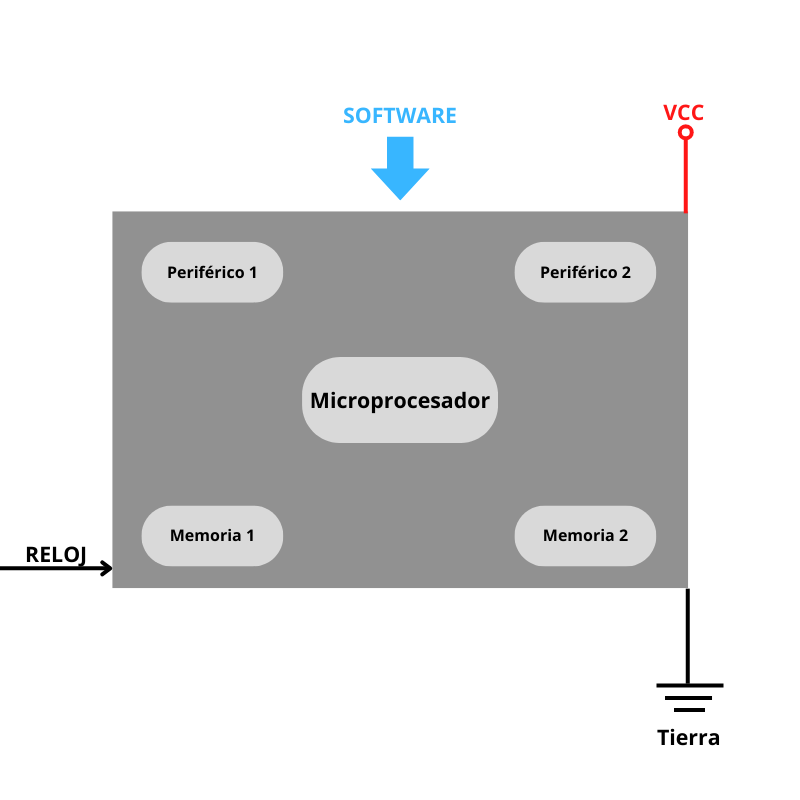

--- 
aliases: 
author: Alejandro García Peláez 
categories: 
- Electrónica 
date: "2022-11-15" 
description: 
image: 
series: 
tags: 
title: Tipos de Memorias en Microcontroladores
--- 

Dentro de un microcontrolador, podemos contemplar dos tipos de memorias esenciales: memoria volátil(comúnmente suele ser SRAM), memoria no volátil para el almacenamiento de programas (ROM, EEPROM, PROM ... ).

 

* Memoria volátil: en esta memoria se guardan los datos en tiempo de ejecución, así como la propia ejecución de nuestro script. En el caso de las placas de desarrollo Arduino y los microcontroladores que integran, hablamos de SRAM, usada en múltiples propósitos para la ejecución del programa, como ya antes hemos comentado.

* Memoria no volátil: se guarda el programa que escribimos desde nuestro programador al microcontrolador; suele ser memoria flash, ya que supera en velocidad a otras memorias más primitivas como la memoria EEPROM, sobre todo por su modo de escritura; mientras que en la EEPROM solo se puede actuar celda por celda, en la memoria flash podemos actuar sobre varias posiciones de memoria a la vez. 

Múltiples microcontroladores vienen con ambas memorias: una es empleada para la carga del programa (flash) y la otra (EEPROM) para guardar datos y evitar su pérdida al apagar nuestro dispositivo. El problema de esta última memoria es que soporta limitadas operaciones de escritura, por lo que no es recomendable usarla para un dispositivo que guarde constantemente datos. 
