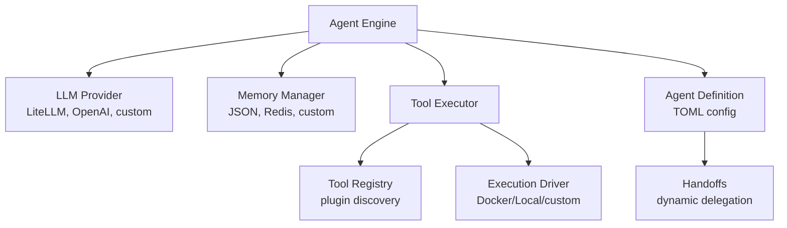

EXODUS is a lightweight, modular, open-source cybersecurity framework. Create and share your agents, add capabilities by creating plugins, and automate your agent teams for pentesting, reconnaissance, vulnerability discovery, and much more.

## Key Features

- **Model Agnostic**: Support for DeepSeek, Ollama, Google, OpenAI, and more.
- **Modular Architecture**: Easily create or use plugins to add functionalities to your agents.
- **Multi-agent Swarm Architecture**: From individual agents to specialized teams with different patterns (central orchestrator, agent delegation, etc.)
- **Lightweight Implementation**: Avoids heavy agent libraries and uses only what is strictly necessary.

## Quick Start

### Start a Chat Session

```bash
# Start with default agent
exodus-cli chat

# Start with a specific agent
exodus-cli chat --agent triage_agent

# Use a different model
exodus-cli chat --model "gemini/gemini-2.5-pro"

# Adjust temperature
exodus-cli chat --temperature 0.7
```

### Example Usage

```bash
# Start with the triage agent for automatic task routing
exodus-cli chat --agent triage_agent

> "Scan 192.168.1.1 for open ports and services"
# triage_agent will automatically transfer to recon_agent
# recon_agent will execute the scan and provide results
```

### Using Ollama (Local Models)

```toml
[llm]
default_model = "ollama/granite4:latest"
custom_api_base = "http://localhost:11434"

[llm.default_provider_config]
api_key = "ollama_apikey"
```

## Architecture

EXODUS is built on abstract, modular architecture that enables endless possibilities. The core components are decoupled allowing custom implementation of LLM providers, Memory systems, and Tool drivers.


