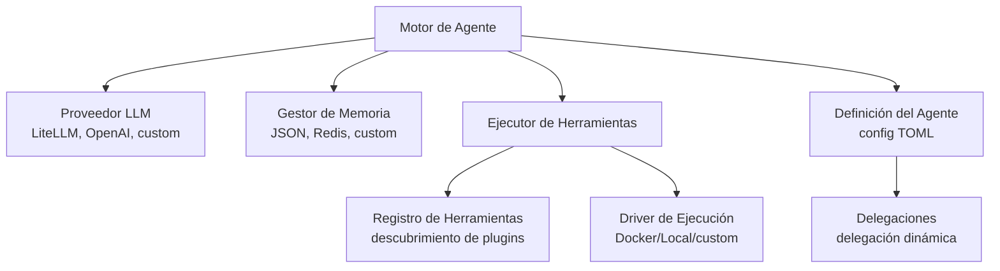

EXODUS es un framework de ciberseguridad ligero, modular y de código abierto. Crea y comparte tus agentes, añade capacidades creando plugins y automatiza tus equipos de agentes para pentesting, reconocimiento, descubrimiento de vulnerabilidades y mucho más.

## Características Principales

- **Agnóstico al Modelo**: Soporte para DeepSeek, Ollama, Google, OpenAI, y más.
- **Arquitectura Modular**: Crea o usa plugins fácilmente para añadir funcionalidades a tus agentes.
- **Arquitectura de Enjambre Multi-agente**: Desde agentes individuales hasta equipos especializados con diferentes patrones (orquestador central, delegación de agentes, etc.)
- **Implementación Ligera**: Evita bibliotecas de agentes pesadas y usa solo lo estrictamente necesario.

## Inicio Rápido

### Iniciar una Sesión de Chat

```bash
# Iniciar con el agente por defecto
exodus-cli chat

# Iniciar con un agente específico
exodus-cli chat --agent triage_agent

# Usar un modelo diferente
exodus-cli chat --model "gemini/gemini-2.5-pro"

# Ajustar temperatura
exodus-cli chat --temperature 0.7
```

### Ejemplo de Uso

```bash
# Iniciar con el agente de triaje para enrutamiento automático de tareas
exodus-cli chat --agent triage_agent

> "Escanea 192.168.1.1 en busca de puertos y servicios abiertos"
# triage_agent transferirá automáticamente a recon_agent
# recon_agent ejecutará el escaneo y proporcionará los resultados
```

### Usando Ollama (Modelos Locales)

```toml
[llm]
default_model = "ollama/granite4:latest"
custom_api_base = "http://localhost:11434"

[llm.default_provider_config]
api_key = "ollama_apikey"
```

## Arquitectura

EXODUS está construido sobre una arquitectura abstracta y modular que permite posibilidades infinitas. Los componentes principales están desacoplados permitiendo la implementación personalizada de proveedores de LLM, sistemas de Memoria y drivers de Herramientas.


