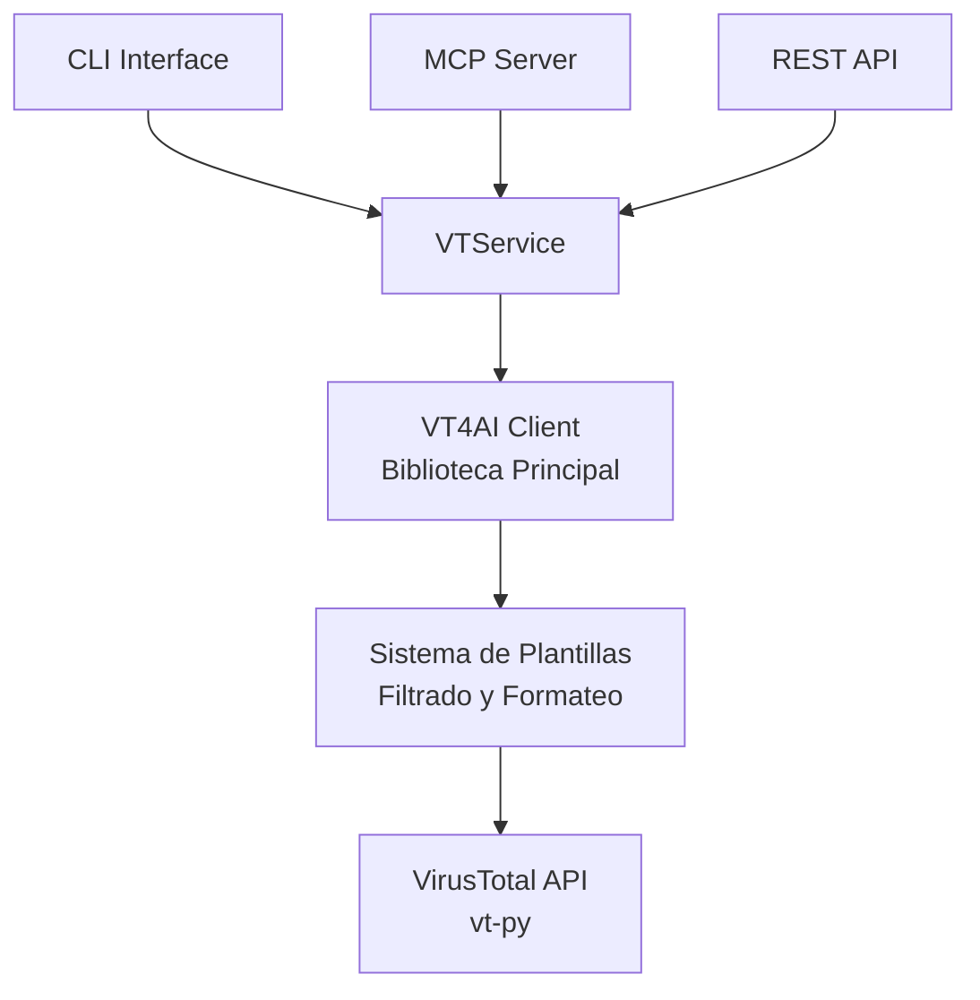

VT4AI is a powerful Python wrapper around the VirusTotal API, specifically designed to enhance AI and LLM applications with comprehensive cybersecurity intelligence. It transforms VirusTotal's responses into AI-friendly formats through templating and multiple integration options.

## Why VT4AI?

Traditional VirusTotal API responses are often overwhelming for AI applications, containing massive amounts of data that can confuse LLMs and waste tokens. VT4AI solves this by:

- **AI-Optimized Responses**: filtering and templating system that presents only relevant data
- **Multiple Interfaces**: CLI, MCP server for LLM agents, and REST API for flexible integration
- **Format Flexibility**: JSON, Markdown, XML, and raw formats to suit any use case

## Key Features

### Smart Templating System
- Pre-configured templates for common AI use cases
- Custom template support for specific requirements
- Attribute filtering to reduce noise and focus on relevant data

### Multiple Integration Options
- **CLI Tool**: Direct command-line access for scripts and automation
- **MCP Server**: Native integration with LLM agents and AI assistants
- **REST API**: HTTP endpoints for web applications and microservices

### Comprehensive VirusTotal Coverage
- File analysis (by hash or file path)
- URL scanning and analysis
- Domain reputation checking
- IP address investigation
- File relationship mapping

## Use Cases

- **Security Analysis in AI Workflows**: Integrate threat intelligence into AI-powered security tools
- **Automated Threat Hunting**: Build intelligent systems that can analyze and correlate security data
- **Incident Response Automation**: Create AI assistants that can quickly assess threats and provide context
- **Research and Development**: Streamline security research with AI-friendly data formats

## Quick Start

```bash
# Install VT4AI
pip install vt4ai

# Set your VirusTotal API key
export VT4AI_API_KEY="your_api_key_here"

# Analyze a file hash
python3 -m vt4ai.cli --hash 275a021bbfb6489e54d471899f7db9d1663fc695ec2fe2a2c4538aabf651fd0f
```

## Arquitectura

VT4AI está construido con una arquitectura modular que separa responsabilidades y maximiza la flexibilidad:



## What's Next?

- [Installation Guide](/docs(/vt4ai/installation) - Get VT4AI up and running
- [CLI Usage](/docs(/vt4ai/cli/overview) - Learn the command-line interface
- [MCP Integration](/docs(/vt4ai/mcp/overview) - Connect with LLM agents
- [REST API](/docs(/vt4ai/api/overview) - HTTP endpoints reference
- [Templates System](/docs(/vt4ai/templates/overview) - Customize data filtering