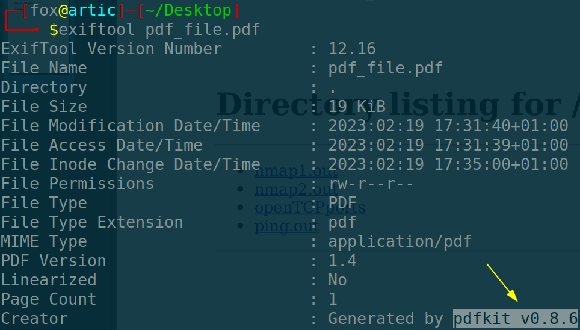
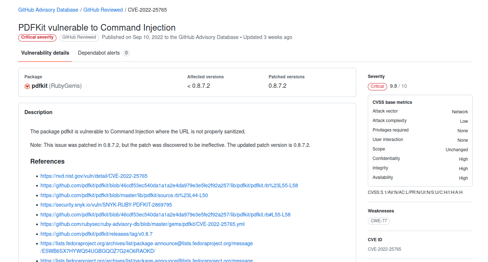
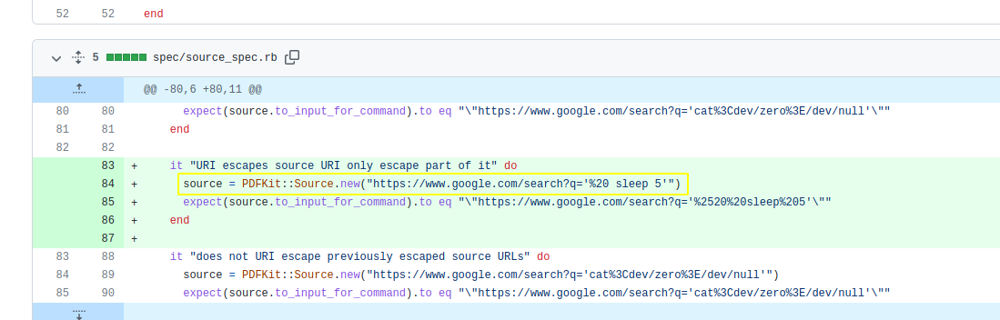
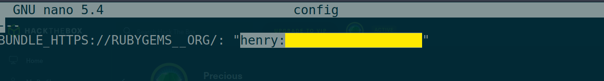
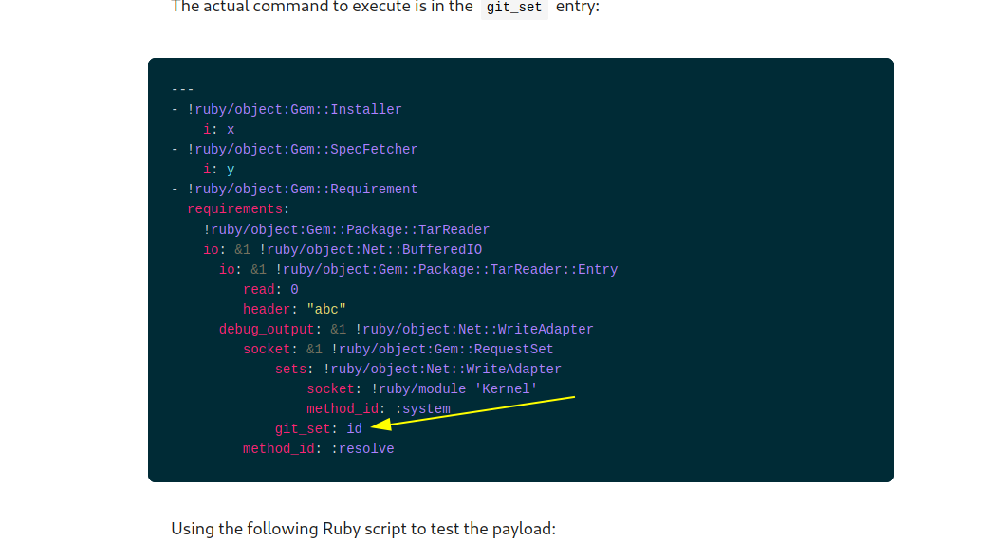

:::::{.spanish}
- [Reconocimiento](#reconocimiento)<br>
- [Obteniendo acceso a la máquina víctima](#obteniendo-acceso-a-la-máquina-víctima)<br>
	- [Inyección de comandos](#inyección-de-comandos)<br>
- [Escalada de privilegios](#escalada-de-privilegios)<br>
:::::

:::::{.english}
- [Recognition](#recognition)<br>
- [Gaining access to the victim machine](#gaining-access-to-the-victim-machine)<br>
	- [Command Injection](#command-injection)<br>
- [Privilege Escalation](#privilege-escalation)<br>
:::::


:::::{.spanish}

# Reconocimiento

Como siempre, vemos si tenemos conexión con la máquina:

```bash
 ping -c 1 10.10.11.189
```

<br>

```
#PING 10.10.11.189 (10.10.11.189) 56(84) bytes of data.
#64 bytes from 10.10.11.189: icmp_seq=1 ttl=63 time=56.1 ms
#
#--- 10.10.11.189 ping statistics ---
#1 packets transmitted, 1 received, 0% packet loss, time 0ms
#rtt min/avg/max/mdev = 56.133/56.133/56.133/0.000 ms
```

Una vez que sabemos que la máquina a la que nos enfrentamos está disponible, nos podemos fijar en que es una máquina Linux (TTL). Posteriormente ejecutamos el escaneo completo de todos los puertos para ver qué puertos abiertos encontramos:

```bash
 nmap -p- --open -T5 -n -Pn 10.10.11.189 -oG openTCPports
```

<br>

```
#Starting Nmap 7.93 ( https://nmap.org ) at 2023-02-19 17:21 CET
#Nmap scan report for 10.10.11.189
#Host is up (0.055s latency).
#Not shown: 56656 closed tcp ports (conn-refused), 8877 filtered tcp ports (no-response)
#Some closed ports may be reported as filtered due to --defeat-rst-ratelimit
#PORT   STATE SERVICE
#22/tcp open  ssh
#80/tcp open  http
#
#Nmap done: 1 IP address (1 host up) scanned in 20.26 seconds
```

Posteriormente ejecutamos el script [grePorts](/scripts/#greports) para pasar los puertos detectados a nmap y realizar un escáner de reconocimiento más exhaustivo en esos puertos mediante una serie de scripts definidos por nmap:

```
 nmap -p20,80 -sVC 10.10.11.189 -oN servicesTCPports
```

<br>

```
## Nmap 7.93 scan initiated Sun Feb 19 17:23:27 2023 as: nmap -p22,80 -sVC -oN nmap2.out 10.10.11.189
#Nmap scan report for 10.10.11.189
#Host is up (0.054s latency).
#
#PORT   STATE SERVICE VERSION
#22/tcp open  ssh     OpenSSH 8.4p1 Debian 5+deb11u1 (protocol 2.0)
#| ssh-hostkey: 
#|   3072 845e13a8e31e20661d235550f63047d2 (RSA)
#|   256 a2ef7b9665ce4161c467ee4e96c7c892 (ECDSA)
#|_  256 33053dcd7ab798458239e7ae3c91a658 (ED25519)
#80/tcp open  http    nginx 1.18.0
#|_http-server-header: nginx/1.18.0
#|_http-title: Did not follow redirect to http://precious.htb/
#Service Info: OS: Linux; CPE: cpe:/o:linux:linux_kernel
#
#Service detection performed. Please report any incorrect results at https://nmap.org/submit/ .
## Nmap done at Sun Feb 19 17:23:36 2023 -- 1 IP address (1 host up) scanned in 9.73 seconds
```

# Obteniendo acceso a la máquina víctima

## Inyección de comandos

Principalmente nos encontramos con una página web que convierte una paǵina web a html; principalmente echamos un vistazo a los metadatos para intentar ver que herramienta se está encargando de esto; y efectivamente la encontramos:



Echando un vistazo en busca de vulnerabilidades asociadas a esta herramienta, podemos encontrar fácilmente el siguiente reporte en GitHub:



Podemos encontrar múltiples recursos, como el propio 'commit' del repositorio de la herramienta:



Hacemos una prueba para ver si la página tarda 5 segundos en emitir el pdf:


Para ver si todo se está ejecutando correctamente, creamos un pequeño servicio web con Python; hacemos clic, vemos la petición GET del lado de la máquina víctima y tarda 5 segundos en generar el pdf. Esto nos sirve para entablar una consola remota y ganar acceso a la máquina.

# Escalada de privilegios

Accedemos con el usuario 'ruby' y en busca de ficheros de configuración encontramos un fichero denominado 'conf' que contiene la contraseña de 'henry' el otro usuario:



Vemos que el usuario puede ejecutar como usuario privilegiado sin ofrecer contraseña un script que carga un fichero de configuración YAML y comprueba si es igual las dependencias existentes de Ruby.

Buscando como inyectar de alguna manera algún tipo de comando en el fichero YAML y poder ganar acceso como administrador, [encontré el siguiente recurso](https://staaldraad.github.io/post/2021-01-09-universal-rce-ruby-yaml-load-updated/) donde se explica perfectamente:



Sustituimos el comando por "bash" y obtenemos permisos de administrador.

:::::

:::::{.english}

# Recognition

As usual, we see if we have connection with the machine:

```bash
 ping -c 1 10.10.11.189
```

<br>

```
#PING 10.10.11.189 (10.10.11.189) 56(84) bytes of data.
#64 bytes from 10.10.11.189: icmp_seq=1 ttl=63 time=56.1 ms
#
#--- 10.10.11.189 ping statistics ---
#1 packets transmitted, 1 received, 0% packet loss, time 0ms
#rtt min/avg/max/mdev = 56.133/56.133/56.133/0.000 ms
```

Once we know that the machine we are dealing with is available, we can check that it is a Linux machine (TTL). We then run the full scan of all ports to see what open ports we find:

```bash
 nmap -p- --open -T5 -n -Pn 10.10.11.189 -oG openTCPports
```

<br>

```
#Starting Nmap 7.93 ( https://nmap.org ) at 2023-02-19 17:21 CET
#Nmap scan report for 10.10.11.189
#Host is up (0.055s latency).
#Not shown: 56656 closed tcp ports (conn-refused), 8877 filtered tcp ports (no-response)
#Some closed ports may be reported as filtered due to --defeat-rst-ratelimit
#PORT   STATE SERVICE
#22/tcp open  ssh
#80/tcp open  http
#
#Nmap done: 1 IP address (1 host up) scanned in 20.26 seconds
```

We then run the grePorts script to pass the detected ports to nmap and perform a more exhaustive reconnaissance scan on those ports using a series of scripts defined by nmap:

```
 nmap -p20,80 -sVC 10.10.11.189 -oN servicesTCPports
```

<br>

```
## Nmap 7.93 scan initiated Sun Feb 19 17:23:27 2023 as: nmap -p22,80 -sVC -oN nmap2.out 10.10.11.189
#Nmap scan report for 10.10.11.189
#Host is up (0.054s latency).
#
#PORT   STATE SERVICE VERSION
#22/tcp open  ssh     OpenSSH 8.4p1 Debian 5+deb11u1 (protocol 2.0)
#| ssh-hostkey: 
#|   3072 845e13a8e31e20661d235550f63047d2 (RSA)
#|   256 a2ef7b9665ce4161c467ee4e96c7c892 (ECDSA)
#|_  256 33053dcd7ab798458239e7ae3c91a658 (ED25519)
#80/tcp open  http    nginx 1.18.0
#|_http-server-header: nginx/1.18.0
#|_http-title: Did not follow redirect to http://precious.htb/
#Service Info: OS: Linux; CPE: cpe:/o:linux:linux_kernel
#
#Service detection performed. Please report any incorrect results at https://nmap.org/submit/ .
## Nmap done at Sun Feb 19 17:23:36 2023 -- 1 IP address (1 host up) scanned in 9.73 seconds
```

# Gaining access to the victim machine

## Command Injection

We mainly came across a web page that converts a web page to html; we mainly took a look at the metadata to try to see what tool is taking care of this; and indeed we found it:


Taking a look for vulnerabilities associated with this tool, we can easily find the following report on GitHub:


We can find multiple resources, such as the tool's own commit repository:


We test to see if the page takes 5 seconds to output the pdf:


To see if everything is running correctly, we create a small web service with Python; we click, see the GET request on the victim machine side and it takes 5 seconds to generate the pdf. This is useful to start a remote console and gain access to the machine.

# Privilege Escalation

We access with the user 'ruby' and looking for configuration files we find a file named 'conf' that contains the password of 'henry' the other user:


We see that the user can run as a privileged user without providing a password a script that loads a YAML configuration file and checks if it is the same as the existing Ruby dependencies.

Looking for how to somehow inject some kind of command into the YAML file and be able to gain administrator access,[I found the following resource](https://staaldraad.github.io/post/2021-01-09-universal-rce-ruby-yaml-load-updated/) where it is perfectly explained:


We replace the command with "bash" and obtain administrator permissions.

:::::