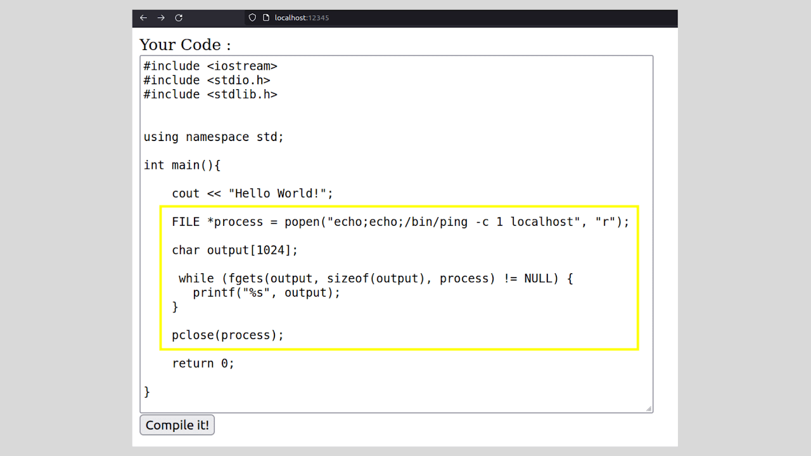

:::::{.spanish}

Llamamos RCE o *Remote Code Execution* a la ejecución de comandos arbitrarios gracias a la toma de control de un equipo remoto mediante alguna vulnerabilidad del servicio expuesto como [LFI](/graphs/cybersecurity/30012023.html).

Esto puede suceder, por ejemplo, si no está bien controlada la entrada de datos del usuario. Despliego el servicio web preparado para explicar esto y supongamos la siguiente situación:

Hay un servicio web que permite a sus usuarios ejecutar código en C++ en el navegador, sin necesidad de ejecutarlo en su dispositivo:

 

Como podemos ver en la salida, parece ser que internamente, el código que escribimos se pasa directamente a un archivo php que a nivel de sistema compila y muestra la salida en el servicio web.

Un atacante podría aprovechar esto para hacer lo siguiente:

 

El bloque de código señalado ejecuta un comando de lado del servidor gracias a la función de C '**popen**'. Posteriormente definimos un array de caracteres que será donde guardemos el stdout de nuestro comando, para posteriormente mostrarlo en el servicio web. Con el uso de la función '**fgets**' podemos hacer fácilmente esto último al pasar los argumentos: primero donde vamos a guardar aquello que leamos, segundo la longitud máxima de lo que queremos leer de la salida y por último de donde vamos a sacar la información ( de la ejecución del comando). 

En este caso vamos a ejecutar en la máquina víctima un 'ping' (protocolo ICMP) a localhost (recordad que es un entorno de prueba, pero en un escenario real se podría probar con nuestra ip para ver si tenemos conexión directa con el servidor y poder entablar una consola remota):

 

:::::

:::::{.english}

We call RCE or *Remote Code Execution* the execution of arbitrary commands by taking control of a remote computer through a vulnerability in the exposed service such as [LFI](/graphs/cybersecurity/30012023.html).

This can happen, for example, if user input is not well controlled. I deploy the prepared web service to explain this and let's assume the following situation:

There is a web service that allows its users to run C++ code in the browser, without running it on their device:

 

As we can see in the output, it appears that internally, the code we write is passed directly to a php file that at the system level compiles and displays the output in the web service.

An attacker could exploit this to do the following:

 

The indicated code block executes a server-side command thanks to the C function '**popen**'. Subsequently we define an array of characters that will be where we store the stdout of our command, to later display it in the web service. With the use of the function '**fgets**' we can easily do the latter by passing the arguments: first where we are going to save what we read, second the maximum length of what we want to read from the output and finally where we are going to get the information (from the execution of the command). 

In this case we are going to execute on the victim machine a 'ping' (ICMP protocol) to localhost (remember that this is a test environment, but in a real scenario we could test with our ip to see if we have a direct connection with the server and be able to establish a remote console):

 

:::::