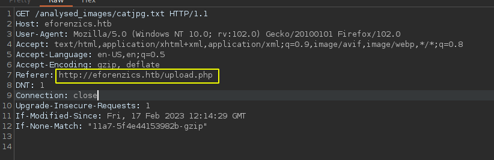
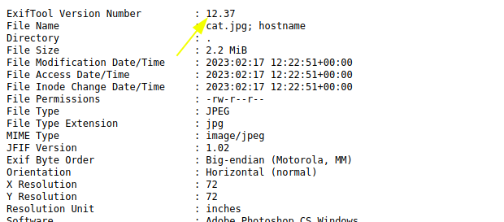
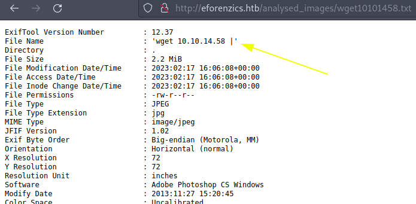
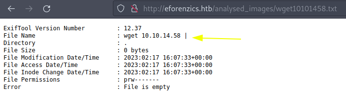
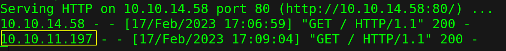
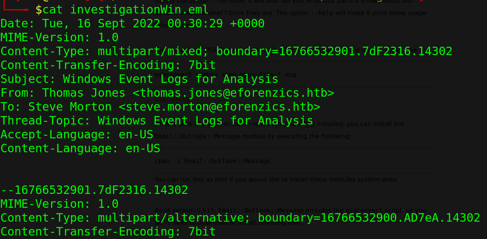
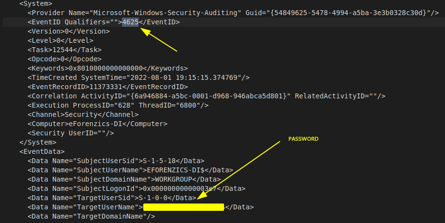
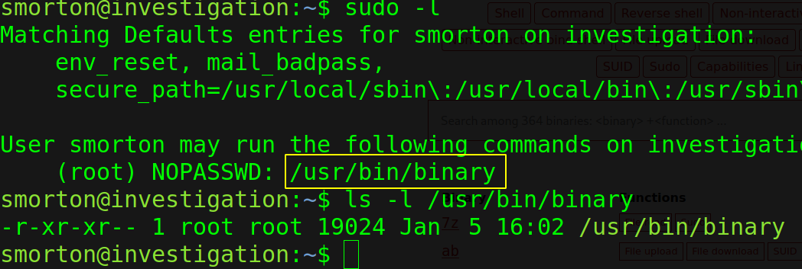
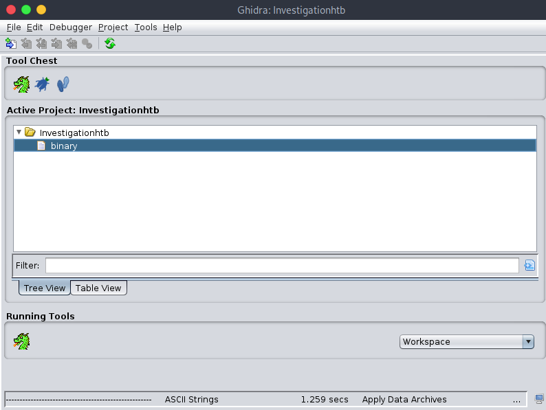
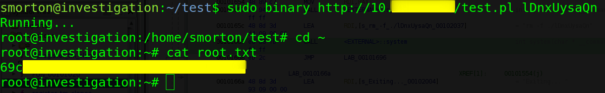

:::::{.spanish}

Esta máquina es una pasada, me ha encantado, es demasiado bonita.

# Reconocimiento

Ejecutamos nmap para ver los puertos abiertos:

```bash
 nmap -p- --open -T5 -Pn -n 10.10.11.197 -oG openTCPports
```
<br>

```
Starting Nmap 7.93 ( https://nmap.org ) at 2023-02-17 13:03 CET
Stats: 0:00:05 elapsed; 0 hosts completed (1 up), 1 undergoing Connect Scan
Connect Scan Timing: About 21.11% done; ETC: 13:03 (0:00:22 remaining)
Nmap scan report for 10.10.11.197
Host is up (0.045s latency).
Not shown: 61711 closed tcp ports (conn-refused), 3822 filtered tcp ports (no-response)
Some closed ports may be reported as filtered due to --defeat-rst-ratelimit
PORT   STATE SERVICE
22/tcp open  ssh
80/tcp open  http

Nmap done: 1 IP address (1 host up) scanned in 16.07 seconds
```

Extraemos los puertos relevantes:

```bash
 grePorts
```

Y lanzamos los scripts de reconocimiento predefinidos de nmap para recopilar más información de los servicios expuestos en la máquina objetivo.

```bash
 nmap -p20,80 -sVC 10.10.11.197 -oN servicesTCPports
```

<br>

```
Starting Nmap 7.93 ( https://nmap.org ) at 2023-02-17 13:04 CET
Nmap scan report for 10.10.11.197
Host is up (0.046s latency).

PORT   STATE SERVICE VERSION
22/tcp open  ssh     OpenSSH 8.2p1 Ubuntu 4ubuntu0.5 (Ubuntu Linux; protocol 2.0)
| ssh-hostkey: 
|   3072 2f1e6306aa6ebbcc0d19d4152674c6d9 (RSA)
|   256 274520add2faa73a8373d97c79abf30b (ECDSA)
|_  256 4245eb916e21020617b2748bc5834fe0 (ED25519)
80/tcp open  http    Apache httpd 2.4.41
|_http-server-header: Apache/2.4.41 (Ubuntu)
|_http-title: Did not follow redirect to http://eforenzics.htb/
Service Info: Host: eforenzics.htb; OS: Linux; CPE: cpe:/o:linux:linux_kernel

Service detection performed. Please report any incorrect results at https://nmap.org/submit/ .
Nmap done: 1 IP address (1 host up) scanned in 8.84 seconds
```

# Obteniendo acceso a la máquina víctima

Vemos una página web a la que podemos subir imágenes para ver los metadatos. Interceptando la petición:



Añadimos el dominio a nuestro archivo de hosts. Echamos un vistazo al análisis que hace la página:



Una vez sabemos la versión de "exiftool" buscamos en Firefox algún tipo de vulnerabilidad asociada; encontramos CVE-2022-23935 que nos permite la ejecución de comandos arbitraria. Siguiendo el reporte:







Obtenemos la petición del equipo objetivo : tenemos conexión directa y ejecutamos comandos en él.

# Escalada de privilegios

## Escalada de privilegios: Windows Security Log Events

Tras una breve búsqueda de ficheros que le pertenezcan al usuario:



Lo que parece ser un correo enviado con un archivo adjunto. Haciendo una serie de conversiones obtenemos el archivo adjunto, que resulta ser un archivo de logs de Windows. Es la primera vez que manejo este tipo de archivos, por tanto me informé de la estructura y me centré en lo que se conoce como "Event Id" una serie de códigos que definen las distintas situaciones que se registran en el archivo. Tras un par de horas entre una cosa y otra: 



¿Qué es lo que ha pasado?¿Por qué está la credencial en texto claro? El evento 4625 está asociado al evento "An account failed to log on" y el usuario cometió el error de ,en lugar de introducir el nombre de usuario, escribió la contraseña por error. Esto nos puede pasar si tenemos algún campo que se rellena solo en un formulario de inicio de sesión o si creemos que ya hemos introducido el nombre de usuario; al final toda esa información queda registrada en los logs del equipo.

## Escalada de privilegios vertical a root: Reverse Engineering with Ghidra

Como usuario "smorton" comprobamos si hay algún binario que podamos ejecutar sin proporcionar contraseña como root:



Parece ser un binario que no pertenece al SO por defecto. Nos lo traemos a nuestro equipo y lo analizamos con Ghidra:



Tras seguir el flujo principal del programa resulta que necesita de dos parámetros: una url de donde se descarga un archivo que posteriormente lo ejecuta con Perl, y una cadena de texto predefinida.

Desde nuestro equipo creamos un pequeño script en Perl que nos otorgue privilegios de administrador:

```perl
 system("/bin/bash")
```

Y desde el equipo objetivo:



:::::

:::::{.english}

Esta máquina es una pasada, me ha encantado, es demasiado bonita.

# Reconocimiento

Ejecutamos nmap para ver los puertos abiertos:

```bash
 nmap -p- --open -T5 -Pn -n 10.10.11.197 -oG openTCPports
```
<br>

```
Starting Nmap 7.93 ( https://nmap.org ) at 2023-02-17 13:03 CET
Stats: 0:00:05 elapsed; 0 hosts completed (1 up), 1 undergoing Connect Scan
Connect Scan Timing: About 21.11% done; ETC: 13:03 (0:00:22 remaining)
Nmap scan report for 10.10.11.197
Host is up (0.045s latency).
Not shown: 61711 closed tcp ports (conn-refused), 3822 filtered tcp ports (no-response)
Some closed ports may be reported as filtered due to --defeat-rst-ratelimit
PORT   STATE SERVICE
22/tcp open  ssh
80/tcp open  http

Nmap done: 1 IP address (1 host up) scanned in 16.07 seconds
```

Extraemos los puertos relevantes:

```bash
 grePorts
```

Y lanzamos los scripts de reconocimiento predefinidos de nmap para recopilar más información de los servicios expuestos en la máquina objetivo.

```bash
 nmap -p20,80 -sVC 10.10.11.197 -oN servicesTCPports
```

<br>

```
Starting Nmap 7.93 ( https://nmap.org ) at 2023-02-17 13:04 CET
Nmap scan report for 10.10.11.197
Host is up (0.046s latency).

PORT   STATE SERVICE VERSION
22/tcp open  ssh     OpenSSH 8.2p1 Ubuntu 4ubuntu0.5 (Ubuntu Linux; protocol 2.0)
| ssh-hostkey: 
|   3072 2f1e6306aa6ebbcc0d19d4152674c6d9 (RSA)
|   256 274520add2faa73a8373d97c79abf30b (ECDSA)
|_  256 4245eb916e21020617b2748bc5834fe0 (ED25519)
80/tcp open  http    Apache httpd 2.4.41
|_http-server-header: Apache/2.4.41 (Ubuntu)
|_http-title: Did not follow redirect to http://eforenzics.htb/
Service Info: Host: eforenzics.htb; OS: Linux; CPE: cpe:/o:linux:linux_kernel

Service detection performed. Please report any incorrect results at https://nmap.org/submit/ .
Nmap done: 1 IP address (1 host up) scanned in 8.84 seconds
```

# Obteniendo acceso a la máquina víctima

Vemos una página web a la que podemos subir imágenes para ver los metadatos. Interceptando la petición:


Añadimos el dominio a nuestro archivo de hosts. Echamos un vistazo al análisis que hace la página:


Una vez sabemos la versión de "exiftool" buscamos en Firefox algún tipo de vulnerabilidad asociada; encontramos CVE-2022-23935 que nos permite la ejecución de comandos arbitraria. Siguiendo el reporte:


Obtenemos la petición del equipo objetivo : tenemos conexión directa y ejecutamos comandos en él.

# Escalada de privilegios

## Escalada de privilegios: Windows Security Log Events

Tras una breve búsqueda de ficheros que le pertenezcan al usuario:


Lo que parece ser un correo enviado con un archivo adjunto. Haciendo una serie de conversiones obtenemos el archivo adjunto, que resulta ser un archivo de logs de Windows. Es la primera vez que manejo este tipo de archivos, por tanto me informé de la estructura y me centré en lo que se conoce como "Event Id" una serie de códigos que definen las distintas situaciones que se registran en el archivo. Tras un par de horas entre una cosa y otra: 


¿Qué es lo que ha pasado?¿Por qué está la credencial en texto claro? El evento 4625 está asociado al evento "An account failed to log on" y el usuario cometió el error de ,en lugar de introducir el nombre de usuario, escribió la contraseña por error. Esto nos puede pasar si tenemos algún campo que se rellena solo en un formulario de inicio de sesión o si creemos que ya hemos introducido el nombre de usuario; al final toda esa información queda registrada en los logs del equipo.

## Escalada de privilegios vertical a root: Reverse Engineering with Ghidra

Como usuario "smorton" comprobamos si hay algún binario que podamos ejecutar sin proporcionar contraseña como root:


Parece ser un binario que no pertenece al SO por defecto. Nos lo traemos a nuestro equipo y lo analizamos con Ghidra:


Tras seguir el flujo principal del programa resulta que necesita de dos parámetros: una url de donde se descarga un archivo que posteriormente lo ejecuta con Perl, y una cadena de texto predefinida.

Desde nuestro equipo creamos un pequeño script en Perl que nos otorgue privilegios de administrador:

```perl
 system("/bin/bash")
```

Y desde el equipo objetivo:


:::::