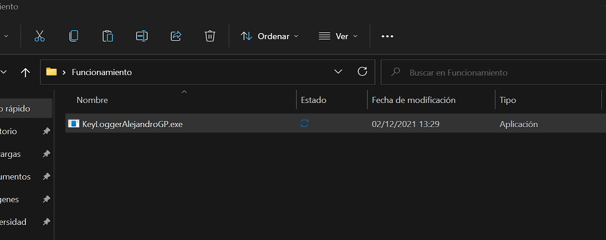
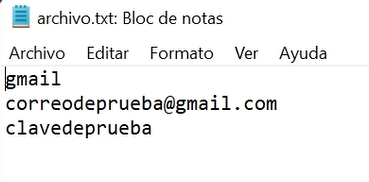

::::: {.spanish}

Un spyware es un tipo de virus informático que tras infectar el ordenador de la víctima busca la manera de conseguir todo tipo de información de esta (desde capturas de pantalla hasta grabar audio o acceder a la cámara).

Un keylogger es un tipo de spyware que registra las pulsaciones del teclado de la víctima para obtener datos personales: contraseñas, datos bancarios, acceso a cuentas...

Usando C he programado un keylogger; el funcionamiento de este es sencillo:

* En primer lugar se ejecuta el programa en el ordenador infectado:

:::::

::::: {.english}

Spyware is a type of computer virus that, after infecting the victim's computer, seeks to obtain all kinds of information from the victim (from screenshots to audio recordings or access to the camera).

A keylogger is a type of spyware that records the keystrokes of the victim's keyboard to obtain personal data: passwords, bank details, access to accounts...

Using C I have programmed a keylogger; its operation is simple:

* First, the program is executed on the infected computer:

:::::

::::: {.spanish}

* Después el usuario víctima introduce todo tipo de información:

:::::

::::: {.english}

* Then the victim user enters all kinds of information:

:::::

::::: {.spanish}

* Para finalizar, esta información se guarda de alguna manera. En mi caso lo he programado para que se guarde en "archivo.txt" en el mismo directorio de ejecución del programa:

:::::

::::: {.english}

* Finally, this information is saved in some way. In my case I have programmed it to be saved in "file.txt" in the same directory where the program is executed:

:::::

