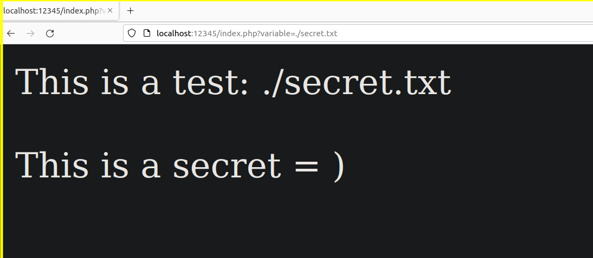

:::::{.spanish}

LFI o *Local File Inclusion* es una de las dos vulnerabilidades del estilo File Inclusion que afecta comunmente a las aplicaciones web. En caso de explotarla satisfactoriamente, puede derivar en una RCE o *Remote Code Execution*.

Gracias a una variable, podemos apuntar directamente a un fichero del sistema de archivos del lado del servidor; una vez apuntado, se ejecutará del lado de servidor, con la rutina web correspondiente. Para explicarlo mejor, vamos a trabajar en un entorno controlado, desplegando nuestro propio servicio web en local, con el siguiente formato:

~~~~~~~~~~~~~~~~~~~~~~~~~~~~~~~~~~~~~~~~~~ {.bash .numberLines}
  php -S localhost:12345
~~~~~~~~~~~~~~~~~~~~~~~~~~~~~~~~~~~~~~~~~~~~~~~~~~~~

Este servicio contiene un "index.php" que toma por GET el contenido de la variable de nombre "variable", de la siguiente forma:

 

* LFI como Directory Path Traversal

Podemos confundir estas dos vulnerabilidades, ya que ambas pueden tener el mismo comportamiento. En esta ocasión vamos a ver el contenido de un fichero que se encuentra en el mismo directorio en el que tenemos desplegado nuestro servicio:

 

* LFI como RCE

Supongamos que obtenemos una vía potencial para subir ficheros y localizarlos. En este caso podríamos hacer un exploit en php y apuntarlo para que se añada su contenido y ejecución a la rutina de la aplicación web. En este caso he preparado un fichero denominado "exploit.php" que ejecutará "phpinfo":

 

:::::

:::::{.english}

LFI or *Local File Inclusion* is one of the two File Inclusion style vulnerabilities that commonly affect web applications. If successfully exploited, it can lead to RCE or *Remote Code Execution*.

Thanks to a variable, we can point directly to a file in the file system on the server side; once pointed, it will be executed on the server side, with the corresponding web routine. To explain it better, let's work in a controlled environment, deploying our own web service locally, with the following format:

~~~~~~~~~~~~~~~~~~~~~~~~~~~~~~~~~~~~~~~~~~ {.bash .numberLines}
  php -S localhost:12345
~~~~~~~~~~~~~~~~~~~~~~~~~~~~~~~~~~~~~~~~~~~~~~~~~~~~

This service contains an "index.php" that takes by GET the content of the variable named "variable", as follows:

 

* LFI as Directory Path Traversal

We can confuse these two vulnerabilities, since both can have the same behavior. This time we are going to look at the contents of a file located in the same directory where our service is deployed:

 

* LFI as CER

Suppose we get a potential way to upload files and locate them. In this case we could make an exploit in php and point it to add its content and execution to the web application routine. In this case I have prepared a file called "exploit.php" that will execute "phpinfo":

 

:::::