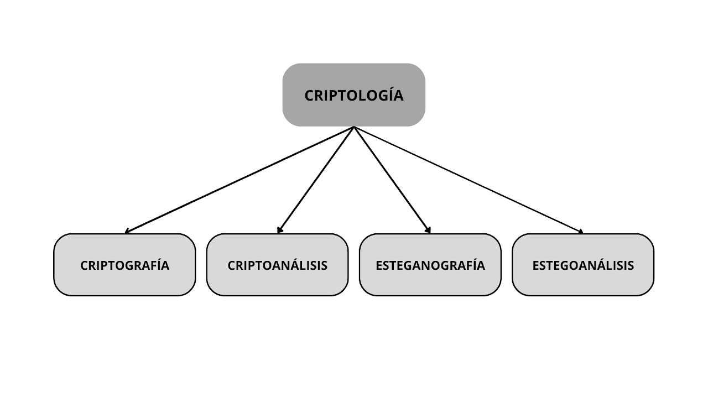

:::::{.spanish}

Últimamente, he estado indagando en el campo de la **criptología**, más concretamente en la criptografía.

Solemos pensar que la criptografía engloba todo lo relacionado con "el estudio de la escritura oculta".

Sin embargo, esto no es así, ya que es la criptología quien se encarga de esto, siendo la criptografía una de las cuatro ramas que la componen:

- **Criptografía**: se encarga de los algoritmos que son usados para proteger la seguridad de la información.

- **Criptoanálisis**: obtiene el mensaje fruto de la criptografía sin autorización, con el fin de romper la seguridad de la información.

- **Esteganografía**: se encarga de transmitir información privada a través de un canal inseguro, de forma subrepticia.

- **Estegoanálisis**: al igual que el criptoanálisis con la criptografía, el estegoanálisis se encarga de detectar estos mensajes transmitidos por canales inseguros.

 

:::::

:::::{.english}

Lately, I have been digging into the field of **criptology**, more specifically cryptography.

We tend to think of cryptography as encompassing everything related to "the study of hidden writing".

However, this is not the case, since it is cryptology that is in charge of this, cryptography being one of the four branches that compose it:

- **Cryptography**: handles the algorithms that are used to protect information security.

- **Cryptanalysis**: obtains the cryptographic message without authorization, in order to break the security of the information.

- **Esteganography**: is responsible for transmitting private information through an insecure channel, surreptitiously.

- **Stegoanalysis**: like cryptanalysis with cryptography, stegoanalysis is responsible for detecting these messages transmitted over insecure channels.

 

:::::