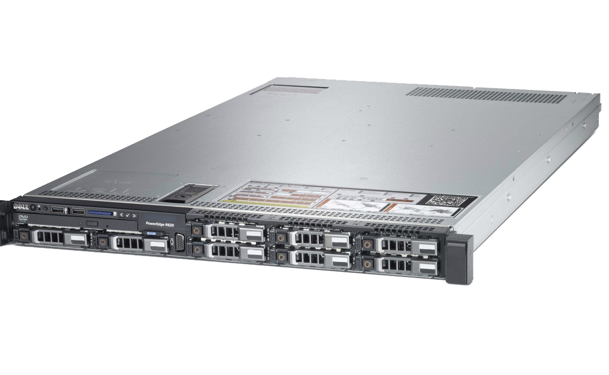

:::::{.spanish}

Un servidor es un ordenador ( o conjunto de ellos) que sigue el modelo "cliente-servidor", manejando peticiones del cliente y devolviendo una respuesta acorde.

Cualquier persona puede configurar un ordenador como servidor, pero dependiendo del servicio que vayamos a ofrecer, se necesitarán más o menos recursos hardware. Por ejemplo, podemos utilizar un ordenador antiguo junto con unos cuantos discos duros para tener nuestro propio NAS (Network Attached Storage); sin embargo, si queremos un servidor que ofrezca máquinas virtuales, necesitaremos más recursos.

Es por esto, que podemos distinguir entre distintos formatos de servidor:

* **Servidores en Rack**: son compactos, tamaño estándar, diseñados para acoplarse en un "mueble" característico para estos servidores.

 

* **Servidores Blade**: Definidos como "solución de alta densidad"; este tipo de servidor está pensado para grandes empresas, ya que en poco espacio almacena varios dispositivos.

* **Tower Server**: servidores con apariencia de PC convencional. Suele ser usado en caso de no poder adquirir un server en Rack. Pueden tener varios procesadores y bancos de memoria.

En mi caso estaré usando un "Server en Rack".Concretamente, es un Dell Poweredge con dos Intel Xeon processors, 10 bays, RAID controller, hasta 768 GB RAM...etc. Es increíble la potencia de estos servidores y las posibilidades que ofrecen.

:::::

:::::{.english}

A server is a computer (or set of computers) that follows the "client-server" model, handling requests from the client and returning a response accordingly.

Anyone can set up a computer as a server, but depending on the service we are going to offer, more or less hardware resources will be needed. For example, we can use an old computer together with a few hard disks to have our own NAS (Network Attached Storage); however, if we want a server that offers virtual machines, we will need more resources.

This is why we can distinguish between different server formats:

* **Servers in Rack**: they are compact, standard size, designed to fit in a "cabinet" characteristic for these servers.

 

* Blade**Servers: Defined as a "high density solution"; this type of server is designed for large companies, as it stores several devices in a small space.

* **Tower Server**: servers with the appearance of a conventional PC. It is usually used in case of not being able to acquire a server in Rack. They can have several processors and memory banks.

In my case I will be using a "Server in Rack", a Dell Poweredge with two Intel Xeon processors, 10 bays, RAID controller, up to 768 GB RAM...etc... It is incredible the power of these servers and the possibilities they offer.

:::::