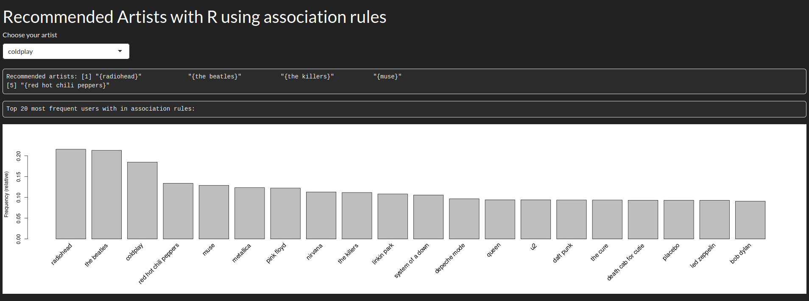

:::::{.spanish}

Es increíble poder extraer conclusiones de cantidades ingentes de datos. Y es que debido a estas conclusiones, a día de hoy nuestra información vale millones. 

En esta ocasión voy a trabajar con R para extraer reglas de asociación de un dataset con centenares de miles de transacciones. En este caso las transacciones son filas donde un usuario escucha a un artista determinado un número X de veces. Esta notación es usada en el **market basket análisis** básicamente un estudio de tendencias y preferencias de mercado que trata de vender productos en base de los que un comprador ha adquirido.

Como he comentado antes, vamos a extraer reglas de asociación usando el algoritmo Apriori; con estas reglas podremos crear un sistema de recomendación de música en base a nuestro dataset, extraído de la plataforma [lastfm](https://www.last.fm).

Empezamos importando las librerías con las que vamos a trabajar y el dataset:

~~~~~~~~~~~~~~~~~~~~~~~~~~~~~~~~~~~~~~~~~~ {.r .numberLines}
library(readr)
library(dplyr)
library(ggplot2)
library(arules)

music_data <- as.data.frame(read_tsv("datasets/lastfm-dataset-360K/usersha1-artmbid-artname-plays.tsv"))
~~~~~~~~~~~~~~~~~~~~~~~~~~~~~~~~~~~~~~~~~~~~~~~~~~~~

Como pequeña anotación: una vez se lee el fichero este es un **tibble** ([explicado en mi publicación de text-mining](/graphs/pillars/08022023.html)), ya que me dió problemas al trabajar con el paquete **arules** a la hora de crear las transacciones.

Cambio el nombre de las columnas para manejar mejor el conjunto de datos:

~~~~~~~~~~~~~~~~~~~~~~~~~~~~~~~~~~~~~~~~~~ {.r .numberLines}
names(music_data) <- c("user","artist-id","artist","plays")

music_data <- group_by(music_data,user)

music_data <- mutate(music_data,
                     UserId = cur_group_id()
)

music_data <- ungroup(music_data,user)
~~~~~~~~~~~~~~~~~~~~~~~~~~~~~~~~~~~~~~~~~~~~~~~~~~~~

Además creo una nueva columna que sirve como id del usuario en vez de usar el sha1 del dataset.

Finalmente generamos las reglas de asociación con Apriori, para ello:

+ Nos quedamos con los datos de interés, para ello dividimos el dataset para quedarnos solo con el id del usuario y los artista que escucha.

+ Filtramos para obtener los valores únicos, evitando repeticiones.

+ Transformamos los datos al tipo "transactions"

+ Generamos las reglas con ciertos valores de **confianza** y **soporte**.

+ Nos quedamos con las mejores reglas en base al parámetro **lift**

~~~~~~~~~~~~~~~~~~~~~~~~~~~~~~~~~~~~~~~~~~ {.r .numberLines}
music_by_user <- split(x=music_data[,"artist"],f=music_data$UserId)

music_by_user <- lapply(music_by_user, unique)

transaction_music_by_user <- as(music_by_user,"transactions")

rules <- apriori(transaction_music_by_user,list(support=.01, confidence=.5))

best_rules <- sort(subset(rules,subset=lift > 1),by="confidence")
~~~~~~~~~~~~~~~~~~~~~~~~~~~~~~~~~~~~~~~~~~~~~~~~~~~~

Una vez tenemos las reglas, solo nos queda filtrar la parte izquierda o **lhs** y encontrar las que tengan al artista en  cuestión, devolviendo al usuario la parte derecha o **rhs**. Para ello despliego una plataforma web que he programado para que el usuario pueda seleccionar al artista, recibiendo las recomendaciones.

:::::

:::::{.english}

It is incredible to be able to draw conclusions from huge amounts of data. It is because of these conclusions, that today our information is worth millions. 

This time I am going to work with R to extract association rules from a dataset with hundreds of thousands of transactions. In this case the transactions are rows where a user listens to a given artist X number of times. This notation is used in the **market basket analysis - ** is basically a study of market trends and preferences that tries to sell products based on what a buyer has purchased.

As I mentioned before, we are going to extract association rules using the Apriori algorithm; with these rules we will be able to create a music recommendation system based on our dataset, extracted from the [lastfm](https://www.last.fm) platform.

We start by importing the libraries we are going to work with and the dataset:

~~~~~~~~~~~~~~~~~~~~~~~~~~~~~~~~~~~~~~~~~~ {.r .numberLines}
library(readr)
library(dplyr)
library(ggplot2)
library(arules)

music_data <- as.data.frame(read_tsv("datasets/lastfm-dataset-360K/usersha1-artmbid-artname-plays.tsv"))
~~~~~~~~~~~~~~~~~~~~~~~~~~~~~~~~~~~~~~~~~~~~~~~~~~~~

As a small note: once the file is read it is a **tibble** ([explained in my text-mining post](/graphs/pillars/08022023.html)), as it gave me problems when working with the **arules** package when creating transactions.

I rename the columns to better manage the data set:

~~~~~~~~~~~~~~~~~~~~~~~~~~~~~~~~~~~~~~~~~~ {.r .numberLines}
names(music_data) <- c("user","artist-id","artist","plays")

music_data <- group_by(music_data,user)

music_data <- mutate(music_data,
                     UserId = cur_group_id()
)

music_data <- ungroup(music_data,user)
~~~~~~~~~~~~~~~~~~~~~~~~~~~~~~~~~~~~~~~~~~~~~~~~~~~~

I also create a new column that serves as the user id instead of using the sha1 value of the dataset.

Finally we generate the association rules with Apriori, for this:

+ We keep the data of interest, so we split the dataset to keep only the id of the user and the artists he/she listens to.

+ We filter to obtain the unique values, avoiding repetitions.

+ We transform the data to the type "transactions".

+ We generate the rules with certain values of **confianza** and **support**.

+ We keep the best rules based on the **lift** parameter.

~~~~~~~~~~~~~~~~~~~~~~~~~~~~~~~~~~~~~~~~~~ {.r .numberLines}
music_by_user <- split(x=music_data[,"artist"],f=music_data$UserId)

music_by_user <- lapply(music_by_user, unique)

transaction_music_by_user <- as(music_by_user,"transactions")

rules <- apriori(transaction_music_by_user,list(support=.01, confidence=.5))

best_rules <- sort(subset(rules,subset=lift > 1),by="confidence")
~~~~~~~~~~~~~~~~~~~~~~~~~~~~~~~~~~~~~~~~~~~~~~~~~~~~

Once we have the rules, we only have to filter the left part or **lhs** and find the ones that have the artist in question, returning to the user the right part or **rhs**. To do this I deploy a web platform that I have programmed so that the user can select the artist, receiving the recommendations.

:::::