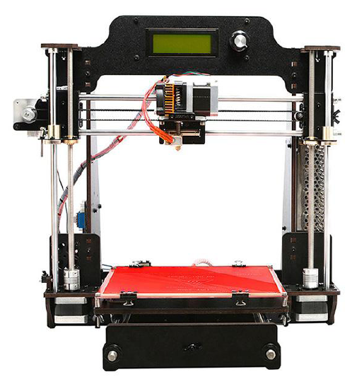
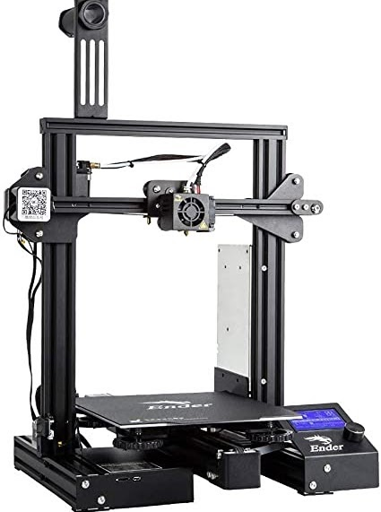

:::::{.spanish}

Recientemente adquirí por primera vez una impresora 3D. Tenía experiencia con este tipo de tecnología ya que en mi instituto montamos una Geetech Prusa I3. En el transcurso del montaje de esta impresora tuvimos diversos problemas que fuimos resolviendo gracias al interés e ilusión que teníamos en aquel momento, esas ansias y ganas de aprender. La impresora no venía lista para imprimir; había que montarla desde cero. Al ser nuestra primera impresora añadía una complejidad extra al reto y gracias a esto aprendimos cómo funciona una impresora 3D de este tipo:

 

 

El problema de esta impresora es que contaba con diversos problemas mecánicos, por lo que tuvimos que sustituir varios componentes electrónicos. Otro problema es que teníamos que estar calibrando todos los ejes por cada impresión que hacíamos y acabamos desesperados. Esto también se debe a que igual era algo más avanzado para nosotros pero como he dicho anteriormente esta impresora nos brindó la ocasión de aprender muchísimo y a día de hoy la recuerdo con cariño.

Ya como estudiante universitario volví a mi instituto y esta vez (gracias a un gran profesor) había una impresora nueva (al igual que la otra, para fomentar el conocimiento usándose en proyectos de tecnología) : La Ender 3 Pro.

 

Estuve trabajando con esta impresora para el desarrollo del "Ensayo I" y vi en ella un potencial desorbitado; ofrecía unas prestaciones elevadas por un precio demasiado asequible. Fue en ese momento cuando decidí comprarme esta impresora.

El montaje  fue sencillo, un poco más complicado fue el eje Z, pero en general el proceso es bastante intuitivo. Es una impresora que cuenta con un sistema de extrusión "poco eficiente" que hace que el filamento pueda verse "estancado" (de esto hablaré en otra ocasión). Una vez montada, lo único que quedaba hacer era conectarla y ponerla a imprimir. Al contrario que la Geetech, esta venía parcialmente montada y solo había que poner un par de cosas. Un consejo que os doy si estáis comenzando en este mundillo, es que antes de la impresión, sobre la cama caliente, añadáis algún elemento para que las primeras capas se adhieran mejor y durante la impresión no se despeguen. En el caso de que tengáis una superficie de cristal o semejante podéis cubrirla con cinta de carrocero; en el caso de que contéis con otro tipo de superficie del estilo de la alfombra magnética de la Ender 3 Pro lo mejor es usar laca (la que más recomiendo es la "Nelly").

Definitivamente con esta compra ya estaba adentrado en este fascinante mundo de la impresión 3D y me alegraba que estas impresoras cada vez estuvieran más acopladas en el mercado y a un precio económico. En concreto estoy fascinado con esta impresora de Creality ya que ofrece un amplio abanico de oportunidades a un precio reducido.

:::::

:::::{.english}

I recently acquired for the first time a 3D printer. I had experience with this type of technology because in my high school we assembled a Geetech Prusa I3. During the assembly of this printer we had several problems that we were solving thanks to the interest and enthusiasm that we had at that time, that eagerness and desire to learn. The printer did not come ready to print; it had to be assembled from scratch. Being our first printer added an extra complexity to the challenge and thanks to this we learned how a 3D printer of this type works:

 

The problem with this printer is that it had several mechanical problems, so we had to replace several electronic components. Another problem is that we had to be calibrating all the axes for every print we made and we ended up desperate. This is also due to the fact that it was a bit more advanced for us, but as I said before, this printer gave us the opportunity to learn a lot and I still remember it fondly.

As a college student I went back to my high school and this time (thanks to a great teacher) there was a new printer (just like the other one, to promote knowledge by using it in technology projects): The Ender 3 Pro.

 

I was working with this printer for the development of "Test I" and I saw in it an exorbitant potential; it offered high performance for a very affordable price. It was then that I decided to buy this printer.

The assembly was simple, a little more complicated was the Z axis, but in general the process is quite intuitive. It is a printer that has an "inefficient" extrusion system that makes the filament can be "stagnant" (I will talk about this another time). Once assembled, the only thing left to do was to connect it and start printing. Unlike the Geetech, this one came partially assembled and only had to put a couple of things. A tip I give you if you are starting in this world, is that before printing, on the hot bed, add some element so that the first layers adhere better and during printing do not peel off. In case you have a glass surface or similar you can cover it with masking tape; in case you have another type of surface like the magnetic carpet of the Ender 3 Pro it is best to use lacquer (the one I recommend the most is the "Nelly").

Definitely with this purchase I was already into this fascinating world of 3D printing and I was glad that these printers were more and more coupled in the market and at an economical price. In particular I am fascinated with this printer from Creality as it offers a wide range of opportunities at a reduced price.

:::::