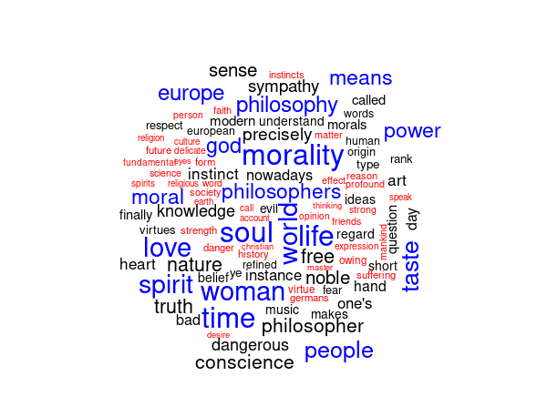

:::::{.spanish}

El '**text mining**' o minería de texto es el proceso mediante el cual se obtiene información de valor o interés a través del análisis de distintas fuentes textuales: blogs, libros, redes sociales ... 

Como podrás pensar esto tiene un gran potencial y permite obtener patrones y tendencias (gracias a diversos métodos estadísticos) que podemos aplicar a múltiples campos.

En mi caso trabajaré con R y los diversos paquetes que ofrece para trabajar con la minería de texto y el análisis de datos en general; además de esto R me parece muy potente y versátil, con una gran comunidad de fondo.

Para explicar más detalladamente el proceso partiré de un ejemplo con la creación de una '**wordcloud**' (representación visual de texto en 'forma de nube') con las palabras más frecuentes en uno de los libros de [Friedrich Nietzsche](https://es.wikipedia.org/wiki/Friedrich_Nietzsche). 

Principalmente partimos de un **conjunto de datos desordenados**. Esto es común cuando trabajamos con datos extraídos de artículos, libros o múltiples fuentes, ya que hay información que no es relevante para nuestro análisis y ni siquiera está ordenada. 

Para facilitar la compresión voy a definir los siguientes conceptos claves:

* **Token**: parte fundamental de nuestro análisis. Es una unidad atómica que tiene gran valor de significado para nosotros; comúnmente es una palabra.

* **Tokenización**: división del texto en Tokens.

* **Tidy Text**: principios generales para obtener mejores resultados del análisis de datos. Consta de una serie de principios fundamentales: cada variable es una columna, cada observación una fila y cada unidad de observación una tabla.

* **Tibble**: data frame moderno en R que se adapta a nuestras necesidades al trabajar con el formato Tidy Text y que nos permite visualizar el data frame de forma eficiente.

Lo primero que hay que hacer es convertir nuestro conjunto de datos desordenados al formato **Tidy Text**, posteriormente **Tokenizarlo** y eliminar información irrelevante. Una vez hecho esto, podemos agrupar las palabras según la frecuencia de estas en el texto y generar la '**wordcloud**'.

Para finalizar muestro el resultado con la versión en inglés de ['Más allá del bien y el mal' de Friedrich Nietzsche](https://es.wikipedia.org/wiki/M%C3%A1s_all%C3%A1_del_bien_y_del_mal):

**R Code**

~~~~~~~~~~~~~~~~~~~~~~~~~~~~~~~~~~~~~~~~~~ {.r .numberLines}
library(tidytext)
library(dplyr)
library(stringr)
library(wordcloud)
library(gutenbergr)

### Worldcloud of a Nietzsche book

stwd <- bind_rows(tibble(word = c("german","hitherto"),lexicon = c("CUSTOM")),stop_words)

Nbook <- gutenberg_download(c(4363)) %>%
  unnest_tokens(word,text) %>%
  anti_join(stwd) %>%
  count(word,sort=TRUE)

Nbook %>%  
  with(wordcloud(word,n,max.words = 100,scale=c(2,.1),colors = c("red","black","blue")))
~~~~~~~~~~~~~~~~~~~~~~~~~~~~~~~~~~~~~~~~~~~~~~~~~~~~
:::::

:::::{.english}

Text mining is the process by which information of value or interest is obtained through the analysis of different textual sources: blogs, books, social networks... 

As you can think this has great potential and allows us to obtain patterns and trends (thanks to various statistical methods) that we can apply to multiple fields.

In my case I will work with R  and the various packages it offers to work with text mining and data analysis in general; besides this R seems to me very powerful and versatile, with a large background community.

To explain the process in more detail I will start from an example with the creation of a '**wordcloud**' (visual representation of text in 'cloud form') with the most frequent words in one of [Friedrich Nietzsche's](https://en.wikipedia.org/wiki/Friedrich_Nietzsche) books. 

We mainly start from a **disordered data set**. This is common when we work with data extracted from articles, books or multiple sources, since there is information that is not relevant to our analysis and is not even ordered. 

For ease of understanding I will define the following key concepts:

* **Token**: fundamental part of our analysis. It is an atomic unit that has great meaning value for us; it is commonly a word.

* **Tokenization**: division of the text into tokens.

* **Tidy Text**: general principles to obtain better results from data analysis. It consists of a series of fundamental principles: each variable is a column, each observation is a row and each observation unit is a table.

** **Tibble**: modern data frame in R that adapts to our needs when working with the Tidy Text format and allows us to visualize the data frame efficiently.

The first thing to do is to convert our unordered data set to **Tidy Text** format, then **Tokenize** it and remove irrelevant information. Once this is done, we can group the words according to their frequency in the text and generate the '**wordcloud**'.

Para finalizar muestro el resultado con la versión en inglés de ['Beyond the good and evil' de Friedrich Nietzsche]():

**R Code**

~~~~~~~~~~~~~~~~~~~~~~~~~~~~~~~~~~~~~~~~~~ {.r .numberLines}
library(tidytext)
library(dplyr)
library(stringr)
library(wordcloud)
library(gutenbergr)

### Worldcloud of a Nietzsche book

stwd <- bind_rows(tibble(word = c("german","hitherto"),lexicon = c("CUSTOM")),stop_words)

Nbook <- gutenberg_download(c(4363)) %>%
  unnest_tokens(word,text) %>%
  anti_join(stwd) %>%
  count(word,sort=TRUE)

Nbook %>%  
  with(wordcloud(word,n,max.words = 100,scale=c(2,.1),colors = c("red","black","blue")))
~~~~~~~~~~~~~~~~~~~~~~~~~~~~~~~~~~~~~~~~~~~~~~~~~~~~

:::::