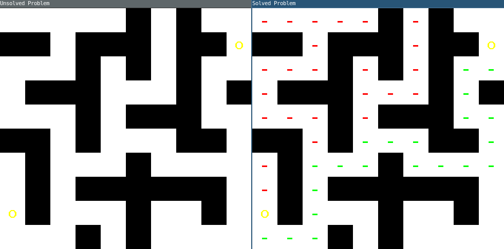

:::::{.spanish}

El problema de resolver laberintos dadas la entrada y salida se puede resolver fácilmente y no muy costosamente (para pequeños laberintos, claro está). La siguiente imagen muestra la salida de un pequeño programa que hice en un rato libre, mostrando el camino de la solución y los caminos explorados por el algoritmo. Dado un laberinto, al ejecutar el programa se mostrarán en dos ventanas el laberinto sin resolver y el laberinto resuelto.  
 

 

:::::

:::::{.english}

The problem of solving mazes given input and output can be solved easily and inexpensively (for small mazes, of course). The following image shows the output of a small program I made in some spare time, showing the solution path and the paths explored by the algorithm. Given a maze, running the program will show in two windows the unsolved maze and the solved maze.

 

:::::