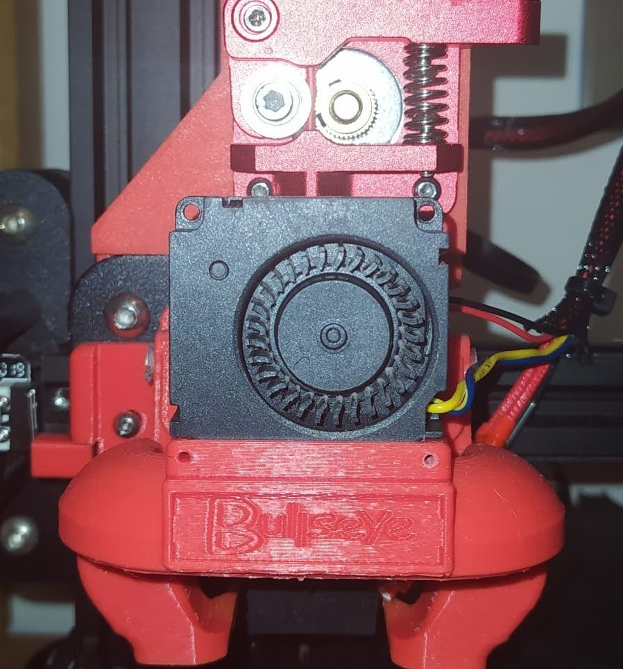

:::::{.spanish}

Como ya venía diciendo desde el principio, la extrusión tipo "Bowden" en esta Impresora me estaba dando problemas.

Este sistema de extrusión tiene una ventaja principal y es que posee una menor masa en lo que es el carro del extrusor, ya que el motor va acoplado directamente al chasis. Sin embargo, cuenta con diversos problemas que es lo que seguramente me haya estado pasando. Por ejemplo, puede ser que el motor que empuja al filamento no tenga suficiente fuerza. He aquí el sonido que mi impresora emitía al no tener la fuerza suficiente.

Una de las cosas que podía hacer, era actualizar el firmware de la  impresora ya que éste se encontraba en una versión un poco primitiva . Resulta que la impresora venía con una placa un poco complicada de actualizar (V1) , sobretodo porque había que hacer uso de una Arduino para "quemar" el bootloader. Por otro lado tenía bastante ganas de tener extrusión directa y me decanté por añadirla.Con la extrusión directa añadía mas peso al carro del extrusor, pero ganaba en velocidad de extrusión y en menos riesgos provocados por el motor. Además me permitía imprimir ciertos materiales con más requisitos de temperatura, como el TPU.

Posteriormente hice lo siguiente:

 

1. Imprimí un diseño que encontré en Thingiverse y me pareció idóneo.

2. Una vez que todo estaba impreso, procedí a desmontar el motor que venía de serie en el chasis (como extra, cambié la pieza de plástico que actuaba de pinza por una de aluminio, ya que estaba empezando a desgastarse).

3. Desmonté por completo el carro del extrusor y le acoplé la pieza impresa (ya de paso ajusté las ruedas excéntricas).

4. Volví a montar el carro y a conectar todos los cables desconectados . 

Desde que hice esta mejora, la impresora no me ha vuelto a dar ningún problema; imprime sin problemas y no se salta pasos. Además de esto, como se puede ver, también le cambié el ventilador de capa; el que venía de serie era poco efectivo, aunque de esto hablaré en otro momento.

:::::

:::::{.english}

As I have been saying from the beginning, the "Bowden" type extrusion on this printer was giving me problems.

This extrusion system has a main advantage and it is that it has a lower mass in the extruder carriage, since the motor is directly coupled to the chassis. However, it has several problems, which is what has probably been happening to me. For example, it may be that the motor that pushes the filament does not have enough force. Here is the sound that my printer emitted when it did not have enough power.

One of the things I could do was to update the printer's firmware, since it was in a rather primitive version. It turns out that the printer came with a board a little complicated to update (V1), especially because you had to make use of an Arduino to "burn" the bootloader. On the other hand I was quite eager to have direct extrusion and I decided to add it, with direct extrusion I added more weight to the extruder carriage, but I gained in extrusion speed and less risks caused by the motor. It also allowed me to print certain materials with higher temperature requirements, such as TPU.

Subsequently, I did the following:

 

1. I printed a design I found on Thingiverse and found it to be ideal.

2. Once everything was printed, I proceeded to disassemble the motor that came standard on the chassis (as an extra, I changed the plastic piece that acted as a clamp for an aluminum one, as it was starting to wear out).

3. I completely disassembled the extruder carriage and attached the printed part to it (while I was at it, I adjusted the eccentric wheels).

4. I reassembled the carriage and reconnected all the disconnected wires . 

Since I made this improvement, the printer has not given me any more problems; it prints without problems and does not skip steps. In addition to this, as you can see, I also changed the coating fan; the one that came as standard was not very effective, although I will talk about this some other time.

:::::