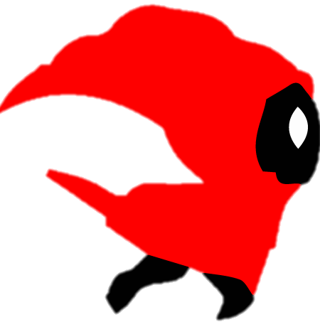

:::::{.spanish}

Esta vez vengo con un juego; la historia de Lea y su travesía como "The Last Unmasked". En este juego nuestra protagonista tiene que ir saltando a espectros, corrompidos por "el abismo".

El juego está programado en Java usando Android Studio como IDE. Está siendo todo un proyecto por el gran mundo de desarrollo móvil que se ha hecho paso en mi camino.

Por ejemplo, a la hora de crear las físicas del mundo asociadas tenías que tener en cuenta distintos tipos de cuerpos programables; el suelo es de tipo "estático" mientras que el personaje principal es "dinámico". Esto es muy relevante a la hora de iniciar el mundo para las distintas fuerzas que se ejercen sobre los distintos cuerpos.
 

 

Por otro lado, al ser un juego "infinito" he tenido que pensar una manera de generar a los enemigos  óptimamente de tal manera que se consuman los menos recursos posibles. En otros juegos puedes hacer un mapa donde el personaje llega a una meta y ahí se acaba el nivel; aquí mientras el protagonista siga vivo, el juego continúa y solo acaba cuando muere. Es por eso que la manera de implementar esto fue con un algoritmo que controlase la generación y posición de los enemigos respectivamente, de tal forma que cuando el objeto "enemigo" saliese del escenario, el algoritmo lo destruyera para no colapsar el dispositivo. De no ser así el juego seguiría generando enemigos hasta consumir todos los recursos del teléfono en cuestión.

Por último los diseños (al igual que los sprites) están creados por mí pixel a pixel. He hecho diversos bocetos antes de ponerme a ello para hacerme una idea de lo que quería siendo el resultado final el que podréis ver en las imágenes de abajo.

 

:::::

:::::{.english}

This time I come with a game; the story of Lea and her journey as "The Last Unmasked". In this game our protagonist has to go jumping spectres, corrupted by "the abyss".

The game is programmed in Java using Android Studio as IDE. It is being quite a project because of the great world of mobile development that has come my way.

For example, when creating the associated world physics you had to take into account different types of programmable bodies; the ground is a "static" type while the main character is "dynamic". This is very relevant when starting the world for the different forces exerted on the different bodies.

 

On the other hand, being an "infinite" game, I had to think of a way to generate the enemies optimally in such a way as to consume as few resources as possible. In other games you can make a map where the character reaches a goal and then the level ends; here, as long as the main character is alive, the game continues and only ends when he dies. That's why the way to implement this was with an algorithm that controlled the generation and position of the enemies respectively, so that when the "enemy" object left the stage, the algorithm would destroy it so as not to collapse the device. Otherwise the game would continue to generate enemies until it consumed all the resources of the phone in question.

Finally the designs (as well as the sprites) are created by me pixel by pixel. I made several sketches before I started to get an idea of what I wanted, being the final result what you can see in the images below.

:::::