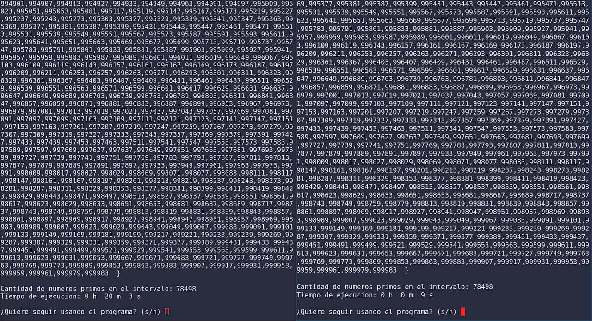
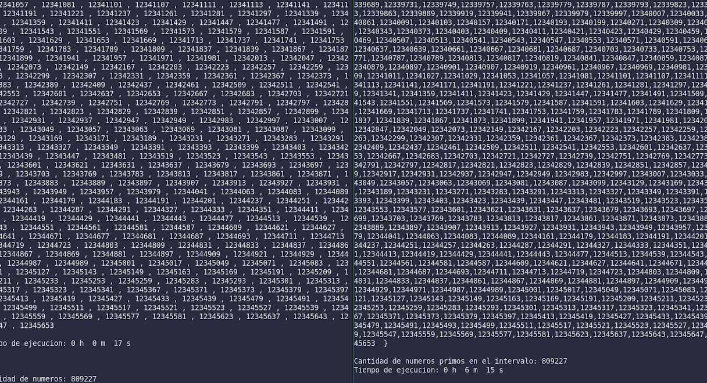

:::::{.spanish}

La tarea de calcular números primos muy grandes es muy costosa. Es por eso que estoy haciendo una especificación de un algoritmo que reduzca drásticamente el tiempo empleado en calcular los números primos del 2 al número seleccionado. 

He conseguido optimizar el algoritmo empleando fuerza bruta, en el que se prueba por cada número todos los posibles divisores, además aprovechando la eficiencia de las estructuras de datos para evitar operaciones:

 

Mejora del algoritmo previo:

:::::

:::::{.english}

The task of calculating very large prime numbers is very expensive. That is why I am making a specification of an algorithm that drastically reduces the time spent in calculating the prime numbers from 2 to the selected number. 

I have managed to optimize the algorithm by employing brute force, in which all possible divisors are tested for each number, as well as taking advantage of the efficiency of the data structures to avoid operations:

Improvement of the previous algorithm:

:::::