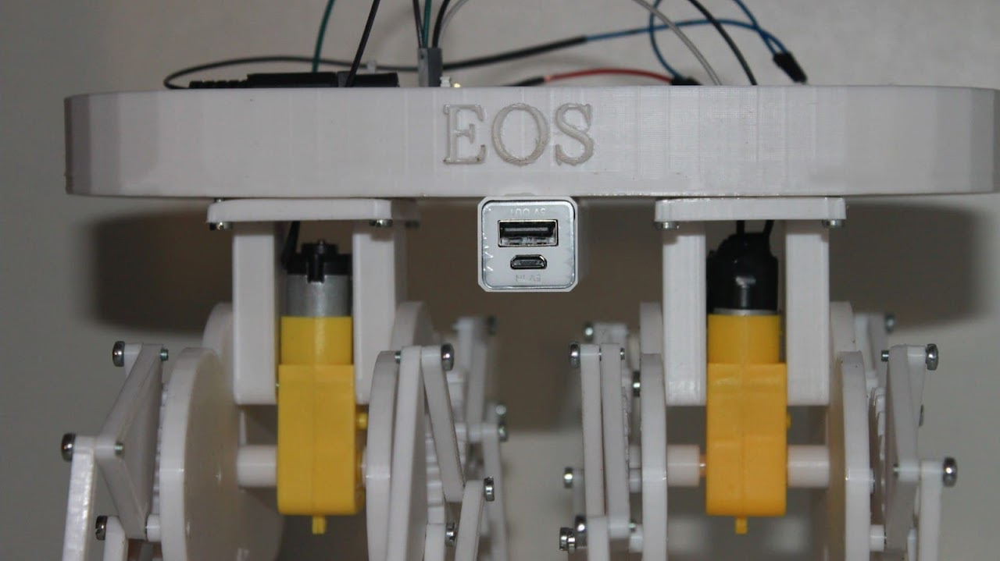

:::::{.spanish}

[EOS es un proyecto open source](https://github.com/Aleph8/EOS/) basado en el "Jansen Linkage" , un mecanismo creado por Teo Jansen ( imagen abajo ).

¡Cualquier persona puede hacer una versión simple del proyecto!

El chasis entero está diseñado e impreso ( PLA blanco ). La versión 0 solo tiene uno de los dos "trenes" que componen EOS

El "cerebro" del proyecto es un arduino nano al que se le añade el driver L293D para controlar la dirección de movimiento.EOS puede moverse en todas la direcciones pivotando en uno de sus dos ejes cuando gira.

Todos los diseños están [disponibles en GitHub](https://github.com/Aleph8/EOS/) para quien quiera aventurarse. Con solo unas pocas conexiones ... ¡ EOS podrá caminar !

:::::

:::::{.english}

[EOS is an open source project](https://github.com/Aleph8/EOS/) based on the "Jansen Linkage", a mechanism created by Teo Jansen ( left image ). a mechanism created by Teo Jansen ( left image ).

Anyone can make a simple version of the project!

The entire chassis is designed and printed (white PLA). Version 0 has only one of the two "trains" that make up EOS.

The "brain" of the project is an arduino nano to which the L293D driver is added to control the direction of movement.EOS can move in all directions by pivoting on one of its two axes when it rotates.

All designs are [available on GitHub](https://github.com/Aleph8/EOS/) for anyone who wants to venture. With just a few connections ... EOS will be able to walk !

:::::