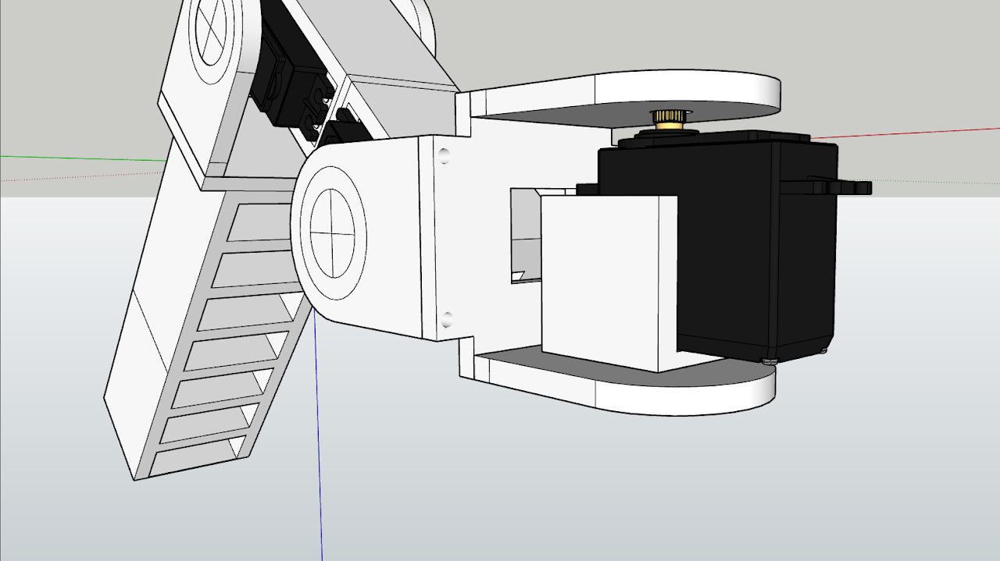
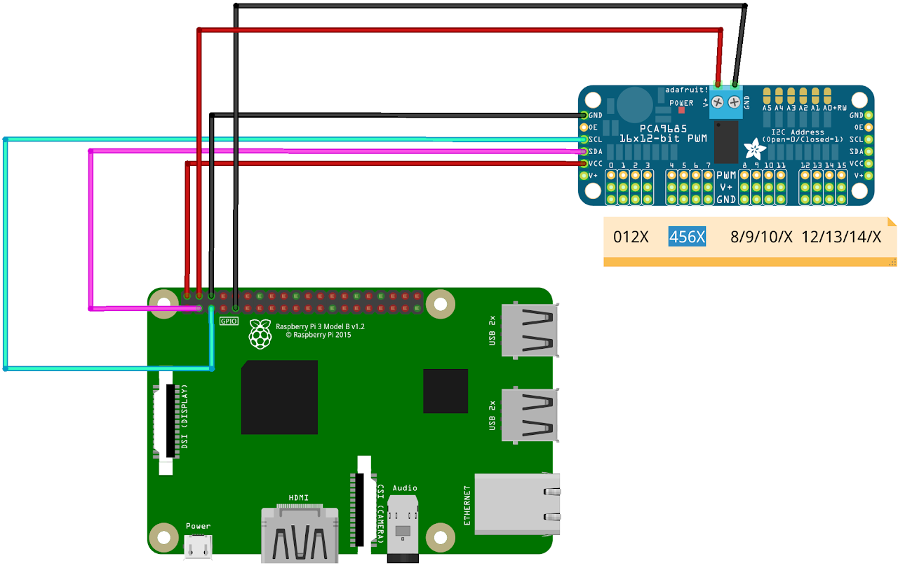

:::::{.spanish}
- [Inspiración](#inspiración) 
- [Diseño de la pata](#diseño-de-la-pata) 
- [Diseño del chasis](#diseño-del-chasis) 
- [Electrónica básica](#electrónica-bsica) 
- [Demostración](#demostración) 
:::::

:::::{.english}
- [Inspiration](#inspiration) 
- [Leg design](#leg-design) 
- [Chassis design](#chassis-design) 
- [Basic electronics](#basic-electronics) 
- [Demonstration](#demonstration) 
:::::

:::::{.spanish}

[Arachne es un proyecto completamente open source](https://github.com/aleph8/Arachne); puedes encontrar todos los archivos de diseño y programación en su repositorio.

# Inspiración

Siempre me ha fascinado todo lo relacionado con "la creación de la naturaleza". Algo que siempre me ha llamado la atención de esto, son los arácnidos, desde sus asombrosos métodos de supervivencia ( por ejemplo la autotomía, también presentes en lagartos ), así como la manera que tienen de cazar a sus presas hasta su increíble diseño.

Influenciado por esto, empecé a pensar en un robot bio-inspirado, que fuera capaz de mantenerse en pie, tras levantarse. He aquí cuando surgió "Arachne". El nombre proviene de la mitología Griega.

# Diseño de la pata

Principalmente me centré en el diseño; pensé que lo más estético era el diseño con seis patas, pero esto significaba mayores costes en cuanto a electricidad, impresión, tiempo ... etc. Por eso dejé de lado esta idea para un futuro y me centré en la funcionalidad. Era el momento de diseñar las patas.
 

La pata tiene tres grados de libertad para realizar el movimiento. Como podemos apreciar en la imagen, tenemos tres servomotores, uno por sección: extremo, centro, chassis.

# Diseño del chasis

Una vez diseñadas las patas, era el turno del chasis, donde iría la elctrónica. El chasis se divide en dos niveles.

El primer nivel es más robusto, debido a que es la unión de todas las patas y debe aportar la robustez necesaria al diseño final. El segundo nivel va atornillado a los servomotores del chasis; es más ligero que el anterior y donde va la electrónica, mientras en el nivel inferior irá la batería.

# Electrónica básica

La electrónica está formada por una Raspberry Pi 3b+ y el integrado PCA9685 (motor driver) que con unas pocas conexiones nos permite conectar hasta 16 servos en nuestra Raspberry.

# Demostración

¡ Arachne se levanta y mantiene de pie !

:::::

:::::{.english}

[Arachne is a completely open source project](https://github.com/aleph8/Arachne); you can find all the design and programming files in its repository.

# Inspiration

I have always been fascinated by everything related to "nature's creation". Something that has always caught my attention are arachnids, from their amazing survival methods (for example autotomy, also present in lizards), as well as the way they hunt their prey to their incredible design.

Influenced by this, I started to think about a bio-inspired robot, which would be able to stand up, after standing up. This is when "Arachne" was born. The name comes from Greek mythology.

# Leg design

I mainly focused on the design; I thought that the most aesthetic was the design with six legs, but this meant higher costs in terms of electricity, printing, time... etc. So I put this idea aside for the future and focused on functionality. It was time to design the legs.

The leg has three degrees of freedom to perform the movement. As we can see in the image, we have three servomotors, one per section: end, center, chassis.

# Chassis design

Once the legs were designed, it was the turn of the chassis, where the electronics would go. The chassis is divided into two levels.

The first level is more robust, because it is the union of all the legs and must provide the necessary robustness to the final design. The second level is screwed to the servomotors of the chassis; it is lighter than the previous one and is where the electronics are located, while the lower level is where the battery is located.

# Basic electronics

The electronics consists of a Raspberry Pi 3b+ and the integrated PCA9685 (motor driver) that with a few connections allows us to connect up to 16 servos in our Raspberry.

# Demonstration

Arachne gets up and keeps standing !

:::::