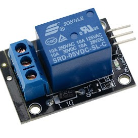
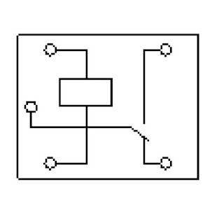
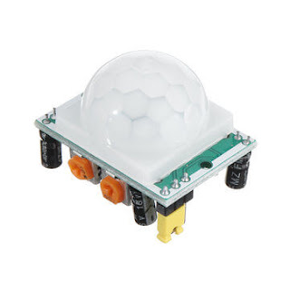

:::::{.spanish}

En esta ocasión me he decantado por hacer una especie de “robot centinela” que tras detectar movimiento se acciona un mecanismo de disparo.

En primer lugar necesitaba algo que pudiera disparar. Para ello me dieron una Nerf antigua para que yo pudiera cacharrear. Una vez la abrí me dí cuenta, que dada la antigüedad, poco quedaba que se pudiera reutilizar, a excepción del cañón al que se acoplaban dos motores. Cada motor lleva acoplado una especie de cilindro por el que se desliza la bala en cuestión.

En segundo lugar nos encontramos con la electrónica. Quería que fuera algo compacto y decidí usar una Arduino Nano la cual me servía de sobra para lo que yo necesitaba. El problema es que la salida es de 5V y aproximadamente unos 40 mA, siendo esto insuficiente para conseguir toda la potencia de los motores. La solución por la que opté fue alimentar los motores externamente con una batería recargable de unos 12V.

El circuito que alimenta los motores en principio estaría abierto y cuando se detectase movimiento pasaría a cerrado. Para esto he usado un relé, en este caso una especie de “interruptor electrónico”, que posee una señal de control para abrir o cerrar el circuito. 

El robot detecta el movimiento mediante un sensor PIR que está dividido en dos celdas que miden la radiación infrarroja convirtiéndola en una señal eléctrica cuando esta cambia.

Por último quedaba el diseño y mi impresora no funcionaba por lo que me las tuve que apañar con una caja circular que encontré y me gustó; ya solo quedaba montar y preparar todo el circuito.
 

 Relé  Pinout Relé  Sensor PIR  Robot Centinela
 

:::::

:::::{.english}

This time I have decided to make a kind of "sentry robot" that, after detecting movement, triggers a firing mechanism.

First of all I needed something I could shoot. For this I was given an old Nerf so I could play with it. Once I opened it I realized that, given its age, there was little left that could be reused, except for the barrel to which two motors were attached. Each motor has a kind of cylinder attached to it through which the bullet slides.

Secondly we came up with the electronics. I wanted it to be compact and decided to use an Arduino Nano which was more than enough for what I needed. The problem is that the output is 5V and approximately 40 mA, being this insufficient to get the full power of the motors. The solution I opted for was to power the motors externally with a 12V rechargeable battery.

The circuit that feeds the motors in principle would be open and when motion is detected it would be closed. For this I have used a relay, in this case a kind of "electronic switch", which has a control signal to open or close the circuit. 

The robot detects movement by means of a PIR sensor that is divided into two cells that measure infrared radiation and convert it into an electrical signal when it changes.

Finally there was the design and my printer was not working so I had to make do with a circular box that I found and I liked; now it only remained to assemble and prepare the whole circuit.

 Relay  Pinout Relay  PIR Sensor  Sentinel Robot
 

:::::